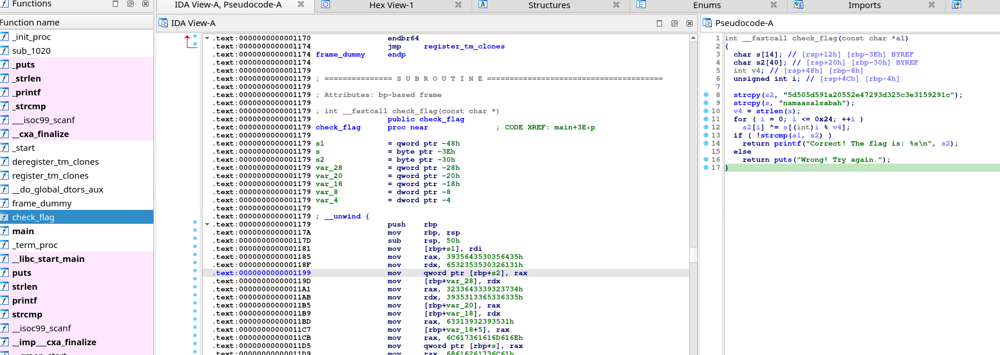
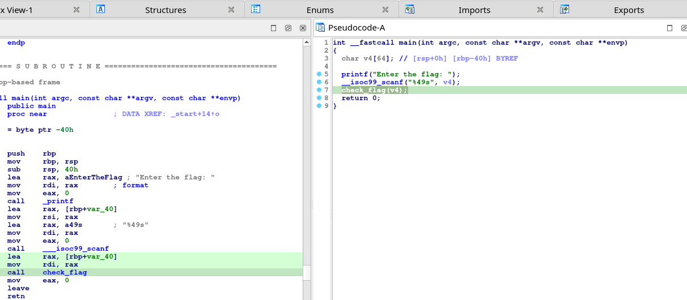

# Asal Nama Sabah

Setiap negeri mempunyai asal nama negeri tersebut. Begitu juga dengan negeri Sabah. Sabah juga mempunyai nama asal negeri tersebut yang popular di kalangan masyarakat tempatan.

- Category: Rev
- Challenge file: Asal\_Nama\_Sabah.exe

### Solution:

##### 1. Use file command to analyze the binary
```sh
$ file Asal_Nama_Sabah.exe 
Asal_Nama_Sabah.exe: ELF 64-bit LSB pie executable, x86-64, version 1 (SYSV), dynamically linked, interpreter /lib64/ld-linux-x86-64.so.2, BuildID[sha1]=950e7949238a5f9fb61caa5d8735ac78615b2814, for GNU/Linux 3.2.0, not stripped
```
It seems the extension showing .exe suggests a Windows executable file, but the output of the file command indicates that it is actually a Linux ELF (Executable and Linkable Format) file. 

##### 2. Remove the .exe extension and give execution permission to the binary
```sh
$ mv Asal_Nama_Sabah.exe Asal_Nama_Sabah && chmod +x Asal_Nama_Sabah
```

##### 3. Run strings to gather any information
```sh
$ strings Asal_Nama_Sabah
```

##### 4. Run the binary
```sh
$ ./Asal_Nama_Sabah
Enter the flag:
```

##### 5. Use the disassembler to view pseudocode and function used in the binary
<a href="ida1.png">
    
</a>


##### 6. Analyze the main function
<a href="ida2.png">
    
</a>

##### 7. Analyze the check\_flag() function
```c
 strcpy(s2, "5d505d591a20552e47293d325c3e3159291c");
 strcpy(s, "namaasalsabah");
  v4 = strlen(s);
  for ( i = 0; i <= 0x24; ++i )
    s2[i] ^= s[(int)i % v4];   //XOR happens here
  if ( !strcmp(a1, s2) )       
    return printf("Correct! The flag is: %s\n", s2);
  else
    return puts("Wrong! Try again.");
```
From this code, we get to know that it encodes the string of s2 with XOR with the key of s ("namaasalsabah") and then compare with the input. 

##### 8. Extract both string and perform XOR with python script
```py
s2 = "5d505d591a20552e47293d325c3e3159291c"
s = "namaasalsabah"

def xor(s2, s):
    out = ""
    length = len(s)
    for i in range(len(s2)):
        char = chr(ord(s2[i]) ^ ord(s[i % length]))
        out += char
    return out  

s2_byte = bytes.fromhex(s2)
flag = xor(s2_byte.decode('latin1'), s)
print("flag:",flag)
```

**Flag:** `3108{S4B4H_S4PP4H}`


