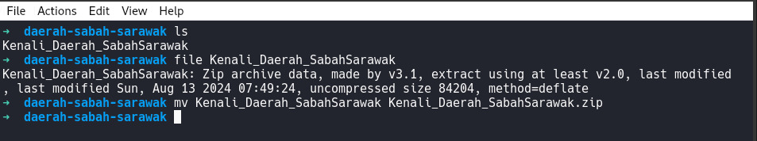

# Daerah Sabah & Sarawak 
Setiap negeri mempunyai dearah. Begitu juga negeri Sabah dan Sarawak mempunyai daerah tersendiri. Cari 'flag' yang mengandungi bilangan daerah Sabah dan Sarawak di dalam file tersebut.

- Category: Forensic
- Challenge File: Kenali\_Daerah\_SabahSarawak

### Solution

##### Step 1: Identify file type



##### Step 2: Unarchive and analyze the content

```sh
$ unzip Kenali_Daearah_SabahSarawak
Archive:  Kenali_Daerah_SabahSarawak.zip
file #1:  bad zipfile offset (local header sig):  0
  inflating: 2.jpg
  inflating: 3.jpg
  inflating: 4.jpg
```
```sh
$ file *.jpg
2.jpg: JPEG image data, JFIF standard 1.01, resolution (DPI), density 120x120, segment length 16, progressive, precision 8, 895x472, components 3
3.jpg: JPEG image data, JFIF standard 1.01, aspect ratio, density 1x1, segment length 16, baseline, precision 8, 1024x1024, components 3
4.jpg: JPEG image data, JFIF standard 1.01, resolution (DPI), density 150x150, segment length 16, progressive, precision 8, 400x266, components 3
```
```sh
$ binwalk *.jpg
Scan Time:     2024-09-02 15:55:05
Target File:   /home/trevorphilips/Desktop/3108-test/2.jpg
MD5 Checksum:  21822c4a44913bd621fe15d2f2fe9545
Signatures:    436

DECIMAL       HEXADECIMAL     DESCRIPTION
--------------------------------------------------------------------------------
0             0x0             JPEG image data, JFIF standard 1.01


Scan Time:     2024-09-02 15:55:05
#Target File:   /home/trevorphilips/Desktop/3108-test/3.jpg
MD5 Checksum:  7477ff674fed796842d2f4da0be22267
Signatures:    436

DECIMAL       HEXADECIMAL     DESCRIPTION
--------------------------------------------------------------------------------
0             0x0             JPEG image data, JFIF standard 1.01
278396        0x43F7C         RAR archive data, version 5.x
278873        0x44159         Zip archive data, encrypted at least v2.0 to extract, compressed size: 66, uncompressed size: 39, name: BenderaKeNi.txt
279119        0x4424F         End of Zip archive, footer length: 22


Scan Time:     2024-09-02 15:55:05
Target File:   /home/trevorphilips/Desktop/3108-test/4.jpg
MD5 Checksum:  0770fc68e1000e8e5485938a575be08f
Signatures:    436

DECIMAL       HEXADECIMAL     DESCRIPTION
--------------------------------------------------------------------------------
0             0x0             JPEG image data, JFIF standard 1.01
```

##### Step 3: Known embedded content (BenderaKeNi.txt) in 3.jpg extraction
```sh
$ binwalk -e 3.jpg
```

```sh
$  cd _3.jpg.extracted/ && tree
.
├── 43F7C.rar
├── 44159.zip
├── BenderaKeNi.txt
├── Daerah_Sabah&Sarawak.txt
└── file.zip
```
##### Step 4: Analyze BenderaKeNi.txt
```sh
file BenderaKeNi.txt
BenderaKeNi.txt: empty
```
It should from the file.zip but the zip file is encrypted and the password should be contain in the Daerah\_Sabah&Sarawak.txt

##### Step 4: John The Ripper for hash cracking for the zipfile
```sh
$ zip2john file.zip > hash 
$ john --wordlist=Daerah_Sabah\&Sarawak.txt hash
LubokAntu        (file.zip/BenderaKeNi.txt)
```

##### Step 5: Open zip folder with the password
```sh
$ 7z x file.zip 
```

##### Step 6: Cat out the BenderaKeNi.txt
```sh
$ cat BenderaKeNi.txt
3108{S4B4H_27_D43RAH_S4R4W4K_40_D43R4H}
```

**Flag:** `3108{S4B4H_27_D43RAH_S4R4W4K_40_D43R4H}`
