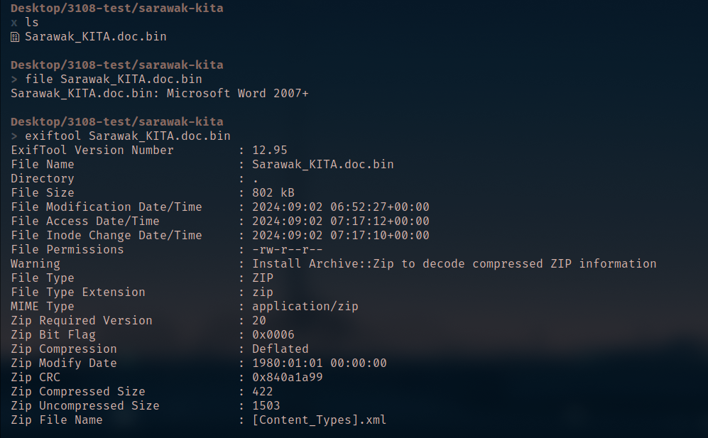

# Sarawak Kita
Ada pendapat yang menyatakan bahawa Kuching mendapat nama sempena sebatang sungai kecil, Sungai Kuching yang mengalir di antara Muzium Cina dan Kuil Tua Pek Kong. Sungai Kuching pula barangkali memperoleh nama daripada Kucing Hutan yang kerap mengunjunginya. Sungai tersebut juga berhampiran dengan sebuah bukit yang banyak ditumbuhi oleh pokok Buah Mata Kucing. Lantaran tersebut ianya diberi nama Bukit Mata Kucing. Tapi ini bukan tentang kisah Kuching, ini kisah bagaimana ingin mendapatkan 'flag' di dalam document yang berbahaya.

Category: Rev
Challenge File: Sarawak\_KITA.doc.bin

### Solution

##### Step 1: Analyze the file 

