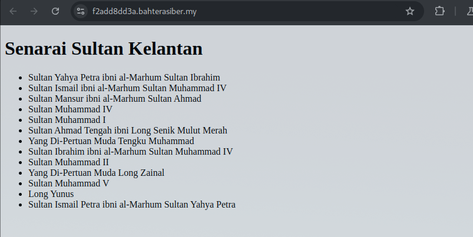
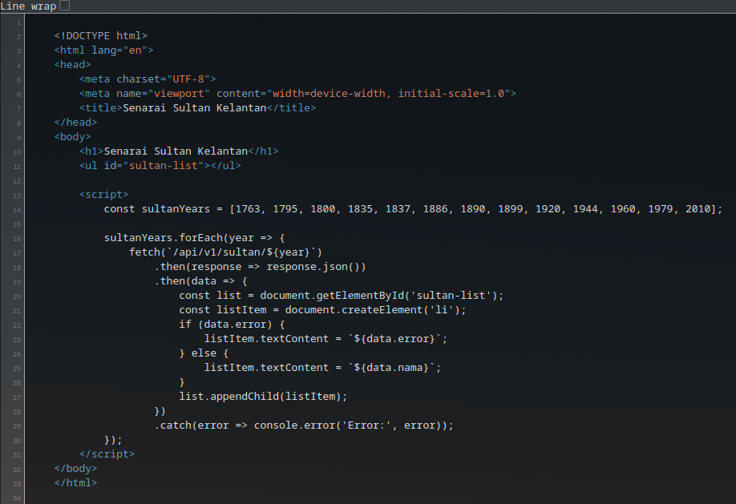
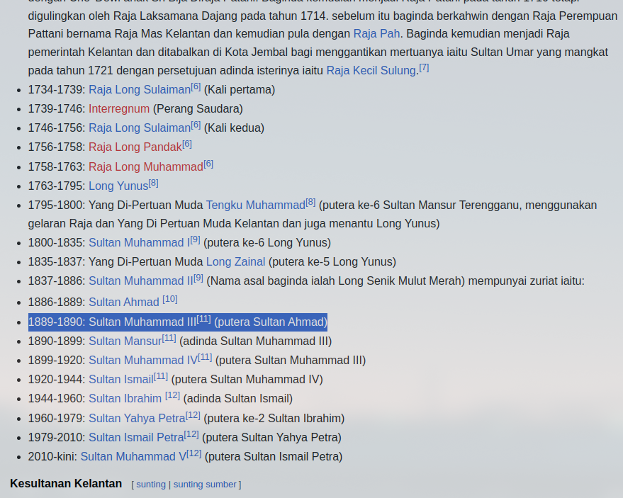
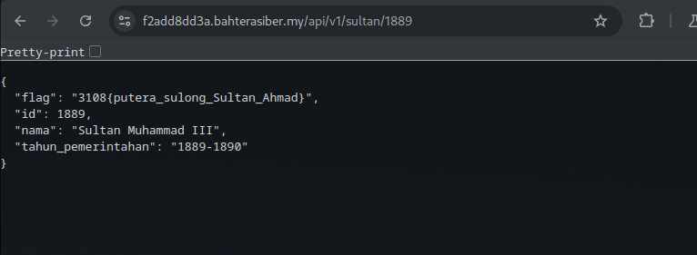

# Sultan Yang Hilang 

Berikut merupakan senarai pemerintahan Sultan-Sultan Kelantan, yang telah memimpin negeri ini sejak abad ke-18. Setiap Sultan membawa kisah dan peranannya yang tersendiri dalam membentuk sejarah Kelantan. Namun, terdapat Sultan yang hilang dari senarai ini.

- Category: Web
- Challenge URL: [Challenge Link](https://f2add8dd3a.bahterasiber.my/)

### Solution:

##### 1. View the page

<a href="step1.png">
    
</a>


##### 2. View page source

<a href="step2.png">
    
</a>


##### 3. Compare with Wiki and find out the missing Sultan

    Year: 1889

<a href="step3.png">
    
</a>


##### 4. Get the flag by quering the API manually

`https://f2add8dd3a.bahterasiber.my/api/v1/sultan/1889`


<a href="step4.png">
    
</a>

```json
{
  "flag": "3108{putera_sulong_Sultan_Ahmad}", 
  "id": 1889, 
  "nama": "Sultan Muhammad III", 
  "tahun_pemerintahan": "1889-1890"
}
```


**Flag:**`3108{putera_sulong_Sultan_Ahmad}`


