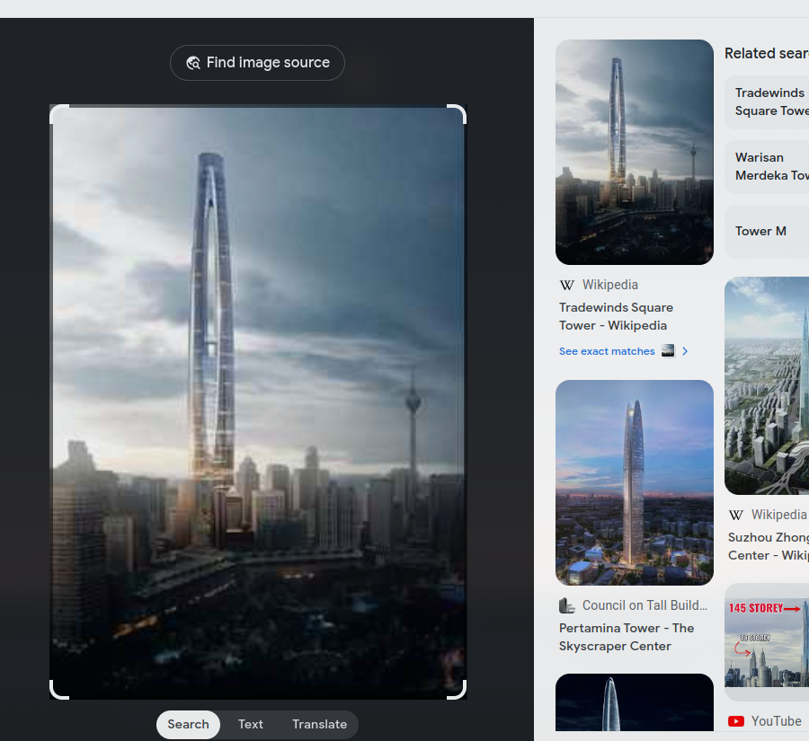

# Tinggi Lagii

Bangunan Tertinggi Di Malaysia yang tidak terbina. Tahu tak kat mana?

Format Flag: 3108{latitude, longtitude}
Jawapan dalam dua titik perpuluhan
Contoh: 1.23

- Category: OSINT
- Challenge File: Bangunan.jpg

### Bangunan.jpg

### Solution

##### Step 1: Reverse Image Search 

##### Step 2: Search GPS Coordinates from Wiki page

GPS Decimal in two decimal place: 3.15, 101.71

**Flag:** `3108{3.15,101.71}`

