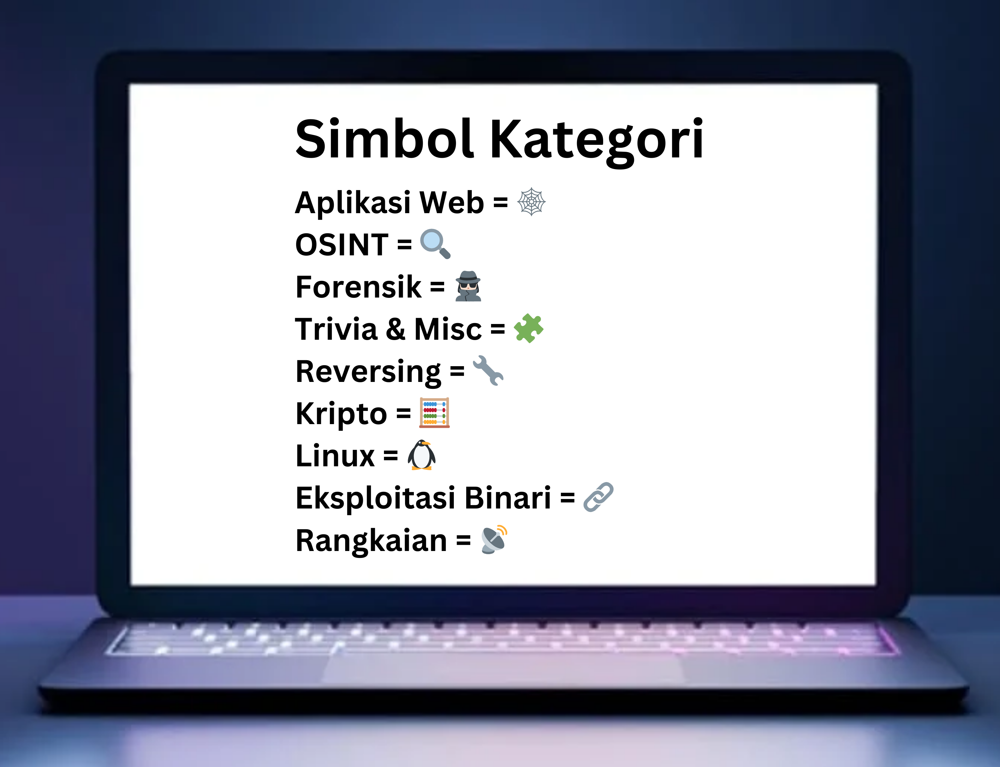

# 3108CTF

## CTF Description:

[3108CTF](https://ctf.bahterasiber.my/)

3108CTF is an exciting online Capture The Flag event celebrating Malaysia's Independence Day, held on 31 August 1957. This individual CTF challenges participants to demonstrate their cybersecurity skills and knowledge within a 24-hour window. Participants engaged in a series of challenges inspired by the historical significance of Malaysia's independence, which tested their problem-solving abilities and technical expertise. Whether seasoned in CTF competitions or new to the game, 3108CTF presented a unique and engaging experience for all involved.

## Challenge categories:

