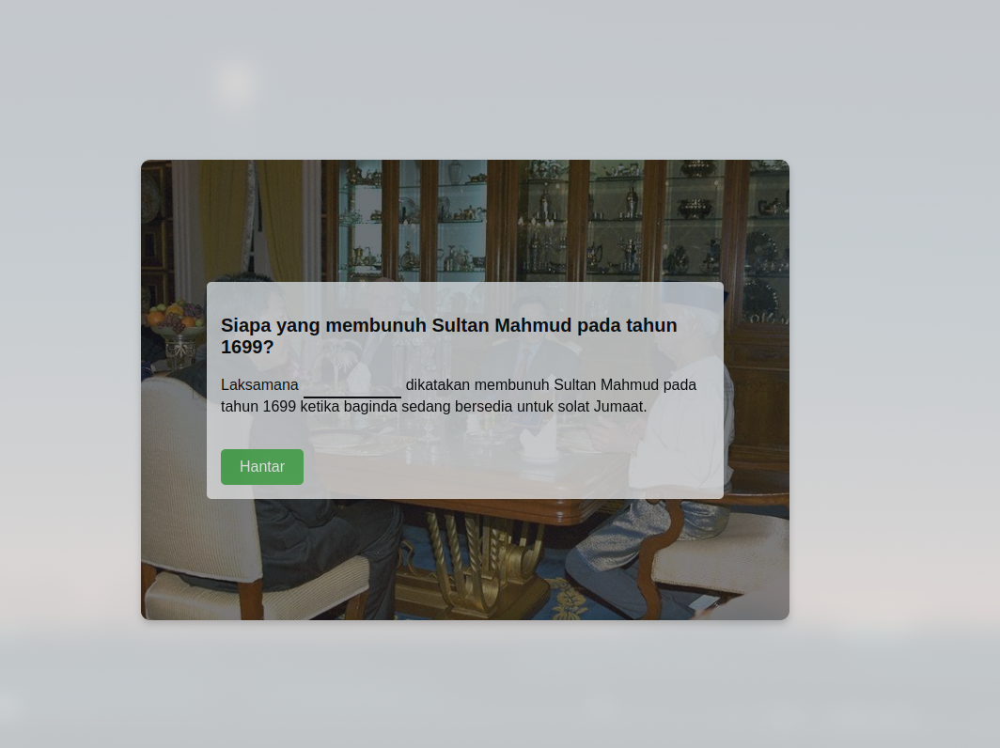

# zZzZz

ZZZZZ ZZZzZ ZZZZZ ZZZZZ ZzZZz ZZZZ ZZZ ZZ ZZZZZ ZZzZZ ZZzZZ ZzZZ ZZZZZZ ZZzZZ

- Category: Web + Crypto 
- Challenge URL: [https://9798fd3cc4.bahterasiber.my/](https://9798fd3cc4.bahterasiber.my/)

### Solution:

##### 1. Open the Challenge Page via the URL

##### 2. Google It (this is coming from a guy who scored A in SPM Sejarah)

[wiki page](https://ms.wikipedia.org/wiki/Sultan_Mahmud_Shah_II_dari_Johor#:~:text=Pada%20hari%20Jumaat%2C%20Ogos%201699,ditikam%20oleh%20Megat%20Seri%20Rama.)

**Flag:** `3108{700ef4a79959615b67ea5297e725c06e}`
