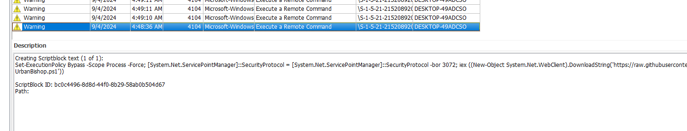
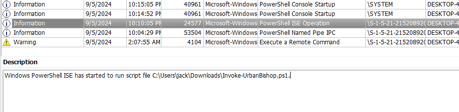
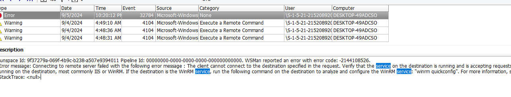
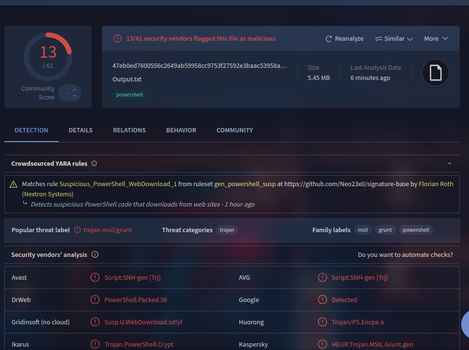
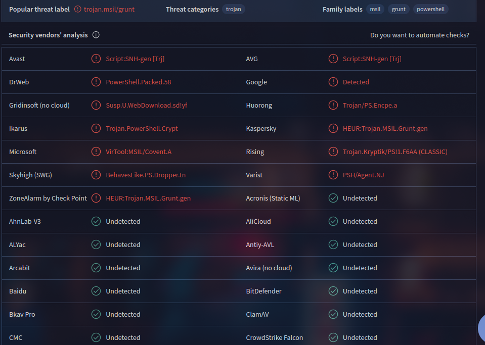

# Bad Blood

- Category: forensic
- Level: easy
- Description: Nothing is more dangerous than a bad guy that used to be a good guy. Something's going on... please talk with our incident response team.
- Challenge File: suspicious.evtx

`nc chal.competitivecyber.club 10001` to answer questions in order to retrieve the flag.


### Solutions:

##### Q1. Forensics found post exploitation activity present on system, network and security event logs. What post-exploitation script did the attacker run to conduct this activity?

- Answer: `Invoke-P0wnedshell.ps1`



- Explaination: The powershell script is being executed with bypassing security measures by having `Set-ExecutionPolicy Bypass -Scope Process -Force`, which allowing it to run regardless of the system's security settings. 

##### Q2. Forensics could not find any malicious processes on the system. However, network traffic indicates a callback was still made from his system to a device outside the network. We believe jack used process injection to facilitate this. What script helped him accomplish this?

- Answer: `Invoke-UrbanBishop.ps1.`



- Explaination: The powershell script can be found in Jack's downloads directory whereby it has run with powershell

##### Q3. We believe Jack attempted to establish multiple methods of persistence. What windows protocol did Jack attempt to abuse to create persistence?

- Answer: `WinRM`



- Explaination: Filters with the keyword 'service' and we noticed that WinRMhas error on connectivity issue which allows remote management of Windows machine

##### Q4. Network evidence suggest Jack established connection to a C2 server. What C2 framework is jack using?

- Answer: `Covenant`





- Explaination: Extract out the powershell script and pipe it into a text file (Do it a safe and isolated environment, Windows Defender will detect it). I tried submit the sha256 hash, it didnt work but uploading the file to VirusTotal gave the result

Script to extract Powershell script execution with Event ID 4104:

```powershell
# Set the path to your EVTX file
$evtxPath = "C:\Users\Administrator\Desktop\suspicious.evtx"

# Set the output text file path
$outputPath = "C:\Users\Administrator\Desktop\Output.txt"

# Get events with ID 4104
$events = Get-WinEvent -Path $evtxPath | Where-Object { $_.Id -eq 4104 }

# Extract descriptions and write to the output file
$events | ForEach-Object {
    $description = $_.Properties[2].Value
    Add-Content -Path $outputPath -Value $description
}

Write-Host "Extraction complete. Check $outputPath for the results."
```

**Flag:** `pctf{3v3nt_l0gs_reve4l_al1_a981eb}`


