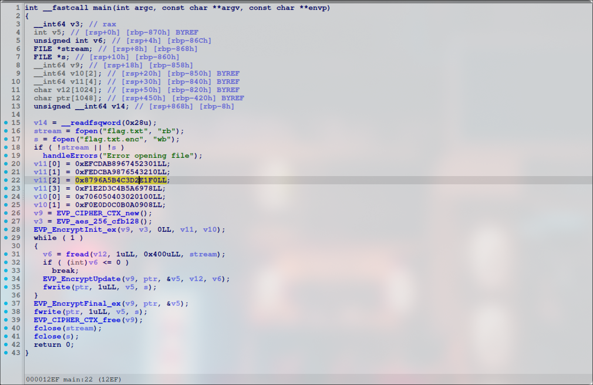

# Packed Full Of Surprises

### Description: 

I encrypted a file with a secret flag, but now I can't seem to figure out how to decrypt it, can you help?

- Challenge File: encrypt, flag.txt.enc

Solutions from: @bbmetr [original writeup](https://github.com/Bruno-Eijs/pctf2024_writeup)

#### Solution:

##### 1. Check debug symbols from encrypt binary file

```bash
file encrypt
encrypt: ELF 64-bit LSB shared object, x86-64, version 1 (SYSV), statically linked, no section header
```

From the output, binary is labeled "statically linked" and "no section header" suggests it has been packed or compressed

##### 2. Unpack the binary

```bash
upx -d encrypt
                       Ultimate Packer for eXecutables
                          Copyright (C) 1996 - 2024
UPX 4.2.4       Markus Oberhumer, Laszlo Molnar & John Reiser    May 9th 2024

        File size         Ratio      Format      Name
   --------------------   ------   -----------   -----------
     23959 <-      7072   29.52%   linux/amd64   encrypt

Unpacked 1 file.
```

##### 3. Disassemble the binary and view the main function



```c
int __fastcall main(int argc, const char **argv, const char **envp)
{
  __int64 v3; // rax
  int v5; // [rsp+0h] [rbp-870h] BYREF
  unsigned int v6; // [rsp+4h] [rbp-86Ch]
  FILE *stream; // [rsp+8h] [rbp-868h]
  FILE *s; // [rsp+10h] [rbp-860h]
  __int64 v9; // [rsp+18h] [rbp-858h]
  __int64 v10[2]; // [rsp+20h] [rbp-850h] BYREF
  __int64 v11[4]; // [rsp+30h] [rbp-840h] BYREF
  char v12[1024]; // [rsp+50h] [rbp-820h] BYREF
  char ptr[1048]; // [rsp+450h] [rbp-420h] BYREF
  unsigned __int64 v14; // [rsp+868h] [rbp-8h]

  v14 = __readfsqword(0x28u);
  stream = fopen("flag.txt", "rb");
  s = fopen("flag.txt.enc", "wb");
  if ( !stream || !s )
    handleErrors("Error opening file");
  v11[0] = 0xEFCDAB8967452301LL;
  v11[1] = 0xFEDCBA9876543210LL;
  v11[2] = 0x8796A5B4C3D2E1F0LL;
  v11[3] = 0xF1E2D3C4B5A6978LL;
  v10[0] = 0x706050403020100LL;
  v10[1] = 0xF0E0D0C0B0A0908LL;
  v9 = EVP_CIPHER_CTX_new();
  v3 = EVP_aes_256_cfb128();
  EVP_EncryptInit_ex(v9, v3, 0LL, v11, v10);
  while ( 1 )
  {
    v6 = fread(v12, 1uLL, 0x400uLL, stream);
    if ( (int)v6 <= 0 )
      break;
    EVP_EncryptUpdate(v9, ptr, &v5, v12, v6);
    fwrite(ptr, 1uLL, v5, s);
  }
  EVP_EncryptFinal_ex(v9, ptr, &v5);
  fwrite(ptr, 1uLL, v5, s);
  EVP_CIPHER_CTX_free(v9);
  fclose(stream);
  fclose(s);
  return 0;
}
```
From the disassemble code, it contain functions like `EVP_CIPHER_CTX_new()`, `EVP_aes_256_cfb128()`, `EVP_EncryptInit_ex(v9, v3, 0LL, v11, v10)`, `EVP_EncryptUpdate(v9, ptr, &v5, v12, v6);` and `EVP_EncryptFinal_ex(v9, ptr, &v5);`. From this [source](https://medium.com/@amit.kulkarni/encrypting-decrypting-a-file-using-openssl-evp-b26e0e4d28d4), we know it use OpenSSL library to encrypt the files. 

In short: 
- EVP\_CIPHER\_CTX\_new() : Creates a cipher context
- EVP\_CIPHER\_CTX\_free() : Clears all information from a cipher context and frees up any allocated memory associate with it, including context itself
- EVP\_EncryptInit\_ex(): Sets up cipher context for encryption with cipher type from ENGINE implementation

##### 4. Create a decryption script

in c:

```c
#include <stdio.h>
#include <openssl/evp.h>

int main()
{
    size_t bytes_read;
    int bytes_read_int;
    int bytes_encrypted;

    unsigned char iv[] = { 0x00, 0x01, 0x02, 0x03, 0x04, 0x05, 0x06, 0x07, 0x08, 0x09, 0x0a, 0x0b, 0x0c, 0x0d, 0x0e, 0x0f};
    unsigned char key[] = {0x01, 0x23, 0x45, 0x67, 0x89, 0xab, 0xcd, 0xef, 0x10, 0x32, 0x54, 0x76, 0x98, 0xba, 0xdc, 0xfe, 0xf0, 0xe1, 0xd2, 0xc3, 0xb4, 0xa5, 0x96, 0x87, 0x78, 0x69, 0x5a, 0x4b, 0x3c, 0x2d, 0x1e, 0x0f};

    unsigned char flag_buf [1024];
    unsigned char enc_buf [1048];

    EVP_CIPHER *cipher;
    EVP_CIPHER_CTX *cipher_context;

    FILE *fp_flag = fopen("flag.txt","wb");
    FILE *fp_enc = fopen("flag.txt.enc","rb");

    cipher_context = EVP_CIPHER_CTX_new();
    cipher = EVP_aes_256_cfb128();
    EVP_DecryptInit_ex(cipher_context, cipher, (ENGINE *)0x0, key, iv);
    while( 1 ) 
    {
        bytes_read = fread(enc_buf, 1, 0x400, fp_enc);
        bytes_read_int = (int)bytes_read;
        if (bytes_read_int < 1)  break;
        EVP_DecryptUpdate(cipher_context, flag_buf, &bytes_encrypted, enc_buf, bytes_read_int);
        fwrite(flag_buf, 1, (size_t)bytes_encrypted, fp_flag);
    }
    EVP_DecryptFinal_ex(cipher_context, flag_buf, &bytes_encrypted);
    fwrite(flag_buf, 1, (size_t)bytes_encrypted, fp_flag);
    EVP_CIPHER_CTX_free(cipher_context);
    fclose(fp_flag);
    fclose(fp_enc);
    return 0;
}
```

or in python:

```py
from Crypto.Cipher import AES

def to_little_endian(hex_str):
    # 0x,'LL' delete
    cleaned_str = hex_str.replace('0x', '').replace('LL', '')
    # padding
    if len(cleaned_str) % 2 != 0:
        cleaned_str = '0' + cleaned_str
    # change_little_endian
    little_endian_str = ''.join(reversed([cleaned_str[i:i+2] for i in range(0, len(cleaned_str), 2)]))
    return little_endian_str

v11_0 = to_little_endian('0xEFCDAB8967452301LL')
v11_1 = to_little_endian('0xFEDCBA9876543210LL')
v11_2 = to_little_endian('0x8796A5B4C3D2E1F0LL')
v11_3 = to_little_endian('0xF1E2D3C4B5A6978LL')
v10_0 = to_little_endian('0x706050403020100LL')
v10_1 = to_little_endian('0xF0E0D0C0B0A0908LL')

key = bytes.fromhex(v11_0 + v11_1 + v11_2 + v11_3)
iv = bytes.fromhex(v10_0 + v10_1)

print(f"Key: {key.hex()}")
print(f"IV: {iv.hex()}")

read file
with open('flag.txt.enc', 'rb') as f:
    encrypted_data = f.read()

print(f"Encrypted data (hex): {encrypted_data.hex()}")

AES-256-CFB128
cipher = AES.new(key, AES.MODE_CFB, iv, segment_size=128)
decrypted_data = cipher.decrypt(encrypted_data)

print("Decrypted Data (UTF-8):", decrypted_data.decode('utf-8'))
```

**Flag:** `PCTF{UPX_15_2_3A$y_t0_uNp4cK}`
