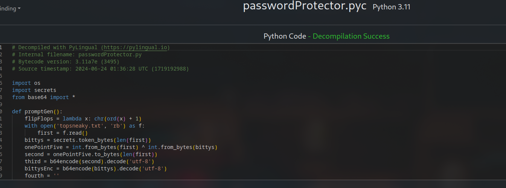

# Password Protector

### Description:

We've been after a notorious skiddie who took the "Is it possible to have a completely secure computer system" question a little too literally. After he found out we were looking for them, they moved to live at the bottom of the ocean in a concrete box to hide from the law. Eventually, they'll have to come up for air...or get sick of living in their little watergapped world. They sent us this message and executable. Please get their password so we can be ready.

"Mwahahaha you will nOcmu{9gtufever crack into my passMmQg8G0eCXWi3MY9QfZ0NjCrXhzJEj50fumttU0ympword, i'll even give you the key and the executable:::: Zfo5ibyl6t7WYtr2voUEZ0nSAJeWMcN3Qe3/+MLXoKL/p59K3jgV"

- Challenge File: passwordProtector.pyc

Solutions from: @Cookies to SELL and @kzb

### Solution:

##### 1. Use pylingual.io to decompile the pyc file



After decompile:

```py
import os
import secrets
from base64 import *

def promptGen():
    flipFlops = lambda x: chr(ord(x) + 1)       # shifting each characters to next (A -> B)
    with open('topsneaky.txt', 'rb') as f:
        first = f.read()
    bittys = secrets.token_bytes(len(first))    # getting random bytes with the length of "first", which is also the length of "topsneaky.txt"
    onePointFive = int.from_bytes(first) ^ int.from_bytes(bittys)   # xor first and bittys 
    second = onePointFive.to_bytes(len(first))   # convert OnePointFive to hex bytes with the length of "first"
    third = b64encode(second).decode('utf-8')  # encode second with base64
    bittysEnc = b64encode(bittys).decode('utf-8')  # encode bittys with base64
    fourth = ''
    for each in third:
        fourth += flipFlops(each)  # adding "each" after going through flipFlops functions and then putting into "fourth"
    fifth = f"Mwahahaha you will n{fourth[0:10]}ever crack into my pass{fourth[10:]}word, i'll even give you the key and the executable:::: {bittysEnc}"
    return fifth

def main():
    print(promptGen())
if __name__ == '__main__':
    main()
```
##### 2. Reverse the function of promptGen() function

- shifting characters back with `chr(ord(x)-1`
- combine the reverse characters and decode it in base64 -> second
- base64 decode bittysEnc -> bittys
- XOR second and bittys 

```py
# Mwahahaha you will nOcmu{9gtufever crack into my passMmQg8G0eCXWi3MY9QfZ0NjCrXhzJEj50fumttU0ympword, i'll even give you the key and the executable:::: Zfo5ibyl6t7WYtr2voUEZ0nSAJeWMcN3Qe3/+MLXoKL/p59K3jgV

import base64

string1="Ocmu{9gtuf"
string2="MmQg8G0eCXWi3MY9QfZ0NjCrXhzJEj50fumttU0ymp"
string3="Zfo5ibyl6t7WYtr2voUEZ0nSAJeWMcN3Qe3/+MLXoKL/p59K3jgV"

fourth=string1+string2
# print(fourth)

# Function to reverse flipFlops
def reverse_flip_flops(encoded_str):
    return ''.join([chr(ord(x)-1) for x in encoded_str])

# XOR decoding function
def xor_decrypt(encoded_bytes, key_bytes):
    return bytes([b1 ^ b2 for b1, b2 in zip(encoded_bytes, key_bytes)])

# zip() pairs up corresponding elements from encoded_bytes and key_bytes
# XOR operation between b1 and b2 from encoded_bytes and key_bytes

# Reverse flipFlops for the transformed base64 string
reversed_flips=reverse_flip_flops(fourth)
# print(reversed_flips)
# Nbltz8fsteLlPf7F/dBWVh2LX8PeY/MiBqWgyIDi4/etlssT/xlo
# echo "Nbltz8fsteLlPf7F/dBWVh2LX8PeY/MiBqWgyIDi4/etlssT/xlo" | base64 -d | xxd -p
# same output as decoded_bytes

# Add padding to the reversed string if needed
while len(reversed_flips) % 4 != 0:
    reversed_flips += '='

# Base64 decode the reversed string
decoded_bytes=base64.b64decode(reversed_flips)
print("Decoded bytes (second): \n", decoded_bytes)

# Base64 decoding of key string
bittys=base64.b64decode(string3)
print("Decoded key (string3): \n", bittys)

# XOR decode to get back the contents of the topsneaky.txt file
original_content=xor_decrypt(decoded_bytes, bittys)
print("Original content (bytes):", original_content)
```
##### Output from the script

```
Decoded bytes (second):
 b'5\xb9m\xcf\xc7\xec\xb5\xe2\xe5=\xfe\xc5\xfd\xd0VV\x1d\x8b_\xc3\xdec\xf3"\x06\xa5\xa0\xc8\x80\xe2\xe3\xf7\xad\x96\xcb\x13\xff\x19h'
Decoded key (string3):
 b'e\xfa9\x89\xbc\xa5\xea\xde\xd6b\xda\xf6\xbe\x85\x04gI\xd2\x00\x97\x961\xc3wA\xed\xff\xf8\xc2\xd7\xa0\xa2\xff\xa7\x9fJ\xde8\x15'
Original content (bytes): b'PCTF{I_<3_$3CUR1TY_THR0UGH_0B5CUR1TY!!}'
```

**Flag:** `PCTF{I_<3_$3CUR1TY_THR0UGH_0B5CUR1TY!!}`
