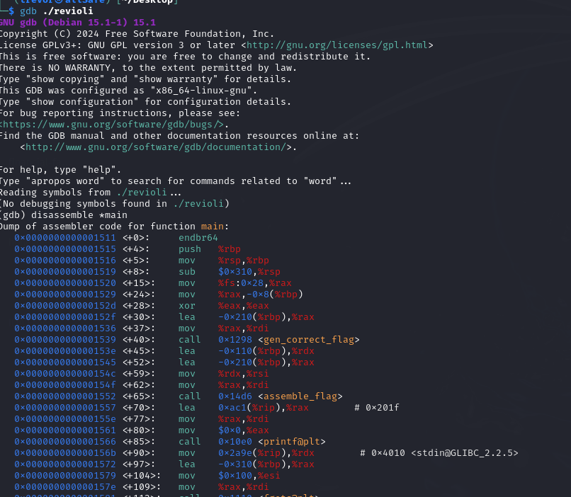
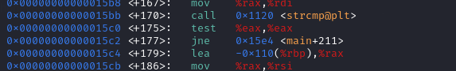

# Revioli, Revioli, give me the formeoli	

### Description: 

Can you unlock the secret formula?

- Challenge File: revioli

Solutions from: 0x251e, @Monsieur Thomas, @Muthra

### Solution (1):

##### 1. Use ltrace to get the flag in clear text as an argument of strcmp() function

```
ltrace ./revioli 
snprintf("0", 20, "%llu", 0)                                                                                                      = 1
strcat("", "0")                                                                                                                   = "0"
snprintf("1", 20, "%llu", 1)                                                                                                      = 1
strcat("0", "1")                                                                                                                  = "01"
snprintf("1", 20, "%llu", 1)                                                                                                      = 1
strcat("01", "1")                                                                                                                 = "011"
snprintf("2", 20, "%llu", 2)                                                                                                      = 1
strcat("011", "2")                                                                                                                = "0112"
snprintf("3", 20, "%llu", 3)                                                                                                      = 1
strcat("0112", "3")                                                                                                               = "01123"
snprintf("5", 20, "%llu", 5)                                                                                                      = 1
strcat("01123", "5")                                                                                                              = "011235"
snprintf("8", 20, "%llu", 8)                                                                                                      = 1
strcat("011235", "8")                                                                                                             = "0112358"
snprintf("13", 20, "%llu", 13)                                                                                                    = 2
strcat("0112358", "13")                                                                                                           = "011235813"
snprintf("21", 20, "%llu", 21)                                                                                                    = 2
strcat("011235813", "21")                                                                                                         = "01123581321"
snprintf("34", 20, "%llu", 34)                                                                                                    = 2
strcat("01123581321", "34")                                                                                                       = "0112358132134"
snprintf("55", 20, "%llu", 55)                                                                                                    = 2
strcat("0112358132134", "55")                                                                                                     = "011235813213455"
snprintf("89", 20, "%llu", 89)                                                                                                    = 2
strcat("011235813213455", "89")                                                                                                   = "01123581321345589"
snprintf("144", 20, "%llu", 144)                                                                                                  = 3
strcat("01123581321345589", "144")                                                                                                = "01123581321345589144"
snprintf("233", 20, "%llu", 233)                                                                                                  = 3
strcat("01123581321345589144", "233")                                                                                             = "01123581321345589144233"
snprintf("377", 20, "%llu", 377)                                                                                                  = 3
strcat("01123581321345589144233", "377")                                                                                          = "01123581321345589144233377"
snprintf("ITALY_01123581321345589144233377"..., 256, "ITALY_%s", "01123581321345589144233377")                                    = 32
snprintf("PCTF{ITALY_011235813213455891442"..., 256, "PCTF{%s}", "ITALY_01123581321345589144233377"...)                           = 38
printf("Enter-a the password-a: ")                                                                                                = 24
fgets(Enter-a the password-a: 

```

### Solution (2): 

##### 1. Use GDB to identify the strcmp call which compares the password with the correct one




##### 2. Step breakpoint at main to step through the program and understand its flow

```
gdb) break *main
Breakpoint 1 at 0x1511
(gdb) run
Starting program: /home/trevor/Desktop/revioli 
[Thread debugging using libthread_db enabled]
Using host libthread_db library "/lib/x86_64-linux-gnu/libthread_db.so.1".

Breakpoint 1, 0x0000555555555511 in main ()
(gdb) ni
0x0000555555555515 in main ()
(gdb) ni
0x0000555555555516 in main ()
(gdb) ni
0x0000555555555519 in main ()
(gdb) 
```

ni means next instruction to step through the program line by line until it prompts for inputs

```
(gdb) ni
Enter-a the password-a: abcda
0x0000555555555586 in main ()
(gdb) ni
```

Input is received by the program and it will store value into the register and compares

##### 3. Manipulate the EAX register

After strcmp call, there is a test instruction which compare value in eax register, if it is same, it will return a zero flag. 
Manipulating the EAX register's value to 0 means forcing the program to check true for password entered. 

Before manipulating:
```
gdb) info register
rax            0x15                21
rbx            0x7fffffffded8      140737488346840
rcx            0x7ffff7ec64e0      140737352852704
```

After manipulating:
```
(gdb) set $eax=0
(gdb) info register
rax            0x0                 0
rbx            0x7fffffffded8      140737488346840
rcx            0x7ffff7ec64e0      140737352852704
```
##### 4. Setting Through the program to retrieve flag

```
0x00005555555555dd in main ()
(gdb) ni
Congratulations! The flag is: PCTF{ITALY_01123581321345589144233377}
```

### Solution 3:

With IDA, disassemble to program to view the pseudocode of main function

main function: 

```c
int __fastcall main(int argc, const char **argv, const char **envp)
{
  char s[256]; // [rsp+0h] [rbp-310h] BYREF
  char s2[256]; // [rsp+100h] [rbp-210h] BYREF
  char v6[264]; // [rsp+200h] [rbp-110h] BYREF
  unsigned __int64 v7; // [rsp+308h] [rbp-8h]

  v7 = __readfsqword(0x28u);                    
  gen_correct_flag(s2, argv, envp);         //gen_correct_flag function
  assemble_flag(s2, v6);                    //assemble_flag function
  printf("Enter-a the password-a: ");
  fgets(s, 256, _bss_start);                
  s[strcspn(s, "\n")] = 0;                  //compare input
  if ( !strcmp(s, s2) )                         
    printf("Congratulations! The flag is: %s\n", v6);
  else
    puts("No toucha my spaget!");
  return 0;
}

gen_correct_flag function:

```c
v38 = __readfsqword(0x28u);
  for ( i = 0; i <= 14; ++i )
    v4[i] = calc((unsigned int)i);    //calc function
  *(_QWORD *)dest = 0LL;


for ( j = 0; j <= 14; ++j )
  {
    snprintf(s, 0x14uLL, "%llu", v4[j]);
    strcat(dest, s);
  }
  snprintf(a1, 0x100uLL, "ITALY_%s", dest);   //append input with ITALY_
  return v38 - __readfsqword(0x28u);
}
```

calc function: 
```c
 if ( !a1 )      // base case
    return 0LL;
  if ( a1 == 1 )
    return 1LL;  // base case
  v3 = 0LL;
  v4 = 1LL;
  for ( i = 2; i <= a1; ++i )  // recursive case
  {
    v5 = v3 + v4;   //fibbonnaci 
    v3 = v4;
    v4 = v5;
  }
  return v4;
}
```

So, we need to calculate Fibboancci sequence from 0 to 14 and append it with "ITALY_" and it will return a flag

```py
a,b=0,1
fibb=str(a)
for _ in range(14):
    fibb+=str(b)
    a,b=b,a+b
print(fibb)
```

```
./revioli
Enter-a the password-a: ITALY_01123581321345589144233377
Congratulations! The flag is: PCTF{ITALY_01123581321345589144233377}
```

**Flag:** `PCTF{out_0f_0ffic3_out_0f_M1nd}`
