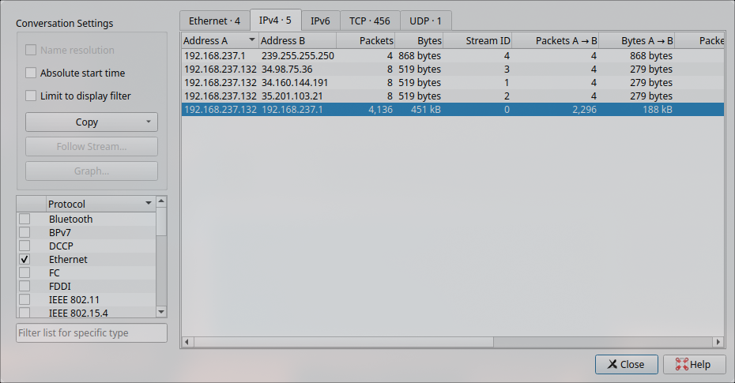
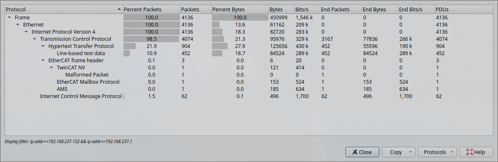

# Simple Exfiltration

- Category: forensic
- Level: easy
- Description: We've got some reports about information being sent out of our network. Can you figure out what message was sent out.
- Challenge file: exfiltration\_activity\_pctf\_challenge.pcapng

### Solution:

##### 1. Checks the conversations from each points 



From here, we notice a huge amount of packets being exchanged between `192.168.237.132` and `192.168.237.1`. My assumptions would be that `192.168.237.1` is the gateway which performs NAT to mask external IP address. 

##### 2. Filter through Protocol Hierarchy



After going through different protocol that may be suspicious to data exfiltration for instance HTTP and AMS, I found ICMP protocol contain a pattern of flag in it.

```
ip.addr==192.168.237.132 && ip.addr==192.168.237.1 && icmp
```

This is the Wireshark filter to see ICMP packet between those two endpoints

##### 3. Use tshark to scrap out hidden text in ICMP packets

```bash
tshark -r exfiltration_activity_pctf_challenge.pcapng -Y "icmp" -T fields -e ip.ttl | awk '{ printf "%c", $1 }'
```

Also, this is the Wireshark filters:
```
ip.ttl && icmp && ip.src==192.168.237.132
```

This is to get the hidden text from ICMP echo requests and extract the TTL field which is a value in IP header to indicates how many hops a packet can take. 

**Flag:** `pctf{time_to_live_exfiltration}`

##### Information:

Attackers sometimes manipulates unsusipicious field like the TTL in network protocols in order to exfiltrate data in a way to avoids detection. This is because that TTL value can carry hidden data since most networking tools doesn't inspect for such purposes


