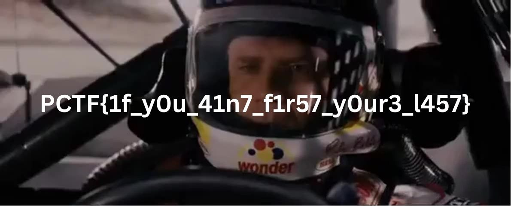

# Slingshot

- Category: forensic
- Description: -We have recently suffered a data breach, and we need help figuring out if any data was stolen. Can you investigate this pcap file and see if there is any evidence of data exfiltration and if possible, what was stolen.
- Challenge file: Slingshot.pcapng

### Solution: 

```py
from pwn import xor
from scapy.all import *

packets = rdpcap('Slingshot.pcapng')
data_bytes = bytearray()

for packet in packets:
    if packet.dport == 22993:
        if packet.haslayer(Raw):
            if len(packet.load) > 1:
                key_bytes = str(int(packet.time))
                data_bytes.extend(packet.load)

with open('flag.jpg', 'wb') as f:
    f.write(xor(data_bytes, key_bytes))

```


