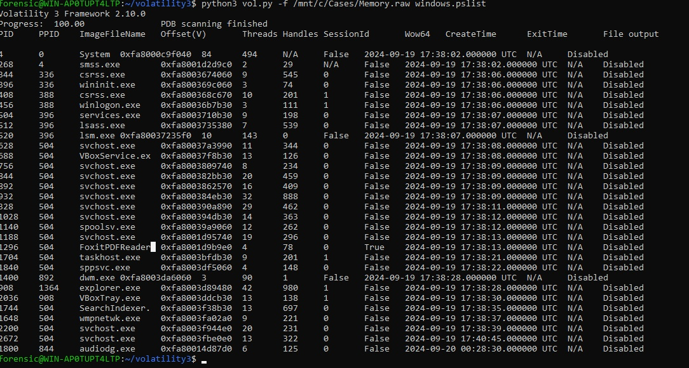
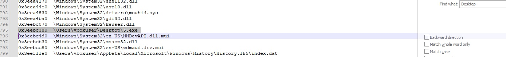

# Easy Forensic

Redteam simulated a malware that had penetrated the system, we couldn't find any evidence on the drive, but we suspect it used some kind of persistence technique that we don't know about, can you find it?

- Category: forensic
- Challenge file: Memory.raw

**I only managed to solve this challenge halfway**

### Solution:

##### 1. Check pslist for suspicious activity

```bash
$ python3 vol.py -f /mnt/c/Cases/Memory.raw windows.pslist
```



From the output, FoxitPDFReader seems offbeat and based on the questions the clue is `persistence technique`. Therefore, my assumption would be a malicious PDF had install some dropper at user directory or maybe manipulate the hive registry. 


##### 2. Check filescan for suspicious files

```bash
$ vol.py -f /mnt/c/Cases/Memory.raw windows.filescan > /mnt/c/Cases/filescan.txt  
```

Suspicious File: `\Users\vboxuser\Desktop\5.exe`



VirusTotal Summary: [5.exe](https://www.virustotal.com/gui/file/d6f47fb2f3d78fef76d0e04590bd8b650a45805e98a6d025acc4a657e2b90ee7)

##### 3. Dump file check for unique strings

Dump 5.exe:
```bash
$ python3 vol.py -f /mnt/c/Cases/Memory.raw -o /mnt/c/Cases/FoxitPDFReader-filedump/ windows.dumpfiles --physaddr 0x3eebc380
```

Check strings in 5.exe
```
$ strings /mnt/c/Cases/FoxitPDFReader-filedump/file.0x3eebc380.0xfa8001c37420.DataSectionObject.5.exe.dat -n 20
```

We can notice a unique base64 string: `UGFzc3dvcmQgaXMge0ZpbGVsZXNzLU1hbHdhcmUtUGVyc2lzdGVuY2V9`

##### 4. Decode the base64 string

```bash
$ echo "UGFzc3dvcmQgaXMge0ZpbGVsZXNzLU1hbHdhcmUtUGVyc2lzdGVuY2V9" | base64 -d
Password is {Fileless-Malware-Persistence}
```

Since it doesn't have any flag header, I assume this was the flag, but the administrator didn't respond to my query on flag header requirements.
