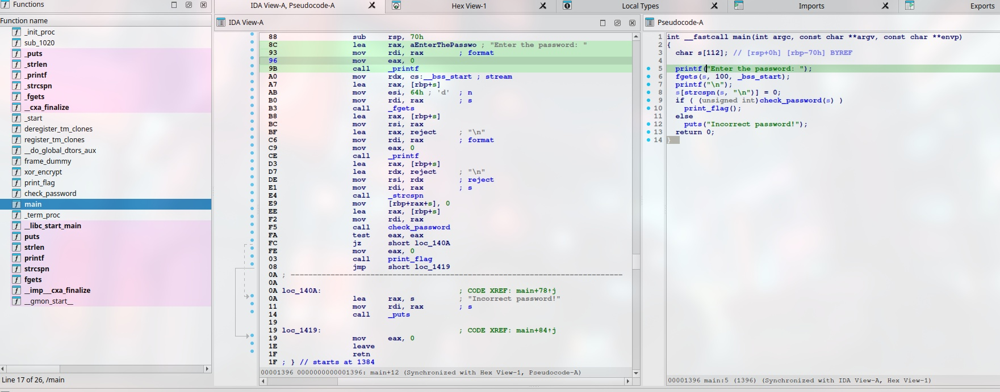

# RE

Reverse me
Password (if required): infected
Format: FLAG{this\_is\_flag}

- Category: reverse
- Challenge File: filedanger

### Solution:

##### 1. Determine whether binary file is packed

```bash
$ file filedanger
filedanger: ELF 64-bit LSB pie executable, x86-64, version 1 (SYSV), statically linked, no section header
```

From the output, we able to notice that `no section header` which is stripped or packed, which means unpacking the binary is needed since we do not have  information about the structure of the ELF file, such as code, data, and symbol sections. If they are missing, it could be an indication of a packed binary or one that has been deliberately stripped to make reverse engineering more difficult.

To unpacked it, we can use upx 


##### 2. Unpack the binary file

```bash
$ upx -d filedanger
                       Ultimate Packer for eXecutables
                          Copyright (C) 1996 - 2024
UPX 4.2.4       Markus Oberhumer, Laszlo Molnar & John Reiser    May 9th 2024

        File size         Ratio      Format      Name
   --------------------   ------   -----------   -----------
     24703 <-      6808   27.56%   linux/amd64   filedanger

Unpacked 1 file.
```

Next, we can verify it via file command

```bash
$ file filedanger
filedanger: ELF 64-bit LSB pie executable, x86-64, version 1 (SYSV), dynamically linked, interpreter /lib64/ld-linux-x86-64.so.2, BuildID[sha1]=e1e8acf7dfb95c74ffd9ba451e148ac735775407, for GNU/Linux 3.2.0, not stripped
```

And we can try to run the binary, is a typically crackme challenge

```bash
$  ./filedanger
Enter the password: test

Incorrect password!
```

##### 3. Disassemble the binary file



We can view the list of function on the left and notice interesting function like `check_password`, `xor_decrypt` and `print_flag`.

This is the C pseudocode from the binary's main function:

```c
  char s[112]; // [rsp+0h] [rbp-70h] BYREF

  printf("Enter the password: ");
  fgets(s, 100, _bss_start);
  printf("\n");
  s[strcspn(s, "\n")] = 0;
  if ( (unsigned int)check_password(s) )
    print_flag();
  else
    puts("Incorrect password!");
  return 0;
}
```

This main function takes in user input as string and assign it to s variable and use `check_password` function to validate, if the password is right, `print_flag` is return, else `"Incorrect password!"`

##### 4. Analyze check\_password and print\_flag

C pseudocode for `check_password`:
```c
BOOL8 __fastcall check_password(__int64 a1)
{
  if ( strlen((const char *)a1) != 10 )
    return 0LL; // check password length is 10
  if ( *(_BYTE *)a1 != 114 || *(_BYTE *)(a1 + 1) != 101 )
    return 0LL; // check input string with ASCII character
  if ( *(_BYTE *)(a1 + 2) != 112 || *(_BYTE *)(a1 + 3) != 97 )
    return 0LL; // same as before 
  if ( *(_BYTE *)(a1 + 4) != 115 || *(_BYTE *)(a1 + 5) != 115 )
    return 0LL; // same as before
  if ( *(_BYTE *)(a1 + 6) != 119 || *(_BYTE *)(a1 + 7) != 111 )
    return 0LL; // same as before
  return *(_BYTE *)(a1 + 8) == 114 && *(_BYTE *)(a1 + 9) == 100;
}
```
The `check_password` function checks for 10 characters are contain in the input string and then compare its value for every two byte with ASCII value

Conversion of ASCII character:
- 114 = r
- 101 = e
- 112 = p
- 97 = a
- 115 = s
- 115 = s
- 119 = w
- 111 = o
- 114 = r
- 100 = d

So, here we know that the correct input password for the binary file is `repassword`

Now, let's take a look at `print_flag` function

C pseudocode for `print_flag`:
```c
nt print_flag()
{
  char v1[13]; // [rsp+3h] [rbp-3Dh] BYREF
  _QWORD v2[3]; // [rsp+10h] [rbp-30h] BYREF
  _QWORD v3[3]; // [rsp+28h] [rbp-18h]

  v2[0] = 0x1317111E3438292DLL;
  v2[1] = 0x1150162C1C161911LL;
  v2[2] = 0x404423F3A1F4717LL;
  v3[0] = 0x54181A513B1A302DLL;
  *(_DWORD *)((char *)v3 + 7) = 407121236;
  strcpy(v1, "keysecretkey");
  xor_encrypt(v2, v1, 35LL);
  return printf("Password correct, please see flag: %s\n", (const char *)v2);
}
```
`print_flag` function has `xor_encrypt` function which decrypt the value in v2 with the key of `keysecretkey`, and then print out the flag if the input password matches.

C pseudocode for `xor_encrypt`:
```c
{
  char v3; // r12
  __int64 result; // rax
  unsigned int i; // [rsp+2Ch] [rbp-14h]

  for ( i = 0; ; ++i )
  {
    result = i;
    if ( (int)i >= a3 )
      break;
    v3 = *(_BYTE *)((int)i + a1);
    *(_BYTE *)((int)i + a1) = a2[(int)i % strlen(a2)] ^ v3;
  }
  return result;
}
```
##### Input `repassword` to get the flag

```bash
$ ./filedanger
Enter the password: repassword

Password correct, please see flag: FLAG{reverseGs)br$m_K)a}FUcH4yj1Y/}v
```

**Flag:** `FLAG{reverseGs)br$m_K)a}FUcH4yj1Y/}`

