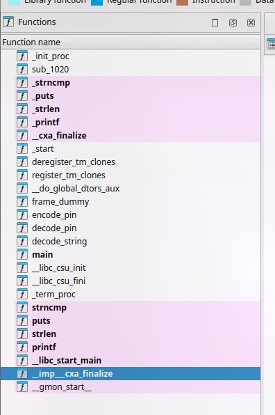

# Authorize by PIN

Small easy crackme, where you gotta guess the pin :)

- Category: rev
- Challenge author: AnanasCharles
- Challenge link: [crackmes.one](https://crackmes.one/crackme/6617d3a5cddae72ae250c556)

### Solution:

##### 1. Use IDA to decompile the binary

As the binary file is not stripped, we can notice functions like `main`, `encode_pin`,`decode_pin` and `decode_string`



##### 2. Analyze main function 

```c
int __fastcall main(int argc, const char **argv, const char **envp)
{
  size_t v4; // rdx
  const char *v5; // [rsp+10h] [rbp-30h]
  size_t v6; // [rsp+28h] [rbp-18h]
  char *s1; // [rsp+38h] [rbp-8h]

  if ( argc == 2 )
  {
    s1 = (char *)decode_pin(argv[1], argv, envp);
    v6 = strlen(argv[1]);
    v4 = strlen("8446");
    if ( !strncmp(s1, "8446", v4) && v6 == strlen(s1) )
    {
      puts("Correct PIN entered!");
      v5 = (const char *)decode_string("}|.wOlHtc}j@z9jf3 O Q", argv[1]);
      printf("Decoded String: %s\n", v5);
      return 0;
    }
    else
    {
      puts("This is not right");
      return 1;
    }
  }
  else
  {
    printf("Usage: %s <pin>\n", *argv);
    return 1;
  }
}
```

From the main function, there are key points would like to highlight:
- To execute the file, `./authorize <PIN>`, as it will check the second argument
- After that the `<PIN>` that was input will be use by calling `decode_pin()` -> need futher analysis
- After `decode_pin()` function, the value will be stored as s1
- v6 stores the length of the raw input of PIN
- v4 is set to the length of "8446" which is 4
- First comparison: s1 (decoded PIN) must be equal to "8446" and v6 has the length of 4

To analyze deeper, we have the options to either analyze `decode_pin` or `decode_string`
