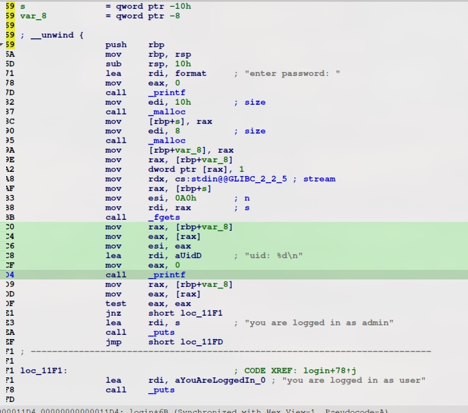
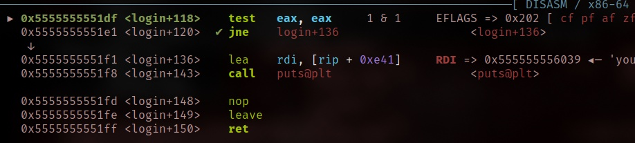
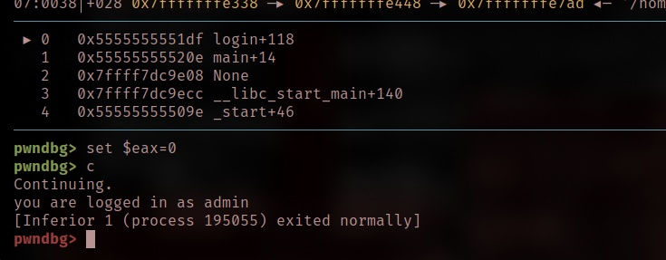

# Simple Overflow

This is a very simple crackme. The goal is to get "you are logged in as admin". Patching is not allowed. The solution should contain an exact description, how this works. Have fun!

- Category: rev
- Challenge author: BitFriends
- Challenge link: [crackmes.one](https://crackmes.one/crackme/5f05ec3c33c5d42a7c66792b)

### Solution:

##### 1. Run the binary

```bash
$ ./a.out
enter password: test
uid: 1
you are logged in as user
```

The binary accept any strings and logged in as user, but our goal is to logged in as admin


##### 2. Use IDA to view its assembly code

As the binary will have some check function to validate the admin input



To summarize the operations:
1. `sys_write` prints out the question 
2. `sys_read` takes input as `password` with the count of 16 bytes (0x10)
3. `_verify` iterates over the first four charaters by ASCII then add the result into r13 registers which will be compared with r15 registers
4. `_incorrect` if the check is failed
5. `_correct` if the check is correct

Dive deeper in the assembly:

```asm
test    eax, eax
jnz     short loc_11F1
lea     rdi, s          ; "you are logged in as admin"
```

We able to use debugger to manipulate the register value to jump to `lea` by fixing zero flag when breakpoint is set at `test` instruction. 

##### 3. Use GDB debugger

We can set breakpoint at `login` function and then set another breakpoints at `*0x5555555551DF`



Next, modify the register value of `eax` to 0 and then continue



Now, we are login in as admin


