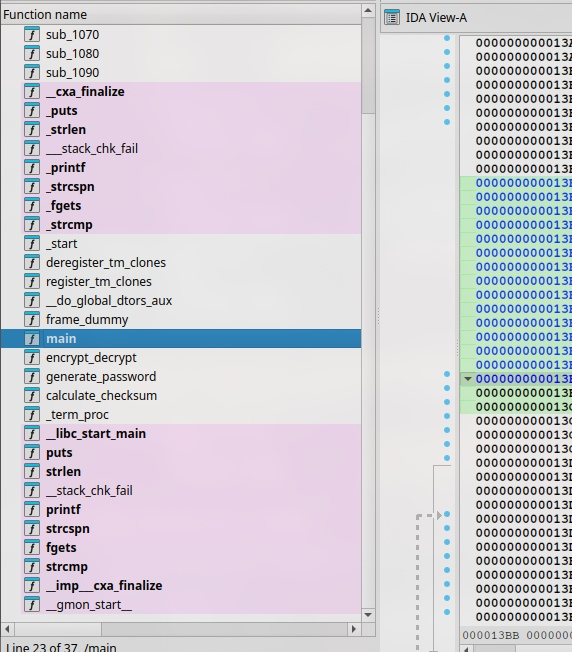
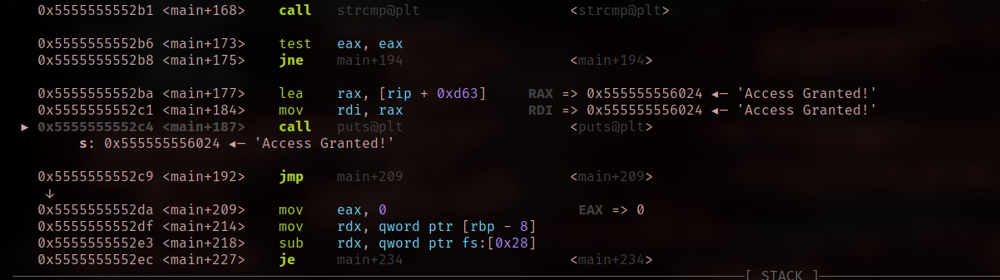

# Sexy 1337

We generate passwords around here.

- Category: rev
- Challenge author: RafaelGFreveng
- Challenge Link: [crackmes.one](https://crackmes.one/crackme/6715466c9b533b4c22bd18bb)

### Solution: 

##### 1. Use IDA to decompile the binary



Here, we notice a list of functions due the binary was not stripped.

##### 2. Check out main function

```c
int __fastcall main(int argc, const char **argv, const char **envp)
{
  char s[64]; // [rsp+0h] [rbp-80h] BYREF
  char s2[56]; // [rsp+40h] [rbp-40h] BYREF
  unsigned __int64 v6; // [rsp+78h] [rbp-8h]

  v6 = __readfsqword(0x28u);
  generate_password(s2, "sexy1337");
  encrypt_decrypt(s2, 4294967210LL);
  printf("Enter the password: ");
  fgets(s, 50, _bss_start);
  s[strcspn(s, "\n")] = 0;
  encrypt_decrypt(s, 4294967210LL);
  if ( !strcmp(s, s2) )
    puts("Access Granted!");
  else
    puts("Access Denied!");
  return 0;
}
```
To note:
- s2 is the variable is to store value after `generate_password` perform its operation with the value `sexy1337` as the argument (will take look into it later)
- s is the variable for the input 
- `encrypt_decrypt` is used for both s and s2 and then compare, so it does not compare directly. (will take look into it also)


##### 3. Analyze generate\_password function

```c
size_t __fastcall generate_password(__int64 a1, const char *a2)
{
  size_t result; // rax
  size_t i; // [rsp+10h] [rbp-10h]
  size_t v4; // [rsp+18h] [rbp-8h]

  v4 = strlen(a2);
  for ( i = 0LL; i < v4; ++i )
    *(_BYTE *)(a1 + i) = a2[i] + 3;
  result = a1 + v4;
  *(_BYTE *)(a1 + v4) = 0;
  return result;
}
```

This functions takes in `sexy1337` as the argument and then shift it by 3 characters
If `sexy1337` is the input, the output will be `vh{|466:`, yes it is a caesar cipher transformation.

##### 4. Analyze encrypt\_decrypt function

```c
__int64 __fastcall encrypt_decrypt(__int64 a1, char a2)
{
  __int64 result; // rax
  int i; // [rsp+18h] [rbp-4h]

  for ( i = 0; ; ++i )
  {
    result = *(unsigned __int8 *)(i + a1);
    if ( !(_BYTE)result )
      break;
    *(_BYTE *)(i + a1) ^= a2;
  }
  return result;
```

This function perform XOR operation from both `input` from the user and `vh{|466:`. In short, it uses XOR to perform a checksum whether it is a match for both. 

##### 5. Enter the correct password

```bash
$ ./sexy1337.out
Enter the password: vh{|466:
Access Granted!
```

#### 6. Using gdb debugger

Since our objective is to get access, we have the manipulate the value in the registers

```asm
test    eax, eax
jnz     short loc_12CB
lea     rax, s          ; "Access Granted!"
mov     rdi, rax        ; s
call    _puts
```

This assembly code locate at the last part of main. Here, it is check the zero flag register of eax, when the register of eax is set to 0, which means the condition is true, will print out "Access Granted", otherwise it will jump to address `loc_12B` which will print out `Access Denied`


```
b main
r
ni
set $rax=0
ni
exit
```

With this debugging flow, you will reach to `call` assembly instruction to print out `Access Granted`. 




