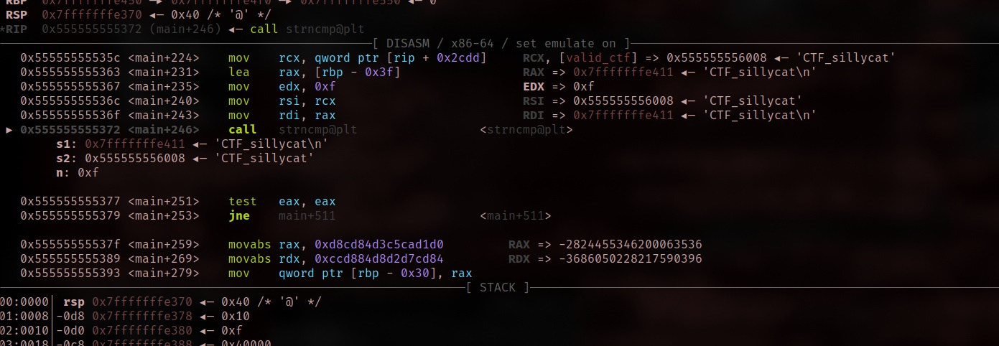
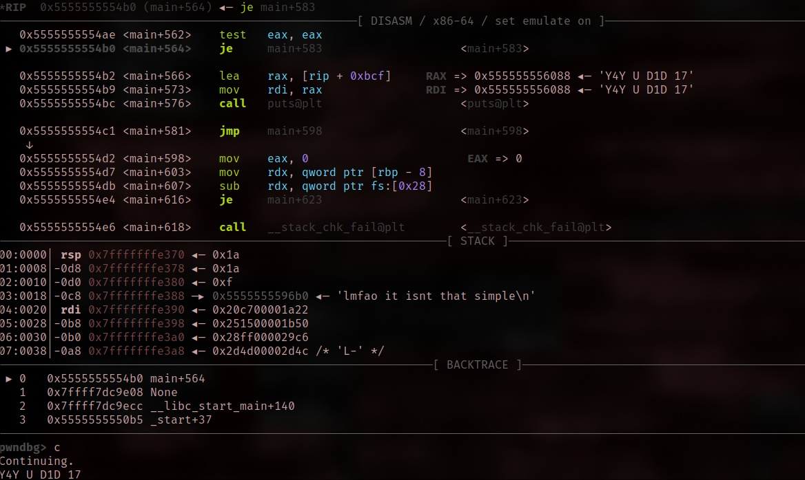

# simple ctf

find the flag!! flag starts with CTF_
warning: it doesnt strip '\n' from the end of your input

- Category: rev
- Challenge author: slice
- Challenge link: [crackmes.one](https://crackmes.one/crackme/66ee30341070323296555610)

### Solution:

##### 1. Run the binary

```bash
$ ./simple_ctf
D0 50M3 H4CK3r r3V
test
7rY 4641N
```

We can try with ltrace to check the strcmp value 

```bash
ltrace ./simple_ctf
puts("D0 50M3 H4CK3r r3V"D0 50M3 H4CK3r r3V)                             = 19
read(0test, "test\n", 15)                                                = 5
strncmp("test\n", "CTF_sillycat", 15)                                    = 49
puts("7rY 4641N"7rY 4641N)                                               = 10
+++ exited (status 0) +++
```
So the correct string is `CTF_sillycat` however the input contain `\n` which is newline character, so the binary doesn't remove.
By right, in the code should have `strtok` to remove newline character. Like this:

```c
strtok(input, "\n");
```

##### 2. Disassemble the binary with IDA

After decompiling the binary to view the C pseudocode, we can head to the main function:

```c
puts("D0 50M3 H4CK3r r3V");
  read(0, buf, 0xFuLL);
  if ( !strncmp(buf, valid_ctf, 0xFuLL) )
  {
    v10 = 0xD8CD84D3C5CAD1D0LL;
    *(_DWORD *)v11 = -757609084;
    *(_QWORD *)&v11[3] = 0x84D8C5CCD884D8D2LL;
    v12 = 0x6EC9D0D4D1CDD7LL;
    for ( size = 1LL; v11[size - 8]; ++size )
      ;
    v6 = (const char *)malloc(size);
    for ( i = 0LL; i != size; ++i )
      v6[i] = v11[i - 8] - 100;
    v6[size + 1] = 0;
    printf("%s", v6);
  }
```

This part of the code receive the input and compare it, we can use gdb debugger the remove the newline character

##### 3. GDB remove newline character



At this part, `s1 (RDI): 0x7fffffffe411` is the address of the first string, `"CTF_sillycat\n"`, which includes a newline at the end but `s2: 0x555555556008` is for address of the second string , `"CTF_sillycat"`, which doesn’t include a newline. 

To remove it: `set *((char*)0x7fffffffe41d) = 0`

###### 4. Going back the decompiler

Notice another function `compare_hashes`, making a comparison. If true, returns `Y4Y U D1D 17`, or else `7rY 4641N`

```c
ctfhash(buf, v8, 15LL);
  if ( (unsigned int)compare_hashes(v7, v8, 15LL) )
    puts("Y4Y U D1D 17");
  else
    puts("7rY 4641N");
  return 0;
}
```

This is the assembly of it:

```asm
lea     rcx, [rbp+var_80]
lea     rax, [rbp+buf]
mov     edx, 0Fh
mov     rsi, rcx
mov     rdi, rax
call    ctfhash
lea     rcx, [rbp+var_80]
lea     rax, [rbp+var_C0]
mov     edx, 0Fh
mov     rsi, rcx
mov     rdi, rax
call    compare_hashes
test    eax, eax        ; "set breakpoint and set eax to another value than 0"
jz      short loc_14C3
lea     rax, aY4yUD1d17 ; "Y4Y U D1D 17"
mov     rdi, rax        ; s
call    _puts
jmp     short loc_14D2  ; "7rY 4641N"
```

##### 5. Using gdb to modify the value of eax to other value to 0

Here it how:
```
b *0x5555555554ae
c
info registers
set $eax=1
c
```




