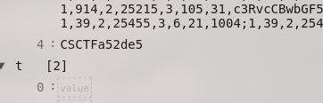

# Geometry Dash 1.2

I would give you the flag but I can't let go (haha get it). use GDBrowser for the last step btw.

Note: You do NOT need Geometry Dash purchased to solve this challenge.

- Category: Forensic
- Challenge File: CCLocalLevels.dat

### Solution

##### Step 1: Decrypt dat file

With this [script - gdcrypt.py](https://gist.githubusercontent.com/FaltoGH/b7563b425e10de41c56bf7af0dc4c864/raw/91275a4561cf658c63e3e02bb7cf5b5f7c1f3551/gdcrypt.py), able to decrypt the dat file

```py
import base64, zlib, re

def decrypt(filename):

    with open(filename, 'rb') as rbf:
        dat = rbf.read()

    a = [x^11 for x in dat]
    b = bytearray(a).decode()
    c = b.replace('-','+').replace('_','/')
    d = c.encode()
    e = base64.b64decode(d)
    f = e[10:]
    g = -zlib.MAX_WBITS
    h = zlib.decompress(f, g)
    i = h.decode()
    return i

def decrypt2(levelcipher):
    c = levelcipher.replace('-','+').replace('_','/')
    d = c.encode()
    e = base64.b64decode(d)
    f = e[10:]
    g = -zlib.MAX_WBITS
    h = zlib.decompress(f, g)
    i = h.decode()
    return i

def decrypt3(filename):
    xml = decrypt(filename)
    levelcipher = re.findall('<k>k4</k><s>(.+)</s><k>k5</k>', xml)[0]
    levelstring = decrypt2(levelcipher)
    xml2 = xml.replace(levelcipher, levelstring)
    return xml2

xml = decrypt3('CCLocalLevels.dat')

with open('a.txt', 'wt') as wtf:
    wtf.write(xml)
```

##### Step 2: Analyze a.txt after decrypting 

```sh
file a.txt
a.txt: XML 1.0 document, ASCII text, with very long lines (29991), with no line terminators
```

Indicating a XML document, with [XML Viewer](https://codebeautify.org/xmlviewer)

##### Step 3: Found an interesting string 

A few base64 strings:
```sh
echo "ZmxhZyBpcyBpbiB0aGUgbGV2ZWwgc29tZXdoZXJl" | base64 -d
flag is in the level somewhere
```

```sh
echo "echo "cA==zQ==cg==aA==YQ==cA==cw==dA==cg==eQ==OQ==NQ==NA==OA==NA==NG==Mw==NQ==" | base64 -d

p�rhapstry95484435% 
```

And also this:



##### Step 4: Flag Found

As the challenge suggest for the last step, using GDBrowser to get the flag. 

With GDBrowser, and search for the player of [CSCTFa52de5](https://gdbrowser.com/comments/CSCTFa52de5), you will get this. 


**Flag:** `CSCTF{geometry_dash_d0895c120d671b}`


