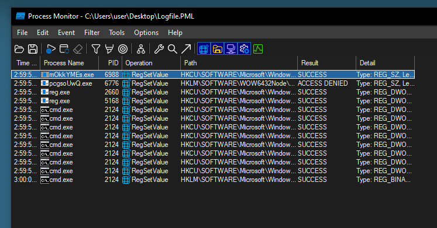

# Pretty Malicious Log

I was trying to install the adobe crack and many weird things happened to my PC. Can you analyze the log and figure out what's going on?

[Challenge File](https://drive.google.com/file/d/1ucky78xmJZBxoEYQJq9y6ayRfNWvilBk/view?usp=sharing)

[Shell connect for questions](nc pretty-malicious-log.challs.csc.tf 1337)


### Solution

##### Q1: What program produced this log file?

```
Your answer: procmon
Correct!
```

Given the Logfile.PML indicates a file produced from a tool which is part of Windows Sysinternals. With procmon, we able to analyze futher with this log file for next questions.

##### Q2: How many registry keys got successfully modified by the malware?

```
Your answer: 13
Correct!
```



With procmon, use the filter and set `Operation is RegSetValue` and `PPID is 1184` (1184 is the PID of adobe.exe). 

##### Q3: What is the MITRE ID of the persistence technique used by the malware?

```
Your answer: T1547.001
Correct!
```

It contain registry run keys which points to mOkkYMEs.exe also achieve persistence by adding a program to a startup folder or referencing it with a Registry run key.

##### Q4: What is the name of the file that is added to autoruns by the malware?

```
Your answer: mOkkYMEs.exe
Correct!
```

##### Q5: Which thread ID is responsible to create the environment for malware to run?

```
Your answer: 5352
Correct!
```


**Flag:** `CSCTF{Pr0cm0n_1s_4_h3lpFul_sy5int3rn4l!_0x22defba1}`


