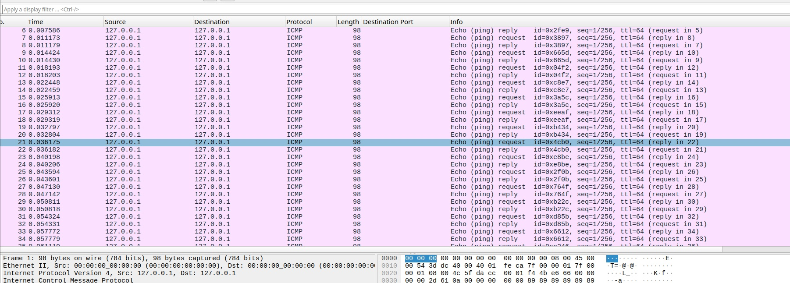

# Echo Chamber

Is anyone there? Is anyone there? I'm sending myself the flag! I'm sending myself the flag!

- Category: scripting
- Challenge file: echo\_chamber.pcap

### Solution:

##### 1. View the pcap file



From the pcap file, all the packets are ICMP TTL contain fixed value of data length. 

##### 2. Use tshark to extract the data fields

```bash
tshark -r echo_chamber.pcap -T fields -e data > out.bin
```

Viewing the `out.bin` file, we notice a pattern of magic hex file header of PNG `89 50 4e 47`. However, we have to eliminate the redundancies

##### 3. Use regex to remove redundant bytes and newlines

```vim
:%s/\v^(.{2})(.|\n){79}.*/\1/g
```

This operation can be done using vim or any editor which support regex for find and replace:

1. `:%s` - This tells Vim to perform a substitute command on all lines of the file.
2. `\v` - This activates "very magic" mode, which makes the regex behavior more like what you'd expect in other programming languages.
3. `^(.{2})` - This matches and captures the first two characters of each line.
4. `(.|\n){79}` - This matches any 79 characters (including newlines).
5. `.*` - This matches the rest of the line.
6. `\1` - This replaces the entire match with just the first captured group (the first two characters).
7. `/g` - This applies the substitution globally (i.e., to all matches in the file).

```vim
:%s/\n//g
```

