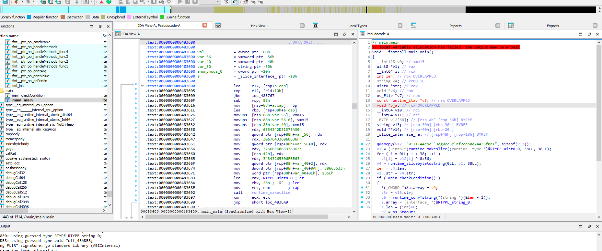

# GoCrackMe1

TENNNNNN-HUT!

Welcome to the Go Dojo, gophers in training!

Go malware is on the rise. So we need you to sharpen up those Go reverse engineering skills. We've written three simple CrackMe programs in Go to turn you into Go-binary reverse engineering ninjas!

First up is the easiest of the three. Go get em!

### Solution:

##### 1. Use IDA to decompile the binary



##### 2. Analyze main function

Since this is a Go binary, we need to note that `main` function is part of the Go's runtime setup and `main_main` is the entry point of the actual code within the `main` package.

Here is the decompiled C code in `main_main`:

```c
// main.main
// local variable allocation has failed, the output may be wrong!
void __fastcall main_main()
{
  __int128 v0; // xmm15
  uint8 *v1; // rax
  __int64 i; // rcx
  int len; // rbx OVERLAPPED
  string v4; // kr00_16
  uint8 *str; // rax
  void *v6; // rax
  os_File *v7; // rbx
  const runtime_itab *v8; // rax OVERLAPPED
  void *p_a; // rcx OVERLAPPED
  __int64 v10; // rdi
  __int64 v11; // rsi
  _BYTE v12[38]; // [rsp+Ah] [rbp-56h] BYREF
  string v13; // [rsp+30h] [rbp-30h] BYREF
  void **v14; // [rsp+40h] [rbp-20h]
  _slice_interface_ a; // [rsp+48h] [rbp-18h] BYREF

  qmemcpy(v12, "0:71-44coc``3dg0cc3c`nf2cno0e24435f0n+", sizeof(v12));
  v1 = (uint8 *)runtime_makeslice((runtime__type *)&RTYPE_uint8_0, 38LL, 38LL);
  for ( i = 0LL; i < 38; ++i )
    v1[i] = v12[i] ^ 0x56;
  v4 = runtime_slicebytetostring(0LL, v1, 38LL);
  len = v4.len;
  v13.str = v4.str;
  if ( main_checkCondition() )
  {
    *(_OWORD *)&a.array = v0;
    str = v13.str;
    v6 = runtime_convTstring(*(string *)(&len - 1));
    a.array = (interface_ *)&RTYPE_string_0;
    a.len = (int)v6;
    v7 = os_Stdout;
    v8 = &go_itab__ptr_os_File_comma_io_Writer;
    p_a = &a;
  }
  else
  {
    v13.len = (int)&RTYPE_string_0;
    v14 = &off_4BADB8;
    v7 = os_Stdout;
    v8 = &go_itab__ptr_os_File_comma_io_Writer;
    p_a = &v13.len;
  }
  v10 = 1LL;
  v11 = 1LL;
  fmt_Fprintln(*(io_Writer *)&v8, *(_slice_interface_ *)&p_a);
}
```

##### 3. Analyze the operations and functions of decompiled code

From the decompiled code, it call `main_checkCondition()` and based on the condition, it will print out the decoded string if the condition is true. 

At this part of the code:

```c
qmemcpy(v12, "0:71-44coc``3dg0cc3c`nf2cno0e24435f0n+", sizeof(v12));
v1 = (uint8 *)runtime_makeslice((runtime__type *)&RTYPE_uint8_0, 38LL, 38LL);
for ( i = 0LL; i < 38; ++i )
    v1[i] = v12[i] ^ 0x56;
```
It uses XOR encryption operation on the string `0:71-44coc``3dg0cc3c`nf2cno0e24435f0n+` with the hex key of `0x56`

##### 4. Decode the XOR operation

Here it the decode script in Python:

```py
def decode_string(encoded_str, key):
    # Convert string to bytes
    encoded_bytes = encoded_str.encode('ascii')
    # XOR each byte with the key
    decoded_bytes = bytes([b ^ key for b in encoded_bytes])
    # Try to decode as ASCII, fallback to hex representation
    try:
        return decoded_bytes.decode('ascii')
    except UnicodeDecodeError:
        return decoded_bytes.hex()

# The encoded string from the binary
encoded = "0:71-44coc``3dg0cc3c`nf2cno0e24435f0n+"
key = 0x56

decoded = decode_string(encoded, key)
print(f"Decoded string: {decoded}")
```

Output:
```
Decoded string: flag{bb59566e21f55e5680d589f3dbbec0f8}
```

**Flag:** `flag{bb59566e21f55e5680d589f3dbbec0f8}`
