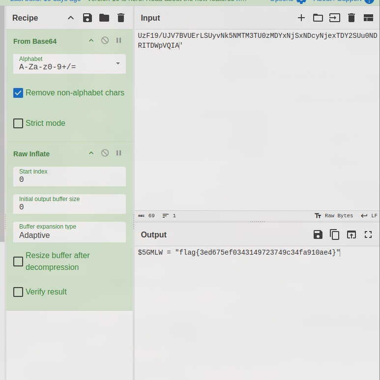

# Obfuscation Station

You've reached the Obfuscation Station!
Can you decode this PowerShell to find the flag?

- Category: forensic
- Challenge file: Challenge.zip

### Solution

##### 1. View chal.ps1

```ps1
(nEW-objECt  SYstem.iO.COMPreSsIon.deFlaTEStREAm( [IO.mEmORYstreAM][coNVERt]::FROMBAse64sTRING( 'UzF19/UJV7BVUErLSUyvNk5NMTM3TU0zMDYxNjSxNDcyNjexTDY2SUu0NDRITDWpVQIA') ,[io.COmPREssioN.coMpreSSioNmODE]::DeCoMpReSS)| %{ nEW-objECt  sYStEm.Io.StREAMrEADeR($_,[TeXT.encodiNG]::AsCii)} |%{ $_.READTOENd()})| & ( $eNV:cOmSPEc[4,15,25]-JOin'')
```

It is obfuscated but can be read easily

```ps1
$compressedData = [System.Convert]::FromBase64String('UzF19/UJV7BVUErLSUyvNk5NMTM3TU0zMDYxNjSxNDcyNjexTDY2SUu0NDRITDWpVQIA')

$memoryStream = [System.IO.MemoryStream]::new($compressedData)

$decompressedStream = [System.IO.Compression.DeflateStream]::new($memoryStream, [System.IO.Compression.CompressionMode]::Decompress)

$reader = [System.IO.StreamReader]::new($decompressedStream, [Text.Encoding]::ASCII)
$decompressedText = $reader.ReadToEnd()

& (([Environment]::GetEnvironmentVariable('ComSpec')).Substring(4, 1) + (Get-Content (Get-Command cmd.exe).Path)[15] + (Get-Content (Get-Command cmd.exe).Path)[25] -join '')
```

The powershell script decodes the base64 string and then decompresses it. Next task will be convert `UzF19/UJV7BVUErLSUyvNk5NMTM3TU0zMDYxNjSxNDcyNjexTDY2SUu0NDRITDWpVQIA` to readible form using CyberChef

##### 2. Convert the compressed base64 string using Cyberchef

Result: [cyberchef](https://gchq.github.io/CyberChef/#recipe=From_Base64('A-Za-z0-9%2B/%3D',true,false)Raw_Inflate(0,0,'Adaptive',false,false)&input=VXpGMTkvVUpWN0JWVUVyTFNVeXZOazVOTVRNM1RVMHpNRFl4TmpTeE5EY3lOamV4VERZMlNVdTBORFJJVERXcFZRSUEn&oeol=VT)



**Flag:** `flag{3ed675ef0343149723749c34fa910ae4}`
