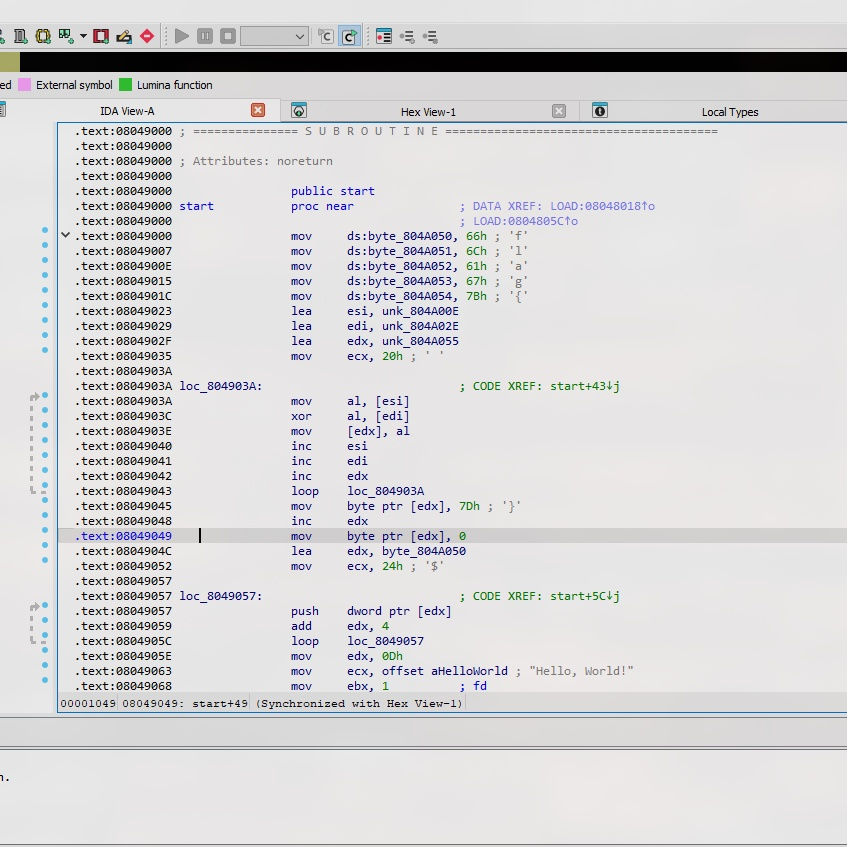
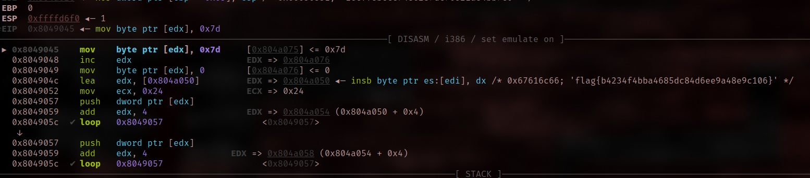

# Stack It

Our team of security analysts recently worked through a peculiar Lumma sample.
The dentists helping us advised we floss at least twice a day to help out.
He also gave us this weird file. Maybe you can help us out.

- Category: reverse
- Challenge file: stack\_it.bin

### Solution:

##### 1. Analyze the binary file

```bash
$ file stack_it.bin
stack_it.bin: ELF 32-bit LSB executable, Intel 80386, version 1 (SYSV), statically linked, stripped
```
Here it indicates the binary has no debugging symbols and couldn't able to see it functions while debugging

Run the program, it will print `Hello, World!`

##### 2. Use IDA to disassemble the binary



Here is the simple form of assembly from the binary:

```asm
; =============================================================================
; Linux x86 Program
; Performs string operations and prints "Hello, World!"
; =============================================================================

section .text
global start

start:
    ; Initialize "flag{" prefix
    mov     byte [byte_804A050], 'f'
    mov     byte [byte_804A051], 'l'
    mov     byte [byte_804A052], 'a'
    mov     byte [byte_804A053], 'g'
    mov     byte [byte_804A054], '{'

    ; Set up registers for XOR operation
    lea     esi, [unk_804A00E]    ; Source string 1
    lea     edi, [unk_804A02E]    ; Source string 2
    lea     edx, [unk_804A055]    ; Destination buffer
    mov     ecx, 0x20             ; Counter (32 bytes)

    ; XOR loop - combines two strings
xor_loop:
    mov     al, [esi]             ; Load byte from source 1
    xor     al, [edi]             ; XOR with byte from source 2
    mov     [edx], al             ; Store result
    inc     esi                   ; Next source 1 byte
    inc     edi                   ; Next source 2 byte
    inc     edx                   ; Next destination byte
    loop    xor_loop              ; Repeat 32 times

    ; Add closing brace and null terminator
    mov     byte [edx], '}'       ; Add closing brace
    inc     edx
    mov     byte [edx], 0         ; Null terminate

    ; Push flag onto stack
    lea     edx, [byte_804A050]   ; Start of flag string
    mov     ecx, 0x24             ; 36 bytes to push
push_loop:
    push    dword [edx]           ; Push 4 bytes at a time
    add     edx, 4                ; Move to next 4 bytes
    loop    push_loop

    ; Print "Hello, World!"
    mov     edx, 13               ; String length
    mov     ecx, aHelloWorld      ; String pointer
    mov     ebx, 1                ; STDOUT file descriptor
    mov     eax, 4                ; sys_write syscall
    int     0x80                  ; Make syscall

    ; Exit program
    mov     eax, 1                ; sys_exit syscall
    xor     ebx, ebx              ; Exit code 0
    int     0x80                  ; Make syscall

section .data
    aHelloWorld     db 'Hello, World!', 0

    ; First source string for XOR operation
    unk_804A00E     db 0x53, 0x51, 0x51, 0x55, 0x52, 0x5E, 0x56, 0x07
                    db 0x01, 0x04, 0x0D, 0x02, 0x00, 0x03, 0x56, 0x5B
                    db 0x0F, 0x50, 0x07, 0x01, 0x53, 0x50, 0x0B, 0x50
                    db 0x55, 0x00, 0x51, 0x5B, 0x01, 0x06, 0x53, 0x06

    ; Second source string for XOR operation
    unk_804A02E     db 0x31, 0x65, 0x63, 0x66, 0x66, 0x38, 0x62, 0x65
                    db 0x63, 0x65, 0x39, 0x34, 0x38, 0x36, 0x32, 0x38
                    db 0x37, 0x64, 0x63, 0x37, 0x36, 0x35, 0x32, 0x31
                    db 0x61, 0x38, 0x34, 0x62, 0x62, 0x37, 0x63, 0x30

section .bss
    byte_804A050    resb 1        ; 'f'
    byte_804A051    resb 1        ; 'l'
    byte_804A052    resb 1        ; 'a'
    byte_804A053    resb 1        ; 'g'
    byte_804A054    resb 1        ; '{'
    unk_804A055     resb 32       ; Buffer for XOR result
    resb 1                        ; For the closing brace '}'
    resb 1                        ; For null terminator

```
The binary will print out the `Hello, World!` but it also set up a string which starts wih `flag{` and perform XOR operation between 2 32-byte strings with `}`. In the end, it will push the entire string into the stack. 

##### 3. Use gdb to debug it

Here is the gdb command to retrieve the flag

```bash
gdb ./stack_it.bin
info files
b *0x8049000
r
ni
b *0x8049045
c
```

The explaination:
- `gdb ./stack_it.bin`: to run gdb
- `info files`: in stripped binary, `start` often represents the entry point
- `b *0x8049000`: Set a breakpoint at the `start` memory address
- `r`: Run till the breakpoint
- `ni`: Next instruction (I always ni so that I make sure it matches with the disassembler from IDA in order to set the next breakpoint)
- `b *0x8049045`: Set breakpoint until `}` is both into the register
- `c`: To jump next breakpoint

Flag is visible now:



**Flag:** `flag{b4234f4bba4685dc84d6ee9a48e9c106}`

