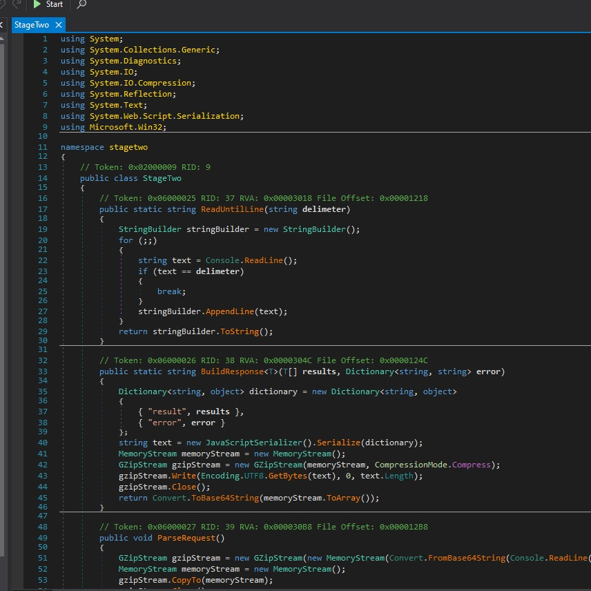

# X-RAY

The SOC detected malware on a host, but antivirus already quarantined it... can you still make sense of what it does?

- Category: malware
- Challenge file: x-ray.7z

### Solution:

##### 1. Recover the quarantined malware

Based on the question, it stated the malware have been quarantined and require to perform analysis. With `dexray`, we able to recover the malware

```bash
$ dexray x-ray

=================================================================
 dexray v2.26, copyright by Hexacorn.com, 2010-2020
 Trend&Kaspersky decryption based on code by Optiv
 McAfee BUP decryption code by Brian Maloney
 Much better Symantec VBN support code by Brian Maloney
 Kaspersky System Watcher decryption by Luis Rocha&Antonio Monaca
 Sentinel One decryption research by MrAdz350
 Microsoft AV/Security Essentials by Corey Forman /fetchered/
 Cisco AMP research by @r0ns3n
 Thx to Brian Baskin, James Habben, Brian Maloney, Luis Rocha,
 Antonio Monaca, MrAdz350, Corey Forman /fetchered/, @r0ns3n
=================================================================
Processing file: 'x-ray'
 -> 'x-ray.00000184_Defender.out' - Defender File
 -> ofs='184' (000000B8)
```

From the output, we can know that the antivirus which successfully quarantine the malware is Windows Defender.

##### 2. Analyze x-ray.00000184\_Defender.out

We can utilize `file` and `exiftool` command to get some metadata and file information of the malware

```bash
$ file x-ray.00000184_Defender.out 
x-ray.00000184_Defender.out: PE32 executable (DLL) (console) Intel 80386 Mono/.Net assembly, for MS Windows

$ exiftool x-ray.00000184_Defender.out 
ExifTool Version Number         : 12.42
File Name                       : x-ray.00000184_Defender.out
Directory                       : .
File Size                       : 23 kB
File Modification Date/Time     : 2024:11:03 16:13:15-05:00
File Access Date/Time           : 2024:11:03 16:13:16-05:00
File Inode Change Date/Time     : 2024:11:03 16:13:15-05:00
File Permissions                : -rw-r--r--
File Type                       : Win32 DLL
File Type Extension             : dll
MIME Type                       : application/octet-stream
Machine Type                    : Intel 386 or later, and compatibles
Time Stamp                      : 2057:11:05 22:02:31-05:00
Image File Characteristics      : Executable, Large address aware, DLL
PE Type                         : PE32
Linker Version                  : 48.0
Code Size                       : 20480
Initialized Data Size           : 1536
Uninitialized Data Size         : 0
Entry Point                     : 0x6ec2
OS Version                      : 4.0
Image Version                   : 0.0
Subsystem Version               : 6.0
Subsystem                       : Windows command line
File Version Number             : 1.0.0.0
Product Version Number          : 1.0.0.0
File Flags Mask                 : 0x003f
File Flags                      : (none)
File OS                         : Win32
Object File Type                : Dynamic link library
File Subtype                    : 0
Language Code                   : Neutral
Character Set                   : Unicode
Comments                        : 
Company Name                    : 
File Description                : stagetwo
File Version                    : 1.0.0.0
Internal Name                   : stagetwo.dll
Legal Copyright                 : Copyright ©  2021
Legal Trademarks                : 
Original File Name              : stagetwo.dll
Product Name                    : stagetwo
Product Version                 : 1.0.0.0
Assembly Version                : 1.0.0.0
```

From the initial analysis, the malware is a DLL file with the name of `stagetwo.dll` and it has executable characteristics, design to execute via command. 

##### 3. Use dnSpy to analyze the DLL file

With dnSpy we able to decompile the DLL file and view C# code:



From the code, it performs:
1. Communication:
- Uses GZip compression and Base64 encoding for data transfer
- Implements a protocol for command/control communication
- Prints machine GUID from Windows registry

2. Self-Preservation:
- Contains self-deletion mechanism using "ping & del" command
- Runs deletion command hidden from view (WindowStyle.Hidden)

3. Suspicious Execution:
- Dynamic code execution through reflection (can load and run code by name)
- PowerShell integration
- Contains OTP (One Time Pad) encryption functionality
- Embedded encoded data (hex strings that are decoded and XORed)

4. Command Processing:
- Can read commands until a delimiter
- Processes requests through a Protocol class
- Has exit functionality

However at `Main` class, we can observe this code which perform OTP encryption:

```csharp
public static void Main(string[] args) {
			new StageTwo().main("", new StreamReader(Console.OpenStandardInput()));
			byte[] array = StageTwo.load("15b279d8c0fdbd7d4a8eea255876a0fd189f4fafd4f4124dafae47cb20a447308e3f77995d3c");
			byte[] array2 = StageTwo.load("73de18bfbb99db4f7cbed3156d40959e7aac7d96b29071759c9b70fb18947000be5d41ab6c41");
			byte[] array3 = StageTwo.otp(array, array2);
			Encoding.UTF8.GetString(array3);
		}
```

##### 4. Generate script to decode OTP

Here is the Python script to perform decoding:

```py
def hex_to_bytes(hex_string):
    """Convert a hexadecimal string to a byte array."""
    return bytes.fromhex(hex_string)

def otp_decrypt(data1, data2):
    """Decrypts data using the one-time pad method."""
    return bytes(a ^ b for a, b in zip(data1, data2))

# Load the hexadecimal strings
hex_data1 = "15b279d8c0fdbd7d4a8eea255876a0fd189f4fafd4f4124dafae47cb20a447308e3f77995d3c"
hex_data2 = "73de18bfbb99db4f7cbed3156d40959e7aac7d96b29071759c9b70fb18947000be5d41ab6c41"

# Convert hex to byte arrays
data1 = hex_to_bytes(hex_data1)
data2 = hex_to_bytes(hex_data2)

# Decrypt using OTP
decrypted_data = otp_decrypt(data1, data2)

# Convert decrypted bytes to string
decoded_string = decrypted_data.decode('utf-8', errors='ignore')

print("Decoded String:", decoded_string)
```

The output:
```bash
Decoded String: flag{df26090565cb329fdc8357080700b621}
```

**Flag:** `flag{df26090565cb329fdc8357080700b621}`


