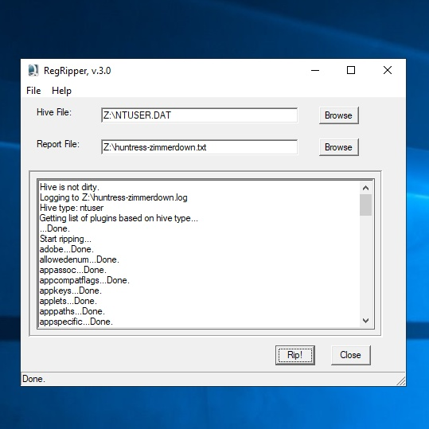
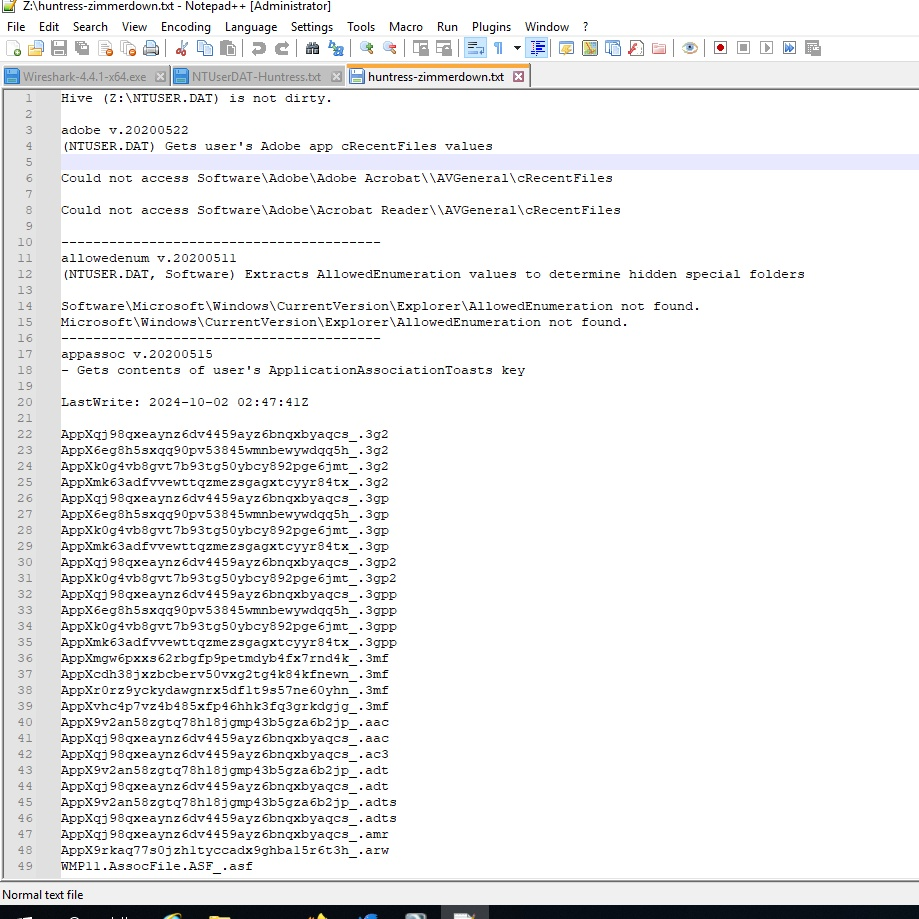
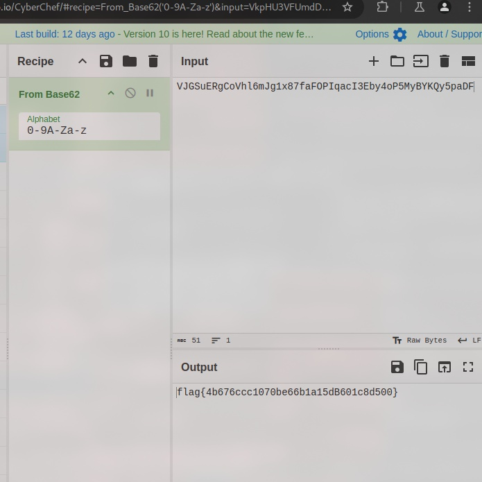

# Zimmer Down

A user interacted with a suspicious file on one of our hosts.
The only thing we managed to grab was the user's registry hive.
Are they hiding any secrets?

- Category: forensic
- Challenge file: NTUSER.DAT

### Solution:

##### 1. Use RegRipper to analyze hive file

Based on the challenge file, it is a user registry hive file which contains information of a particular user account settings. We can utilize RegRipper to investigate futher



##### 2. Analyze the output file from RegRipper

The challenge question stated that a suspicious file is used by the user.



From performing analysis on the output file, we able to notice suspicious files under `recentdocs` plugin which is about the files and directories recently accessed by the user. 

```
recentdocs v.20200427
(NTUSER.DAT) Gets contents of user's RecentDocs key

RecentDocs
**All values printed in MRUList\MRUListEx order.
Software\Microsoft\Windows\CurrentVersion\Explorer\RecentDocs
LastWrite Time: 2024-10-02 02:48:01Z
  26 = Windows
  25 = d2FmZmxld2FmZmxld2FmZmxld2FmZmxl.dll
  24 = passwords.zip
  23 = passwords.dll
  22 = passwords.db
  21 = passwords.ppt
  20 = passwords.docx
  19 = passwords.xlsx
  18 = passwords.txt
  17 = OneDrive
  16 = VJGSuERgCoVhl6mJg1x87faFOPIqacI3Eby4oP5MyBYKQy5paDF.b62
  15 = Videos
  14 = How to find flags.mp4
  13 = Music
  12 = huntress_beats_to_study_and_relax_to.mp3
  2 = Pictures
  4 = just_john.bmp
  1 = john_and_i_on_the_beach.bmp
  3 = john_and_i_at_dinner.bmp
  5 = huntress secrets.txt.txt
  6 = top_secret.zip
  11 = strings
  10 = made_me_redo_this.txt
  9 = files
  8 = notthe_flag.txt
  7 = super_secret_stuff.zip
  0 = &suppressAnimations=false&showFooter=true&allowPageNavigation=true&edgeGestureOffset=0&inputAnimationSourceId=0&inputAnimationProviderId=0

Software\Microsoft\Windows\CurrentVersion\Explorer\RecentDocs\.b62
LastWrite Time 2024-10-02 02:47:01Z
MRUListEx = 0
  0 = VJGSuERgCoVhl6mJg1x87faFOPIqacI3Eby4oP5MyBYKQy5paDF.b62
```

##### 3. Use CyberChef to decode the suspicious string

From the output of regripper, there are multiple suspicious strings, some are misleadings which are guessy. However, the intended string to be decoded is `VJGSuERgCoVhl6mJg1x87faFOPIqacI3Eby4oP5MyBYKQy5paDF.b62` as it is not common for b62 for a file extension. Mostly I am assuming the string is encoded with base62.



**Flag:** `flag{4b676ccc1070be66b1a15dB601c8d500}`


