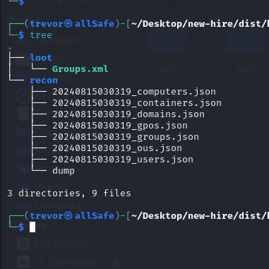

# New Hire

After the intern left and was arrested for hacking his previous company, the company has finally decided to take in new hires! What could go wrong? Oh no, the company was hacked again! We have gathered evidence from the attacker’s machine!

- Category: Forensic
- Challenge File: kali.zip

### Solutions:

##### 1. Extract the archieved file and view its contents

```bash
$ unzip kali.zip
```



**Neglect the dump file** is not part of the challenge file, is from my output


