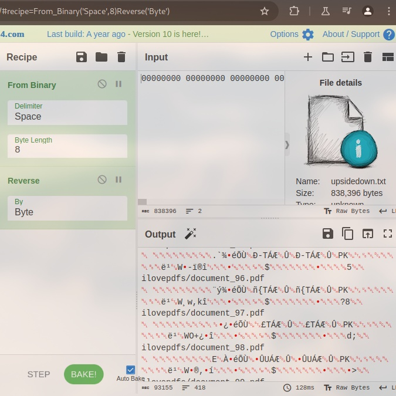
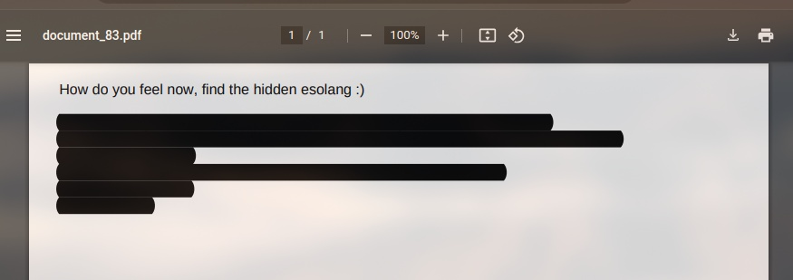

# Game of Hunt

A Cryptic Voyage 

- Category: forensic
- Challenge file: upsidedown.txt

### Solution:

##### 1. View the content of upsidedown.txt

```
00000000 00000000 00000000 00000001 01000001 10101101 00000000 00000000 00101010 00100000 00000000 01100101 00000000 01100101 00000000 00000000 00000000 00000000 00000110 00000101 01001011 01010000 00000001 11011011 ...
```

The text file contain binary string in the format of raw representation of data.

##### 2. Use cyberchef to convert it 

[cyberchef decode binary and reverse](https://cyberchef.org/#recipe=From_Binary('Space',8)Reverse('Byte')



Next we can save the output of the file

##### 3. Examine the download file

The file is a zip archieve file and we can unzip it

```bash
$ unzip download.zip
Archive:  download.zip
   creating: ilovepdfs/
  inflating: ilovepdfs/document_1.pdf
  inflating: ilovepdfs/document_10.pdf
  inflating: ilovepdfs/document_100.pdf
  inflating: ilovepdfs/document_11.pdf
  inflating: ilovepdfs/document_12.pdf
  inflating: ilovepdfs/document_13.pdf
  inflating: ilovepdfs/document_14.pdf
  inflating: ilovepdfs/document_15.pdf
  inflating: ilovepdfs/document_16.pdf
  inflating: ilovepdfs/document_17.pdf
  inflating: ilovepdfs/document_18.pdf
  inflating: ilovepdfs/document_19.pdf
  inflating: ilovepdfs/document_2.pdf
  inflating: ilovepdfs/document_20.pdf
  inflating: ilovepdfs/document_21.pdf
  inflating: ilovepdfs/document_22.pdf
  inflating: ilovepdfs/document_23.pdf
  inflating: ilovepdfs/document_24.pdf
  inflating: ilovepdfs/document_25.pdf
  inflating: ilovepdfs/document_26.pdf
  inflating: ilovepdfs/document_27.pdf
  inflating: ilovepdfs/document_28.pdf
  inflating: ilovepdfs/document_29.pdf
  inflating: ilovepdfs/document_3.pdf
  inflating: ilovepdfs/document_30.pdf
  inflating: ilovepdfs/document_31.pdf
  inflating: ilovepdfs/document_32.pdf
  inflating: ilovepdfs/document_33.pdf
  inflating: ilovepdfs/document_34.pdf
  inflating: ilovepdfs/document_35.pdf
  inflating: ilovepdfs/document_36.pdf
  inflating: ilovepdfs/document_37.pdf
  inflating: ilovepdfs/document_38.pdf
  inflating: ilovepdfs/document_39.pdf
  inflating: ilovepdfs/document_4.pdf
  inflating: ilovepdfs/document_40.pdf
  inflating: ilovepdfs/document_41.pdf
  inflating: ilovepdfs/document_42.pdf
  inflating: ilovepdfs/document_43.pdf
  inflating: ilovepdfs/document_44.pdf
  inflating: ilovepdfs/document_45.pdf
  inflating: ilovepdfs/document_46.pdf
  inflating: ilovepdfs/document_47.pdf
  inflating: ilovepdfs/document_48.pdf
  inflating: ilovepdfs/document_49.pdf
  inflating: ilovepdfs/document_5.pdf
  inflating: ilovepdfs/document_50.pdf
  inflating: ilovepdfs/document_51.pdf
  inflating: ilovepdfs/document_52.pdf
  inflating: ilovepdfs/document_53.pdf
  inflating: ilovepdfs/document_54.pdf
  inflating: ilovepdfs/document_55.pdf
  inflating: ilovepdfs/document_56.pdf
  inflating: ilovepdfs/document_57.pdf
  inflating: ilovepdfs/document_58.pdf
  inflating: ilovepdfs/document_59.pdf
  inflating: ilovepdfs/document_6.pdf
  inflating: ilovepdfs/document_60.pdf
  inflating: ilovepdfs/document_61.pdf
  inflating: ilovepdfs/document_62.pdf
  inflating: ilovepdfs/document_63.pdf
  inflating: ilovepdfs/document_64.pdf
  inflating: ilovepdfs/document_65.pdf
  inflating: ilovepdfs/document_66.pdf
  inflating: ilovepdfs/document_67.pdf
  inflating: ilovepdfs/document_68.pdf
  inflating: ilovepdfs/document_69.pdf
  inflating: ilovepdfs/document_7.pdf
  inflating: ilovepdfs/document_70.pdf
  inflating: ilovepdfs/document_71.pdf
  inflating: ilovepdfs/document_72.pdf
  inflating: ilovepdfs/document_73.pdf
  inflating: ilovepdfs/document_74.pdf
  inflating: ilovepdfs/document_75.pdf
  inflating: ilovepdfs/document_76.pdf
  inflating: ilovepdfs/document_77.pdf
  inflating: ilovepdfs/document_78.pdf
  inflating: ilovepdfs/document_79.pdf
  inflating: ilovepdfs/document_8.pdf
  inflating: ilovepdfs/document_80.pdf
  inflating: ilovepdfs/document_81.pdf
  inflating: ilovepdfs/document_82.pdf
  inflating: ilovepdfs/document_83.pdf
  inflating: ilovepdfs/document_84.pdf
  inflating: ilovepdfs/document_85.pdf
  inflating: ilovepdfs/document_86.pdf
  inflating: ilovepdfs/document_87.pdf
  inflating: ilovepdfs/document_88.pdf
  inflating: ilovepdfs/document_89.pdf
  inflating: ilovepdfs/document_9.pdf
  inflating: ilovepdfs/document_90.pdf
  inflating: ilovepdfs/document_91.pdf
  inflating: ilovepdfs/document_92.pdf
  inflating: ilovepdfs/document_93.pdf
  inflating: ilovepdfs/document_94.pdf
  inflating: ilovepdfs/document_95.pdf
  inflating: ilovepdfs/document_96.pdf
  inflating: ilovepdfs/document_97.pdf
  inflating: ilovepdfs/document_98.pdf
  inflating: ilovepdfs/document_99.pdf
```

A total of 100 pdf. Goodness gracious.

##### 4. Examine pdf size

In the ilovepdf's directory, check the size of each file

```
ls -ll
```

For `document_83.pdf`'s size appears the be more than usual compared to the rest:
```
.rw-r--r-- 6.3k trevorphilips 30 Sep 05:28  document_83.pdf
```

##### 5. View document\_83.pdf



The text is highlight in black but we can copy and paste it into a text editor

document\_83.pdf's contents:
```
How do you feel now, find the hidden esolang :)

++++++++++[>+>+++>+++++++>++++++++++<<<<-]>>>>+++++.++++++++
+.---.-.<---.+++++++++++++++++.--------------.>+++++++++++++.<+++++++++++++++++
++.>------------.+++++
+.<++++++.++.>---.<++++.------.>++.<+++++++++.---.------.+++++++.+
++.+++++.---------.>-.
+.+++++++++.
```

Appear to a brainfuck code

##### 6. Interprete brainfuck code

Use online tools to decode it, example used is [md5decrypt.net](https://md5decrypt.net/en/Brainfuck-translator/)

```
ironCTF{You_are_the_finest}
```

**Flag:** `ironCTF{You_are_the_finest}`

