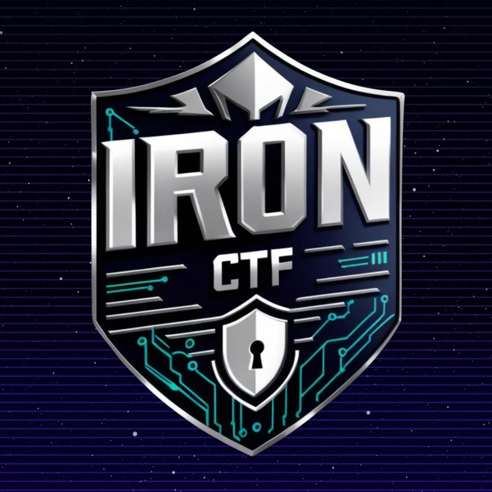

# IRON CTF 2024

Team 1nf1n1ty of SASTRA Deemed University organized its first-ever Capture the Flag (CTF) event. Open to all skill levels, this jeopardy-style CTF features challenges in Web Exploitation, Cryptography, Reverse Engineering, pwn, OSINT, Forensics, and more.

Challenge Category:
- Web Exploitation
- Game Hacking 
- Reverse Engineering 
- Cryptography 
- Forensics 
- Binary Exploitation

**I only managed to solve one challenges, but I will share writeups of others and trying it out as learning experience**
