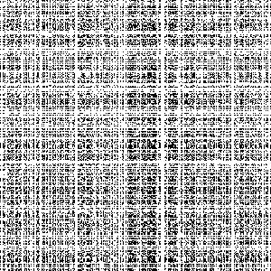

# Random Pixel

My Image accidently fell into a pixel mixer can you help me recover it?

- Category: forensic
- Challenge file: chal.zip

### Solution:

##### 1. Unzip the file and check the contents

```bash
$ unzip chal.zip
Archive:  chal.zip
  inflating: enc.py
  inflating: encrypted.png
```



enc.py:
```py
import random, time, numpy
from PIL import Image
from secret import FLAG

def randomize(img, seed):
	random.seed(seed)
	new_y = list(range(img.shape[0]))
	new_x = list(range(img.shape[1]))
	random.shuffle(new_y)
	random.shuffle(new_x)

	new = numpy.empty_like(img)
	for i, y in enumerate(new_y):
		for j, x in enumerate(new_x):
			new[i][j] = img[y][x]
	return numpy.array(new)


if __name__ == "__main__":
	with Image.open(FLAG) as f:
		img = numpy.array(f)
		out = randomize(img, int(time.time()))
		image = Image.fromarray(out)
		image.save("encrypted.png")
```
The encryption code reads an image from a file specified by FLAG, then randomizes its pixel positions based on a seed derived from the current time (time.time()). It shuffles the pixel rows and columns independently, creating an encrypted image. To reverse this image, we can take the timestamp of the image which can be used as the seed for reversing the randomization.

##### 2. Check the metadata of encrypted.png

Exiftool metadata of encrypted.png:
```bash
$ exiftool encrypted.png
ExifTool Version Number         : 12.96
File Name                       : encrypted.png
Directory                       : .
File Size                       : 22 kB
File Modification Date/Time     : 2024:10:02 21:02:40+00:00
File Access Date/Time           : 2024:10:07 09:17:44+00:00
File Inode Change Date/Time     : 2024:10:07 09:16:22+00:00
File Permissions                : -rw-rw-r--
File Type                       : PNG
File Type Extension             : png
MIME Type                       : image/png
Image Width                     : 300
Image Height                    : 300
Bit Depth                       : 8
Color Type                      : RGB with Alpha
Compression                     : Deflate/Inflate
Filter                          : Adaptive
Interlace                       : Noninterlaced
Image Size                      : 300x300
Megapixels                      : 0.090
```

We can take note of the file modification time:
`File Modification Date/Time     : 2024:10:02 21:02:40+00:00`

With this information, we can generate a script to reverse back the encryption process:
- Generating the same shuffled indices for x and y axes.
- Creating inverse mappings of these indices.
- Rearranging the pixels back to their original positions using the inverse mappings.

##### Script for reverse the encryption process

```py
import random
import numpy as np
from PIL import Image
import os

def get_seed_from_mtime(file_path):

    mtime = os.path.getmtime(file_path)
    unix_timestamp = int(mtime)
    return unix_timestamp

def reverse_randomize(encrypted_img, seed):
    random.seed(seed)
    height, width = encrypted_img.shape[:2]

    new_y = list(range(height))
    new_x = list(range(width))
    random.shuffle(new_y)
    random.shuffle(new_x)

    inverse_y = [0] * height
    inverse_x = [0] * width
    for i, y in enumerate(new_y):
        inverse_y[y] = i
    for j, x in enumerate(new_x):
        inverse_x[x] = j

    decrypted_img = np.empty_like(encrypted_img)

    for i in range(height):
        for j in range(width):
            decrypted_img[i][j] = encrypted_img[inverse_y[i]][inverse_x[j]]

    return decrypted_img

encrypted_image_path = 'encrypted.png'
decrypted_image_path = 'decrypted.png'

seed = get_seed_from_mtime(encrypted_image_path)

with Image.open(encrypted_image_path) as img:
    img = img.convert('RGB')
    encrypted_array = np.array(img)

decrypted_array = reverse_randomize(encrypted_array, seed)

decrypted_image = Image.fromarray(decrypted_array)
decrypted_image.save(decrypted_image_path)

print(f"Decrypted image saved as {decrypted_image_path}")
```
