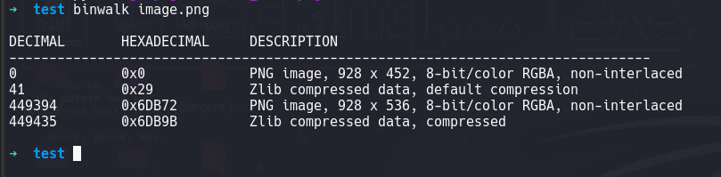

# a little bit of tomcroppery
Once you crop an image, the cropped part is gone... right???

- Category: misc
- Challenge File: image.png

### Solution:

##### 1. Run binwalk to identify embedded files

binwalk able to find out any embedded data within the image file and identifies the offsets within the file. Notice there is another PNG image data with different dimensions embedded in the image file. It starts at the offset 0x6DB9B. 

##### 2. Use dd to extract the hidden image

Using dd will extract the hidden image to a new image file in order to perform more analysis.

##### 3. View the cropped part of the image

**Flag found:** `LITCTF{4cr0p41yp5e_15_k1nd_0f_c001_j9g0s}`

This challenge is a great example of **aCropalypse vulnerability (CVE-2023-21036)** example where it involves a flaw in image processing tools that improperly handles cropped areas, allowing sensitive information to be exposed even after cropping. 

In Github, there is a tool that detect and restore aCropalypse vulnerable PNG and GIF files:
[Acropalypse-Multi-Tool](https://github.com/frankthetank-music/Acropalypse-Multi-Tool)

