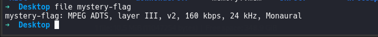
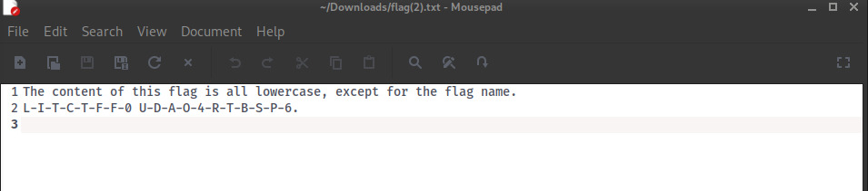

# endless
Whoops! I deleted the file ending of this file, and now I can't seem to figure out what type of file it was. Can you help me?

- Category: misc
- Challenge file: mystery-flag 

### Solution:

##### 1. Use file command to know intended file format

<a href="image1.png">
    
</a>

The file command shows that the file is an MP3 audio file, we can rename it with proper file extension

```
$ mv mystery-flag mystery-flag.mp3
```

##### 2. Listen to the audio file 

Apparently, the flag is spoken letter by letter with a human voice. I still have some difficulties with getting each letter. I use [Online Audio to Text tool](https://www.zamzar.com/tools/audio-to-text/) to convert it.

<a href="image2.png">
    
</a>

**Flag:** `LITCTF{f0udao4rtbsp6}`


