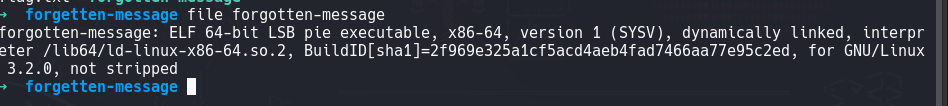
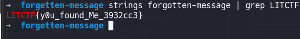

# forgotten-message
I made a cool program to show the flag, but i forgot to output it! Now that I lost the source, I can't seem to remember the flag. Can you help me find it?

- Challenge file: forgetten-message
- Category: rev

Solution:

### 1. Static Analysis

Since the executable is not stripped, where we can analyze the debugging symbols which has the possibility of containing the flag string

### 2. Use $strings and $grep

We can utilize grep with the flag header "LITCTF" and get the flag. 

**Flag:** `LITCTF{y0u_found_Me_3932cc3}`

