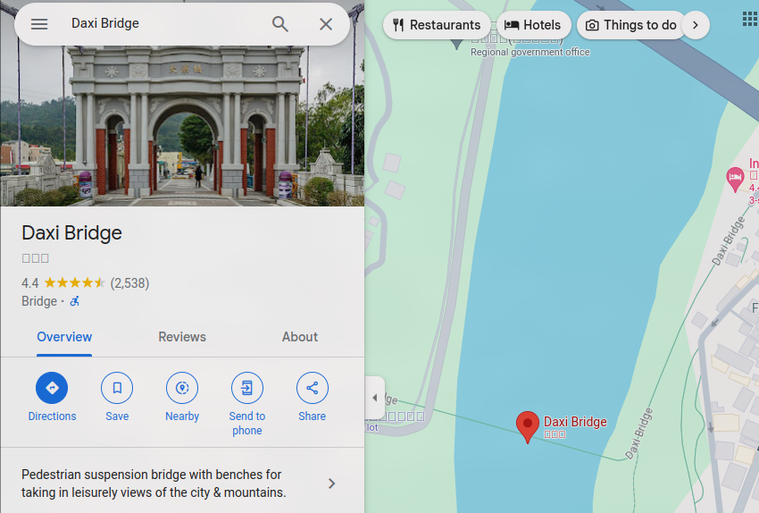

# geoguessr1

Where is this? Flag format: Use three decimal points of precision and round. The last digit of the first coordinate is ODD, and the last digit of the second coordinate is EVEN. Example: LITCTF{80.439,-23.498} (no spaces)

- Category: misc
- Challenge Image:

Solution:

##### 1. Use Yandex Reverse Image Search

From the result, the location of the image is Daxi Bridge, Taiwan. Next, using Google Maps Street View to figure out the exact position and GPS coordinates that image was taken from.

##### 2. Using Google Maps Street View 

So, we can head towards to exact location and get the coordinates from the URL

This is the URL:
[https://www.google.com/maps/@24.8848598,121.2844656,2a,75y,77.6h,88.76t/data=!3m6!1e1!3m4!1s-eqB6IRxVtkZR0ngtrle5w!2e0!7i13312!8i6656?coh=205409&entry=ttu](https://www.google.com/maps/@24.8848598,121.2844656,2a,75y,77.6h,88.76t/data=!3m6!1e1!3m4!1s-eqB6IRxVtkZR0ngtrle5w!2e0!7i13312!8i6656?coh=205409&entry=ttu)

From here, we get the coordinates (24.8848598,121.2844656)

Now we can adjust accordingly for the flag requirements

**Flag:** `LITCTF{24.885,121.284}`

