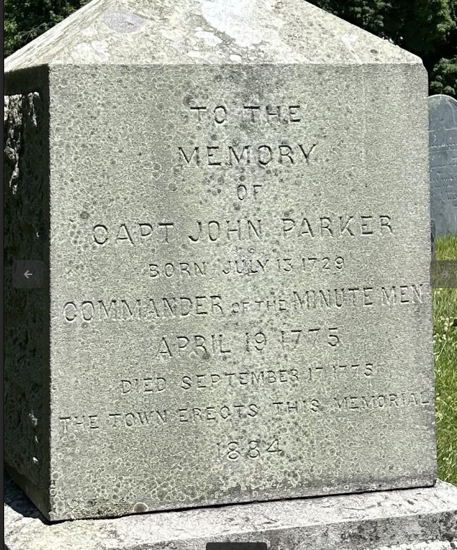

# geoguessr2

Our history class recently took a walk on a field trip here. Where is this? Flag format: Use three decimal points of precision and round. The last digit of the first coordinate is EVEN, and the last digit of the second coordinate is ODD. Example: LITCTF{80.438,-23.497} (no spaces)

- Category: misc
- Challenge Image:

### Solution:

##### 1. Gather information from the image 

From the challenge image, it shows a gravestone dedicated to Captain John Parker. Captain John Parker also known as Commander of the Minute Men.

##### 2. Google Dorking 

[John Parker (1729-1775) - Memorials](https://www.findagrave.com/memorial/1857/john-parker)

From the first result, we can cross-check and it displays the correct birth date. 

##### 3. Analyze more 

From the first result, it shows all the correct information based on the gravestone of Captain John Parker memorial.
Moreover, it shows the GPS coordinates.
- **GPS-Latitude:** 42.4505193, Longitude: -71.2335803
- **Location:** Lexington’s Old Burying Ground

So there is the flag: `LITCTF{42.450,-71.233}`

