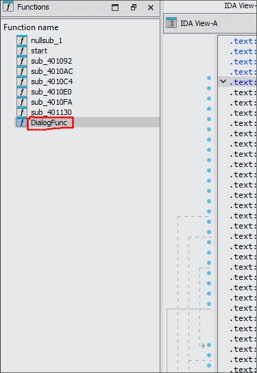
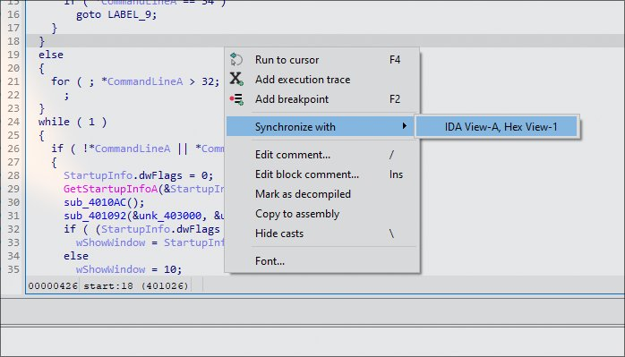
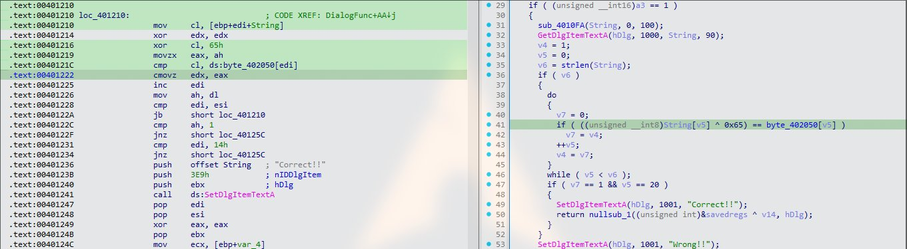
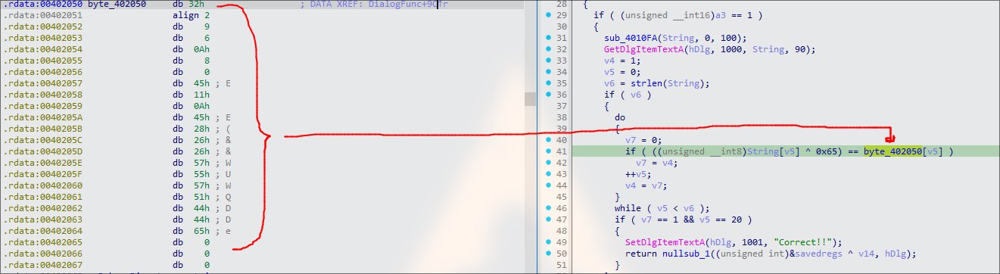
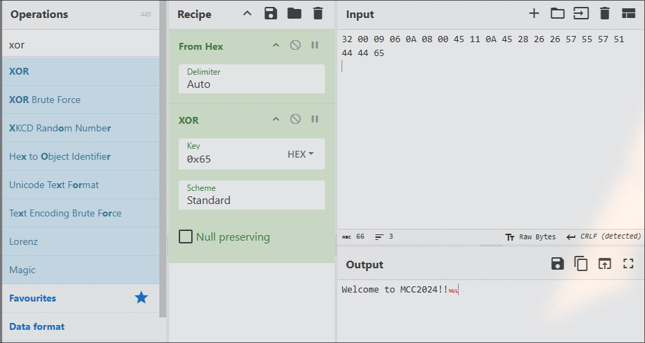
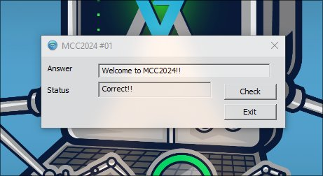

# ex01.exe

### Solution:

1. Open IDA to disassemble the binary

Find the function that initialize the DialogBox. From the Function Panel, we can notice `DialogFunc`. This is like the "main" function for the dialogbox handler. This is from WndProc class function that runs on 32-bit. 



2. Decompile the binary to view the pseudocode in C

Press F5 to view the pseudocode, drag the panel to the right side, and then right click to synchronize with assembly code. This step is to make it easier to refer C code to assembly back to back. 



Next, analyze the code to find the operation where its check the input string validation



```c
 GetDlgItemTextA(hDlg, 1000, String, 90);
      v4 = 1;
      v5 = 0;
      v6 = strlen(String);
      if ( v6 )
      {
        do
        {
          v7 = 0;
          if ( ((unsigned __int8)String[v5] ^ 0x65) == byte_402050[v5] )
            v7 = v4;
          ++v5;
          v4 = v7;
        }
        while ( v5 < v6 );
        if ( v7 == 1 && v5 == 20 )
        {
          SetDlgItemTextA(hDlg, 1001, "Correct!!");
          return nullsub_1((unsigned int)&savedregs ^ v14, hDlg);
        }
      }
      SetDlgItemTextA(hDlg, 1001, "Wrong!!");
    }
```

The breakdown:
- `GetDlgItemTextA` is for the string input function and `String` is the buffer that holds the input string.
- `if ( ((unsigned __int8)String[v5] ^ 0x65) == byte_402050[v5] )`: this is where the checking operation happens, `String` is XOR with `0x65` and if the result matches with `byte_402050` which is a static array bytes locate in the memory, if is correct else wrong.

3. View the contents of byte\_402050

Double-click on the `byte_402050` and notice the byte array of .rdata section, representing each character in hex. The `align 2` ensures that the next data is aligned on 2-byte boundary to improve memory access performance, whereas `db` is `define byte`. Finally step is to use this hex byte and XOR with `0x65`.



4. Use CyberChef or Python script to decode it



```py
reference_bytes = [
    0x32, 0x00, 0x09, 0x06, 0x0A, 0x08, 0x00, 
    0x45, 0x11, 0x0A, 0x45, 0x28, 0x26, 
    0x26, 0x57, 0x55, 0x57, 0x51, 0x44, 
    0x44, 0x65
]

password = [byte ^ 0x65 for byte in reference_bytes]
password_str = ''.join(chr(b) for b in password)
print(password_str)
```

**Flag:** `Welcome to MCC2024!!`




