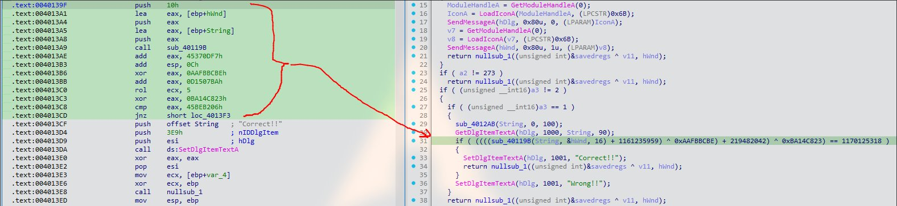
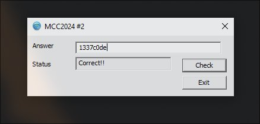

### Solution:

##### 1. Use IDA to disassemble the binary

Similar process as before, find the `DialogFunc` and analyze the disassembled assembly code or C pseudocode. 



##### 2. Getting in depth into assembly instruction

```nasm
.text:004013AE                 add     eax, 45370DF7h
.text:004013B3                 add     esp, 0Ch
.text:004013B6                 xor     eax, 0AAFBBCBEh
.text:004013BB                 add     eax, 0D1507BAh
.text:004013C0                 rol     ecx, 5
.text:004013C3                 xor     eax, 0BA14C823h
.text:004013C8                 cmp     eax, 45BEB206h
.text:004013CD                 jnz     short loc_4013F3 
```

Here the assembly code perform a series of operations:
1. Add `0x45370DF7`
2. XOR `0x0AAFBBCBE`
3. Add `0x0D1507BA`
4. Xor `OxBA14C823`
5. Finally it compares the value with `0x45BEB206`, if matches then print out correct

##### 3.Reverse the operation

Here is the C implementation code to reverse the operation

```c
#include <stdio.h>

int main() {
    int sum = 0x45BEB206;
    sum ^= 0x0BA14C823;
    sum -= 0x0D1507BA;
    sum ^= 0x0AAFBBCBE;
    sum -= 0x45370DF7;
    printf("%x",sum);
    return 0;
}
```

After running the code, it will return `1337c0de`. This is the correct input string.

**Flag:** `1337c0de`


