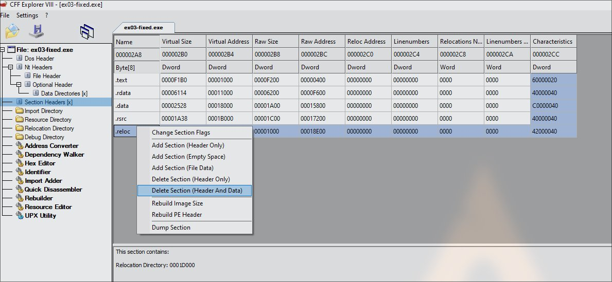
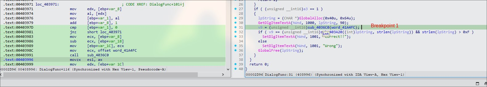
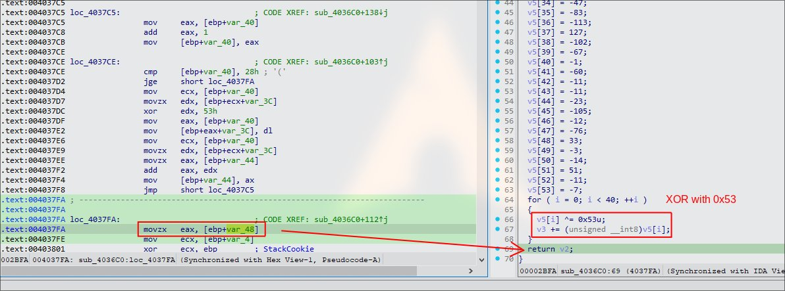
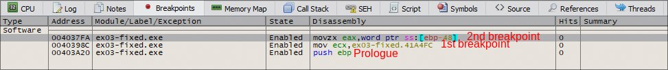
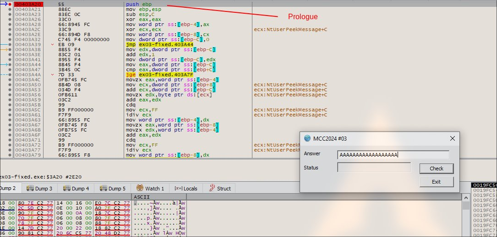
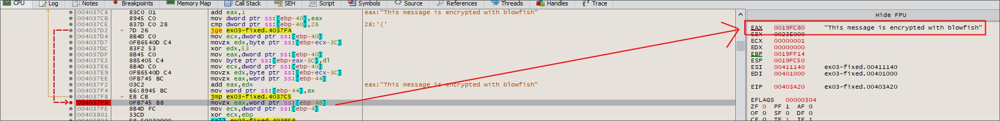
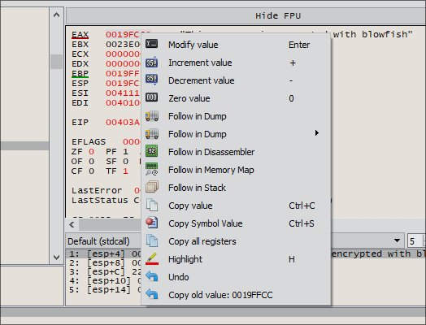
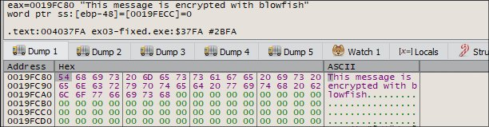
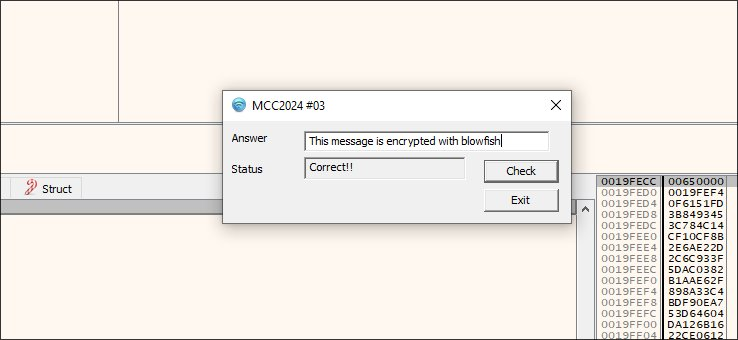

### Solution:

##### 1. Use CFF Explorer to remove .reloc data section



**Knowing what is `.reloc` data:**
- It contains data which allows the PE file to be loaded at different address each time it is executed (.reloc = relocation)
- It contains pointers to functions or variables
- It also has address references for dynamic linking or imported functions

**Reason to remove `.reloc` data:**
- Improving debugging behavior
- Easier to analyze 

References on PE Base Relocations: [https://0xrick.github.io/win-internals/pe7/](https://0xrick.github.io/win-internals/pe7/)

##### 2. Use IDA to diassemble and identify suitable breakpoints



From the decompiled C pseudocode:
```c
   GetDlgItemTextA(hWnd, 1000, lpString, 90); // -> Input text function, lpString will store the input 
      v9 = (unsigned __int16)sub_4036C0(&unk_41A4FC); // -> v9 stores the result of sub_40360 (Breakpoint #1)
      if ( v9 == (unsigned __int16)sub_403A20(lpString, strlen(lpString)) && strlen(lpString) > 0xF )  // -> Checks lpString matches the value of v9 and length is more than 15
```

Since there is a function call, we have to inspect deeper into `sub_40360`

##### 3. Dive deeper into `sub_4036C0`



The operation of `sub_4036C0` is loop through character byte array with XOR `0x53` and returns it as `v9`. Next, we should set the second breakpoint when it return. The return value will be stored in EAX register. 


##### 4. Use x32dbg to set breakpoints and check the EAX value at the second breakpoint



After place the breakpoint, run it, it will hit the Prologue breakpoint. Input a test string like `AAAAAAAA`. 



When you click `Check` button, it will hit the first breakpoint.


Hit next again, it will complete the `sub_4036C0` process execution, it will store the result into EAX.



To verify more, we can follow in follow in dump, just right click and `Follow in Dump`





**Flag:** `This message is encrypted with blowfish`




##### 4. Use x32dbg to set breakpoints
