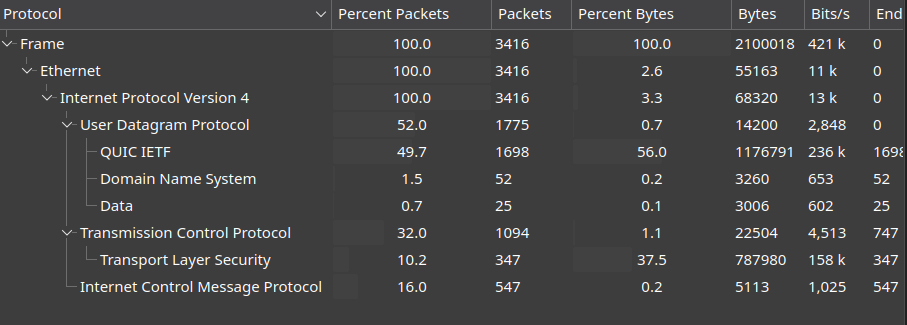
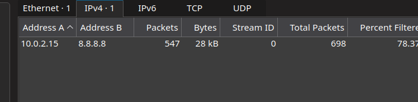

# Hidden in the Traffic

A whistleblower tipped us off about a secret communication between two devices. We managed to intercept the network traffic, but the flag is hidden within the data. Your task is to analyze the provided PCAP file, uncover the hidden message, and extract the flag.

- Category: Forensic
- Challenge File: Very_mysterious_file.pcapng

### Solution:
##### 1. Check Protocol Hierarchy of the Packet Capture
The challenge description state that there is a hidden message contained in the packet capture, maybe some unencrypted protocol may have been used to stored the flag. 

Upon checking the list of protocol used in the packet capture. ICMP stands out as it is common technique to be used for data exfiltration. 



##### 2. Check IP addresses used ICMP 
From the Conversation tab, we can notice only two IP addresses uses ICMP to communicate (`8.8.8.8` and `10.0.2.15`) 



Next we should filter and parse out the bytes transfer between these two IP addresses with ICMP protocol

##### 3. Use tshark to parse out bytes from ICMP Protocol

```bash
$ tshark -r Very_mysterious_file.pcapng -T fields -e data.data -Y 'icmp.type == 8' | xxd -r -p

AABCDEFGHIJKLCABCDEFGHIJKLEABCDEFGHIJKLCABCDEFGHIJKLTABCDEFGHIJKLFABCDEFGHIJKL{ABCDEFGHIJKLpABCDEFGHIJKL1ABCDEFGHIJKLnABCDEFGHIJKL6ABCDEFGHIJKL_ABCDEFGHIJKL0ABCDEFGHIJKLfABCDEFGHIJKL_ABCDEFGHIJKLDABCDEFGHIJKL3ABCDEFGHIJKL4ABCDEFGHIJKL7ABCDEFGHIJKLhABCDEFGHIJKL}ABCDEFGHIJKL
```

There are `_` and `{ } ` within the data, oddly `ABCDEFGHIJKL` is repeating itself, which can be seen at the last part after the closing braces. 

Using `sed` to parse it more cleaner:
```bash
$ tshark -r Very_mysterious_file.pcapng -T fields -e data.data -Y 'icmp.type == 8' | xxd -r -p | sed s/ABCDEFGHIJKL//g
 
ACECTF{p1n6_0f_D347h}
```

**Flag:** `ACECTF{p1n6_0f_D347h}`


