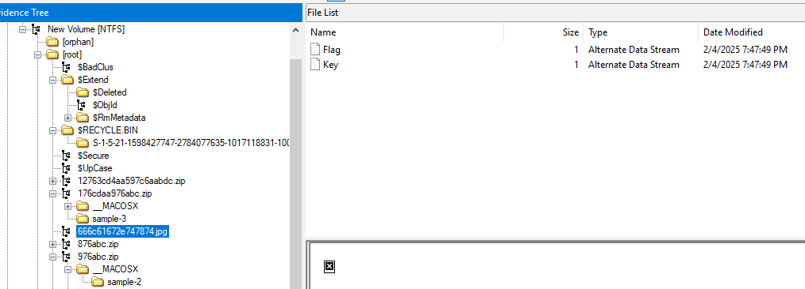
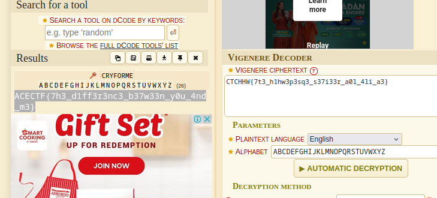

# Virtual Hard Disk

One of the first things I learnt when I started learning to hack was linux. It was fun until I hit a ceiling of understanding about the differences in Operating Systems, what's a Shell, Kernel, etc.

But once I got better I started developing a liking towards the terminal and how the Linux operating system is `better` than say Windows, or `worse` in some cases. How none of them is superior, nor the other inferior. We shall find out with this challenge.

Be careful, a lot of fake galfs around.

- Category: Forensic
- Challenge File: challenge (`DOS/MBR boot sector`)

### Solution:
##### 1. Use FTKImager to identify any suspicious file
After a long time of exploring (clicking and clicking --\_\--), this weird file `666c61672e747874.jpg` contain two data streams `Flag` and `Key`. 



Taking a look what are the strings in it:
```
Flag: CTCHHW{7t3_h1hw3p3sq3_s37i33r_a0l_4li_a3}
Key: Key='cryforme'
```

This is a Vigenere Cipher which uses key to perform rotation cipher. Chunk it into a decoder will give us the flag

##### 2. Decode Vigenere encoded string 



**Flag:** `ACECTF{7h3_d1ff3r3nc3_b37w33n_y0u_4nd_m3}`
