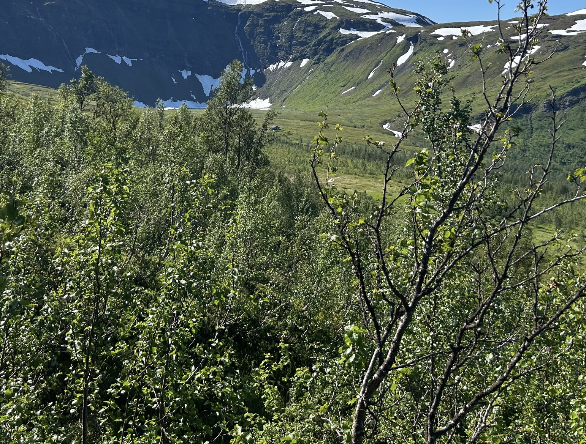

# Scandinavia and the World 

- Category: OSINT
- Difficulty: Hard 
- Author: Nissen 

Everybody in Denmark agrees that the rest of Scandinavia are basically just sillier-sounding Danes - and we're definitely not just still salty about Sweden ditching the Kalmar Union in 1523 and Norway in 1814 (shoutout [Kalmarunionen](https://kalmarunionen.dk/posts/about/), leaving us with no oil and no mountains.

So this summer we went north, behind enemy lines, to take it all back. But distracted by all our delicious Danish pastries and snacks (okay, maybe it was Kvikk Lunsj), we forgot to follow the red markings on our trail. We can still see our cabin but have no clue how to get there - can you help us find our way?

The flag is the cabin's Google Plus Code when clicked on in Google Maps (without city and country), wrapped in brunner{}.

Example: `brunner{9C8J+R75}`

Challenge Image: 

### Solution:

1. Reverse image search around the mountain region
2. It brings to this result: [https://www.flickr.com/photos/valugi/28072903476/]([https://www.flickr.com/photos/valugi/28072903476/)
3. The author of this image place it under Tromsdalstinden folder
4. Open google maps 3D view find for Tromdalstinden cabin
5. Finally, the cabin is located at [here](https://www.google.com/maps/place/Folkehjelpshytta+Tromsdalen/@69.6057776,19.0476987,3118m/data=!3m1!1e3!4m9!1m2!2m1!1sTromsdalstinden+red+cross+cabin!3m5!1s0x45c4dab7688264fd:0xeed495fbe8282d8a!8m2!3d69.6057793!4d19.085261!16s%2Fg%2F11bw506z84?entry=ttu&g_ep=EgoyMDI1MDgxOS4wIKXMDSoASAFQAw%3D%3D)

**Flag:** `brunnerctf{J34P+84}`

