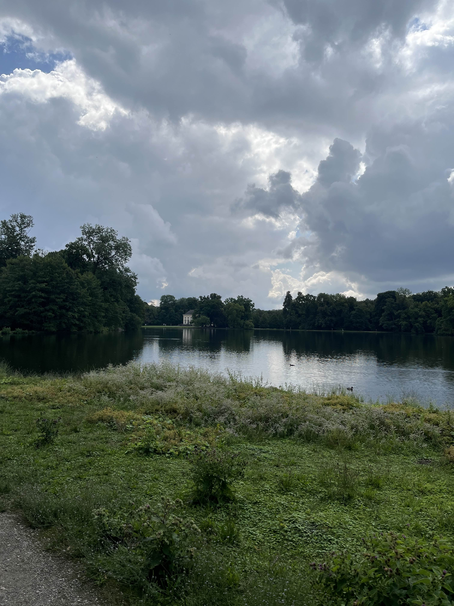

# Traditional Cake 

- Category: OSINT
- Difficulty: Medium
- Author: OddNorseman

I tried this amazing traditional cake at this amazing place I visited... but now I don't remember what it was called and where I was. All I have is this picture I took some time before.

Can you help me find the exact spot I took the image from, so I can try to retrace my steps?

Flag format: Use [what3words](https://what3words.com/) to find the 3-word code for the location (without leading slashes) and wrap in `brunner{}`.
So, if the location found has code `apricot.surfer.uses`, the flag would be `brunner{apricot.surfer.uses}`.

Challenge Image:

### Solution:

1. Reverse image search will shows result of [Nymphenburg Palance](https://www.schloss-nymphenburg.de/englisch/palace/) in Munich, Germany

2. Also this [image](https://www.flickr.com/photos/28432918@N04/4778028878/) from Flickr shows very identical position of where the image is taken 

3. Use (what3words)[https://what3words.com/] find around the area where image is taken, on the road

**Flag:** `brunner{rice.underway.pump}`

