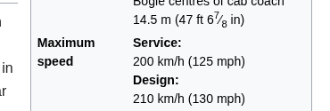

# Train Mania 

- Category: OSINT
- Difficulty: easy
- Author: Quack

I recently stumpled upon this cool train! But I'd like to know a bit more about it... Can you please tell me the operating company, model number and its maximum service speed (km/h in regular traffic)?

The flag format is `brunner{OPERATOR-MODELNUMBER-SERVICESPEED}`.
So if the operator you have found is DSB, the model number RB1, and the maximum service speed is 173 km/h, the flag would be `brunner{DSB-RB1-173}`.

Challenge Video:

### Solution:

1. Reverse image search the last second of the video (having the rear side of the train clear) 
2. Results showing a train of [SJ X2](https://en.wikipedia.org/wiki/X_2000)
3. Search of maximum service speed

**Flag:** `brunner{SJ-X2-200}`
