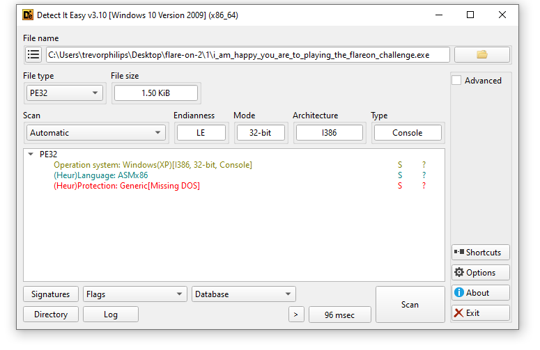
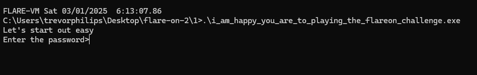

# Challenge 1

Challenge File: `i_am_happy_you_are_to_playing_the_flareon_challenge.exe`

### Solution:
##### 1. Run Detect-It-Easy to understand the binary

The binary given is a 32-bit and used Assembly to code. Running it will prompts to enter a password 




##### 2. Decompile it using IDA 
Here is the assembly code for the binary
```nasm
push    ebp
mov     ebp, esp
sub     esp, 10h
mov     [ebp+var_10], eax
push    0FFFFFFF6h      ; nStdHandle
call    GetStdHandle
mov     [ebp+var_C], eax
push    0FFFFFFF5h      ; nStdHandle
call    GetStdHandle
mov     [ebp+hFile], eax
push    0               ; lpOverlapped
lea     eax, [ebp+NumberOfBytesWritten]
push    eax             ; lpNumberOfBytesWritten
push    2Ah ; '*'       ; nNumberOfBytesToWrite
push    offset aLetSStartOutEa ; "Let's start out easy\r\nEnter the passw"...
push    [ebp+hFile]     ; hFile
call    WriteFile
push    0               ; lpOverlapped
lea     eax, [ebp+NumberOfBytesWritten]
push    eax             ; lpNumberOfBytesRead
push    32h ; '2'       ; nNumberOfBytesToRead
push    offset byte_402158 ; lpBuffer
push    [ebp+var_C]     ; hFile
call    ReadFile
xor     ecx, ecx

loc_loop:
mov     al, byte_402158[ecx]
xor     al, 7Dh
cmp     al, byte_402140[ecx]
jnz     loc_failure
inc     ecx
cmp     ecx, 18h
jl      loc_loop

push    0               ; lpOverlapped
lea     eax, [ebp+NumberOfBytesWritten]
push    eax             ; lpNumberOfBytesWritten
push    12h             ; nNumberOfBytesToWrite
push    offset aYouAreSuccess ; "You are success\r\n"
push    [ebp+hFile]     ; hFile
call    WriteFile
jmp     loc_exit

loc_failure:
push    0               ; lpOverlapped
lea     eax, [ebp+NumberOfBytesWritten]
push    eax             ; lpNumberOfBytesWritten
push    12h             ; nNumberOfBytesToWrite
push    offset aYouAreFailure ; "You are failure\r\n"
push    [ebp+hFile]     ; hFile
call    WriteFile

loc_exit:
mov     esp, ebp
pop     ebp
retn
```

At `call ReadFile` is where our input get process as `byte_402158`. Next, it will compare with `byte_402140` after XORing with `0x7D`. Here is the array bytes of `byte_402140` which can be found at .data section. 

```
.data:00402140 byte_402140     db 1Fh                  ; DATA XREF: start+55↑r
.data:00402141                 db    8
.data:00402142                 db  13h
.data:00402143                 db  13h
.data:00402144                 db    4
.data:00402145                 db  22h ; "
.data:00402146                 db  0Eh
.data:00402147                 db  11h
.data:00402148                 db  4Dh ; M
.data:00402149                 db  0Dh
.data:0040214A                 db  18h
.data:0040214B                 db  3Dh ; =
.data:0040214C                 db  1Bh
.data:0040214D                 db  11h
.data:0040214E                 db  1Ch
.data:0040214F                 db  0Fh
.data:00402150                 db  18h
.data:00402151                 db  50h ; P
.data:00402152                 db  12h
.data:00402153                 db  13h
.data:00402154                 db  53h ; S
.data:00402155                 db  1Eh
.data:00402156                 db  12h
.data:00402157                 db  10h
```

##### 3. Script to reverse XOR operation
Here is the python script as the solution:
```python
data = [
    0x1F, 0x08, 0x13, 0x13, 0x04, 0x22, 0x0E, 0x11,
    0x4D, 0x0D, 0x18, 0x3D, 0x1B, 0x11, 0x1C, 0x0F,
    0x18, 0x50, 0x12, 0x13, 0x53, 0x1E, 0x12, 0x10
]

key = 0x7D
decoded = ''.join(chr(byte ^ key) for byte in data)
print(decoded)
```

**Flag:** `bunny_sl0pe@flare-on.com`

