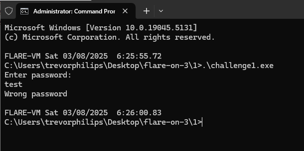
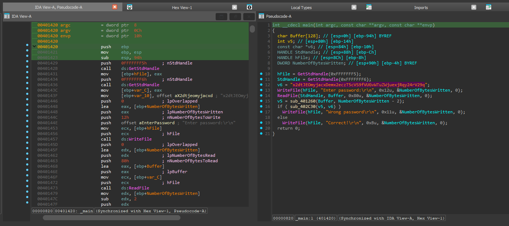
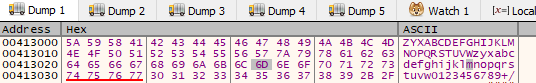
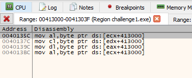
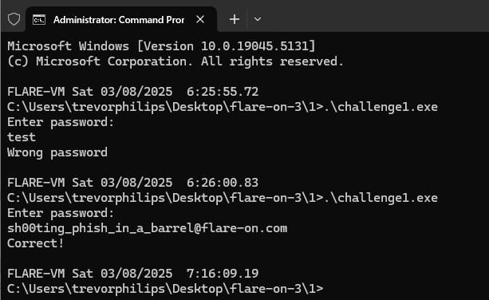

# Challenge 1

Using command prompt to run the challenge executable will prompt to enter password. 



### Solution:
##### 1. Use IDA to disassemble to challenge executable 



Here the main function use Windows API function (WriteFile, ReadFile) to display text and takes user input. 

```c
int __cdecl main(int argc, const char **argv, const char **envp)
{
  char Buffer[128]; // [esp+0h] [ebp-94h] BYREF
  int v5; // [esp+80h] [ebp-14h]
  const char *v6; // [esp+84h] [ebp-10h]
  HANDLE StdHandle; // [esp+88h] [ebp-Ch]
  HANDLE hFile; // [esp+8Ch] [ebp-8h]
  DWORD NumberOfBytesWritten; // [esp+90h] [ebp-4h] BYREF

  hFile = GetStdHandle(0xFFFFFFF5);
  StdHandle = GetStdHandle(0xFFFFFFF6);
  v6 = "x2dtJEOmyjacxDemx2eczT5cVS9fVUGvWTuZWjuexjRqy24rV29q";
  WriteFile(hFile, "Enter password:\r\n", 0x12u, &NumberOfBytesWritten, 0);
  ReadFile(StdHandle, Buffer, 0x80u, &NumberOfBytesWritten, 0);
  v5 = sub_401260(Buffer, NumberOfBytesWritten - 2);
  if ( sub_402C30(v5, v6) )
    WriteFile(hFile, "Wrong password\r\n", 0x11u, &NumberOfBytesWritten, 0);
  else
    WriteFile(hFile, "Correct!\r\n", 0xBu, &NumberOfBytesWritten, 0);
  return 0;
}
```

User input is stored in **Buffer** and then will be use as argument for `sub_401260`, which then uses **v5** to stored as it result. The function `sub402C30` is a **strcmp** function which compares the value of **v5** and **v6**. Our next objective is to reverse the function `sub_401260`. 

##### 2. Reverse the function of sub_401260 
Here is the decompile function of sub_401260:
```c
int __cdecl sub_401260(int a1, unsigned int a2)
{
  int v3; // [esp+Ch] [ebp-24h]
  int v4; // [esp+10h] [ebp-20h]
  int v5; // [esp+14h] [ebp-1Ch]
  int i; // [esp+1Ch] [ebp-14h]
  unsigned int v7; // [esp+20h] [ebp-10h]
  int v8; // [esp+24h] [ebp-Ch]
  int v9; // [esp+28h] [ebp-8h]
  int v10; // [esp+28h] [ebp-8h]
  unsigned int v11; // [esp+2Ch] [ebp-4h]

  v8 = sub_402CBC(4 * ((a2 + 2) / 3) + 1);
  if ( !v8 )
    return 0;
  v11 = 0;
  v9 = 0;
  while ( v11 < a2 )
  {
    v5 = *(unsigned __int8 *)(v11 + a1);
    if ( ++v11 >= a2 )
    {
      v4 = 0;
    }
    else
    {
      v4 = *(unsigned __int8 *)(v11 + a1);
      ++v11;
    }
    if ( v11 >= a2 )
    {
      v3 = 0;
    }
    else
    {
      v3 = *(unsigned __int8 *)(v11 + a1);
      ++v11;
    }
    v7 = v3 + (v5 << 16) + (v4 << 8);
    *(_BYTE *)(v9 + v8) = byte_413000[(v7 >> 18) & 0x3F];
    v10 = v9 + 1;
    *(_BYTE *)(v10 + v8) = byte_413000[(v7 >> 12) & 0x3F];
    *(_BYTE *)(++v10 + v8) = byte_413000[(v7 >> 6) & 0x3F];
    *(_BYTE *)(++v10 + v8) = byte_413000[v3 & 0x3F];
    v9 = v10 + 1;
  }
  for ( i = 0; i < dword_413040[a2 % 3]; ++i )
    *(_BYTE *)(v8 + 4 * ((a2 + 2) / 3) - i - 1) = 61;
  *(_BYTE *)(4 * ((a2 + 2) / 3) + v8) = 0;
  return v8;
}
```

Examining the operation of the function, it process in a 3-byte chunks, using shift left (`<<`) and right (`>>`) operations to manipulate the data.
- **Memory Allocation:** The function first allocates memory using `sub_402CBC`. The required buffer size is calculated as `4 * ((a2 + 2) / 3) + 1`, which ensures enough space for the Base64-encoded output, including the null terminator. 
- **Processing in 3-Byte Chunks:** It iterates through `a1`, reading three bytes at a time. If there are fewer than three bytes remaining, the missing bytes are set to zero.
- **Bit Manipulation:** Each 3-byte sequence is converted into a single  24-bit integer (`v7 = v3 + (v5 << 16) + (v4 << 8)`). The function then extracts four 6-bit segments by shifting and masking. 
- **Base64 Encoding:** These 6-bit segments serve as indices into `byte_413000` which is the Base64 lookup table. The corresponding Base64 characters are stored in the output buffer. 
- **Padding Handling:** If the input size (`a2`) is not a multiple of 3, the function appends padding characters (`=`) as determined by `dword_413040[a2 %3]`. 
- **Finalizing Output:** The encoded string is null-terminated before being returned.

However, the lookup table for the Base64 string is modified, we can notice the `byte_413040` starts with `Z` as beginning. We can take a look in the memory dump of x32dbg:



If using the **Find References** tools from x32dbg is shows using is used as the lookup table to map and encoded as the output. 



According to this [resource](https://www.sunshine2k.de/articles/coding/base64/understanding_base64.html), it shows the Base64 index mapping table starts with like this `ABCDEFGHIJKLMNOPQRSTUVWXYZabcdefghijklmnopqrstuvwxyz0123456789+/`. For our case is `ZYXABCDEFGHIJKLMNOPQRSTUVWzyxabcdefghijklmnopqrstuvw0123456789+/`. So in order to reverse the "modified" Base64 encoded string from **v6**, we need a customized our solution script. 
##### 3.  Decoding Base64 string with custom lookup table
Before proceeding to solution script, we have knew that **v6** is the Base64 string which uses the custom lookup table, later is compared with the user input. Here is the Go reverse solution script:

```go 
package main

import (
	"encoding/base64"
	"fmt"
	"strings"
)

func main() {
	// Define the custom and standard Base64 alphabets
	customB64 := "ZYXABCDEFGHIJKLMNOPQRSTUVWzyxabcdefghijklmnopqrstuvw0123456789+/"
	standardB64 := "ABCDEFGHIJKLMNOPQRSTUVWXYZabcdefghijklmnopqrstuvwxyz0123456789+/"

	// Encoded string
	encodedStr := "x2dtJEOmyjacxDemx2eczT5cVS9fVUGvWTuZWjuexjRqy24rV29q"

	// Translate the encoded string to standard Base64
	translatedStr := translateCustomBase64(encodedStr, customB64, standardB64)

	// Decode the translated string
	decodedBytes, err := base64.StdEncoding.DecodeString(translatedStr)
	if err != nil {
		fmt.Println("Error decoding Base64:", err)
		return
	}

	// Convert bytes to string
	decodedStr := string(decodedBytes)
	fmt.Println("Decoded string:", decodedStr)
}

// translateCustomBase64 translates a custom Base64 string to standard Base64
func translateCustomBase64(encodedStr, customB64, standardB64 string) string {
	// Create a mapping from custom to standard Base64
	translationMap := make(map[rune]rune)
	for i, char := range customB64 {
		translationMap[char] = rune(standardB64[i])
	}

	// Translate the encoded string
	var translatedStr strings.Builder
	for _, char := range encodedStr {
		if standardChar, ok := translationMap[char]; ok {
			translatedStr.WriteRune(standardChar)
		} else {
			translatedStr.WriteRune(char) // Handle padding characters (e.g., '=')
		}
	}

	return translatedStr.String()
}
```

The output: `sh00ting_phish_in_a_barrel@flare-on.com`. 



**Flag:** `sh00ting_phish_in_a_barrel@flare-on.com`
