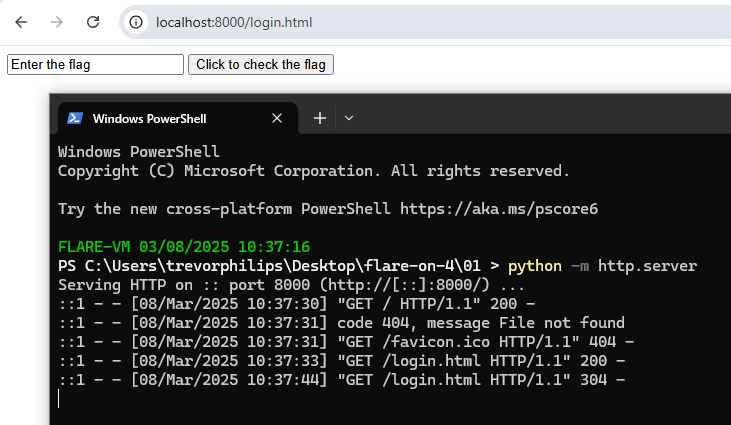
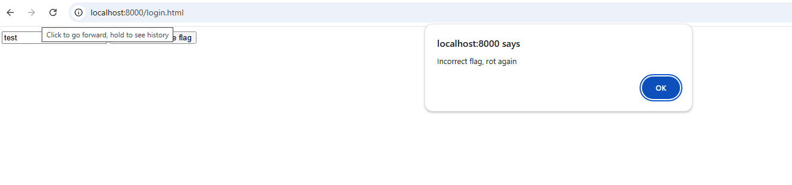
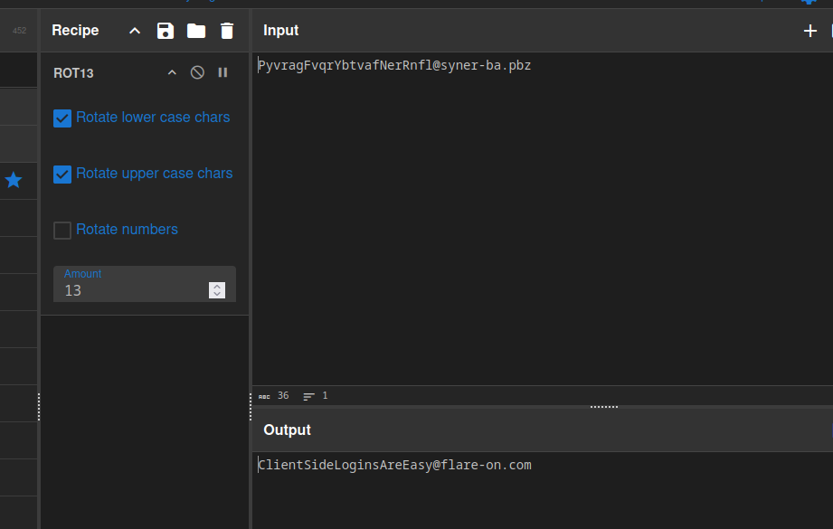

# Challenge 1

Challenge file given was a html named **login.html**. Use Python web server to run will show a text box to enter a flag. 



Enter a test string will show a incorrect



### Solution
##### 1. Analyze the html source 
Here is the part of javascript that process user input. 
```html
<script type="text/javascript">
            document.getElementById("prompt").onclick = function () {
                var flag = document.getElementById("flag").value;
                var rotFlag = flag.replace(/[a-zA-Z]/g, function(c){return String.fromCharCode((c <= "Z" ? 90 : 122) >= (c = c.charCodeAt(0) + 13) ? c : c - 26);});
                if ("PyvragFvqrYbtvafNerRnfl@syner-ba.pbz" == rotFlag) {
                    alert("Correct flag!");
                } else {
                    alert("Incorrect flag, rot again");
                }
            }
        </script>
```

The javascript uses ROT13 encoding to validate the flag input. User input as string will be encode with ROT13 and compares whether is match with `PyvragFvqrYbtvafNerRnfl@syner-ba.pbz`. 

##### 2. ROT13 checked string 
ROT13 to get back the intended readable string. With [CyberChef](https://gchq.github.io/CyberChef/#recipe=ROT13(true,true,false,13)&input=UHl2cmFnRnZxcllidHZhZk5lclJuZmxAc3luZXItYmEucGJ6), we can reverse it



We got the correct flag: `ClientSideLoginsAreEasy@flare-on.com`
